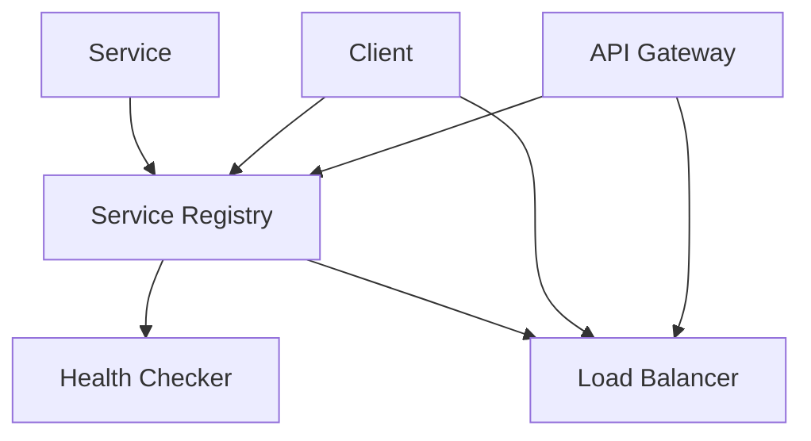
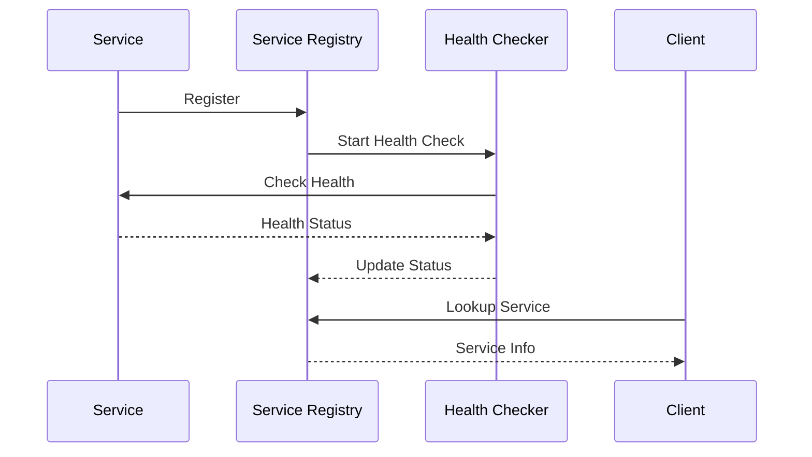

INITIAL CONTEXT FOR LLM - never change the context-----------------------------
-> THIS SECTION IS A GUIDELINE TO THE LLM CONSIDER BEFORE WORKING IN THIS FILE, DO NOT CHANGE THIS

-> GOES OF THE SERVICE DISCOVERY PATTERN:

- This document describes the Service Discovery pattern used in the microservices architecture
- It covers service registration, health checking, and service lookup
- Includes implementation details and configuration examples
- All patterns are implemented and tested in the current architecture
- For LLM-specific guidelines, refer to [LLM Integration Guide](../../../docs/llm/README.md)

-> CONSIDERER BEFORE UPDATING THIS FILE:

- This is a documentation file about the Service Discovery pattern
- Never add fictional dates, version numbers, or metrics
- Changes should be incremental and based on verified information
- Add comments for clarification when needed
- Maintain LLM-friendly format

---

# Service Discovery Pattern

## Context

- When to use: For dynamic service location in a microservices architecture
- Problem it solves: Enables services to find and communicate with each other
- Related patterns: API Gateway, Load Balancing, Health Checks

## Solution

### Service Registration

- Self-registration
- Health check integration
- Metadata management
- Instance tracking

Implementation:

```yaml
service_registration:
  provider: kubernetes
  registration:
    type: self
    interval: 30s
  metadata:
    - name
    - version
    - environment
    - endpoints
  health_check:
    endpoint: /health
    interval: 10s
    timeout: 5s
```

### Service Lookup

- DNS-based discovery
- Client-side caching
- Load balancing
- Failover handling

Implementation:

```yaml
service_lookup:
  strategy: dns
  caching:
    enabled: true
    ttl: 30s
  load_balancing:
    strategy: round_robin
    health_check: true
  failover:
    max_retries: 3
    timeout: 5s
```

### Health Checking

- Liveness probes
- Readiness probes
- Dependency checking
- Status reporting

Implementation:

```yaml
health_checking:
  liveness:
    endpoint: /health/live
    interval: 30s
    timeout: 5s
  readiness:
    endpoint: /health/ready
    interval: 10s
    timeout: 5s
  dependencies:
    - database
    - cache
    - message_queue
```

### Service Registry

- Centralized registry
- Distributed storage
- Event notifications
- Configuration management

Implementation:

```yaml
service_registry:
  storage: etcd
  replication:
    enabled: true
    factor: 3
  events:
    - service_registered
    - service_deregistered
    - health_changed
  configuration:
    refresh_interval: 60s
    cache_size: 1000
```

## Benefits

- Dynamic service location
- Automatic failover
- Load balancing
- Health monitoring
- Configuration management

## Drawbacks

- Additional complexity
- Network overhead
- Cache consistency
- Failure detection
- Configuration management

## Examples

### Service Discovery Architecture



### Service Registration Flow



## Related Patterns

- API Gateway: For service access
- Load Balancing: For request distribution
- Circuit Breaker: For fault tolerance
- Health Checks: For service monitoring
- Configuration Management: For service settings

## Notes

- Keep registry up to date
- Monitor health checks
- Document service metadata
- Test failover scenarios
- Maintain security
