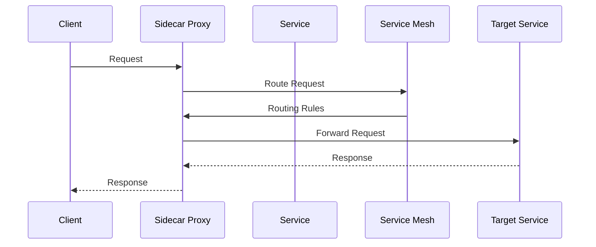
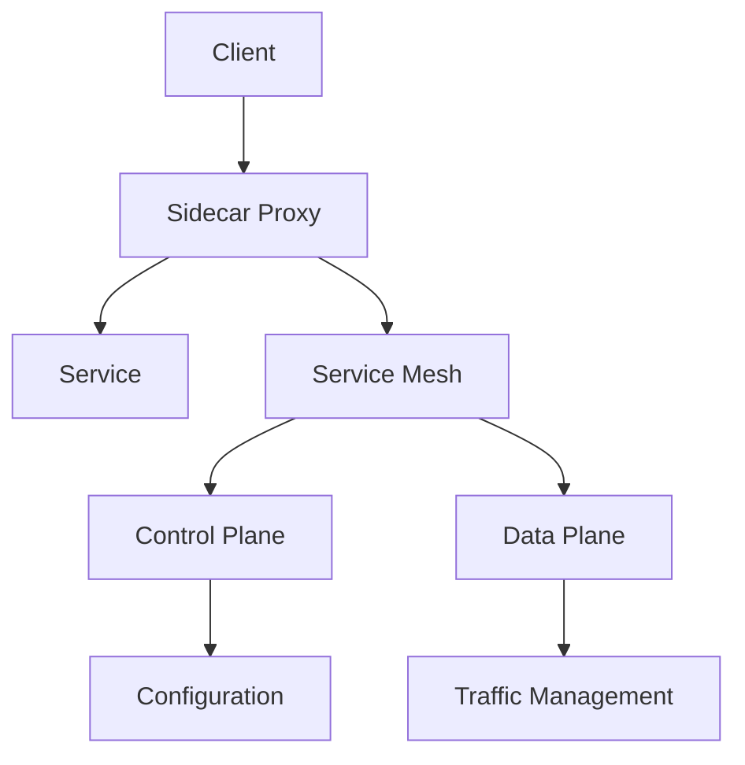

INITIAL CONTEXT FOR LLM - never change the context-----------------------------
-> THIS SECTION IS A GUIDELINE TO THE LLM CONSIDER BEFORE WORKING IN THIS FILE, DO NOT CHANGE THIS

-> GOES OF THE SERVICE MESH PATTERN:

- This document describes the Service Mesh pattern used in the microservices architecture
- It covers service-to-service communication, traffic management, and observability
- Includes implementation details and configuration examples
- All patterns are implemented and tested in the current architecture
- For LLM-specific guidelines, refer to [LLM Integration Guide](../../../docs/llm/README.md)

-> CONSIDERER BEFORE UPDATING THIS FILE:

- This is a documentation file about the Service Mesh pattern
- Never add fictional dates, version numbers, or metrics
- Changes should be incremental and based on verified information
- Add comments for clarification when needed
- Maintain LLM-friendly format

---

# Service Mesh Pattern

## Context

- When to use: For managing service-to-service communication in a microservices architecture
- Problem it solves: Provides consistent service communication, security, and observability
- Related patterns: API Gateway, Circuit Breaker, Service Discovery

## Solution

### Traffic Management

- Load balancing
- Traffic routing
- Traffic splitting
- Traffic mirroring

Implementation:

```yaml
traffic_management:
  load_balancing:
    enabled: true
    algorithm: round_robin
    health_check: true
  routing:
    enabled: true
    rules:
      - header_based
      - path_based
      - weight_based
  splitting:
    enabled: true
    strategy: percentage
    monitoring: true
  mirroring:
    enabled: true
    percentage: 10
    destination: staging
```

### Service Discovery

- Service registration
- Service resolution
- Health checking
- Load balancing

Implementation:

```yaml
service_discovery:
  registration:
    enabled: true
    provider: consul
    ttl: 30s
  resolution:
    enabled: true
    cache: true
    timeout: 5s
  health_check:
    enabled: true
    interval: 10s
    timeout: 3s
  load_balancing:
    enabled: true
    strategy: least_conn
    max_retries: 3
```

### Security

- mTLS
- Authorization
- Access control
- Encryption

Implementation:

```yaml
security:
  mtls:
    enabled: true
    mode: strict
    cert_rotation: 24h
  authorization:
    enabled: true
    policy: deny_all
    rules: dynamic
  access_control:
    enabled: true
    source: ip
    destination: service
  encryption:
    enabled: true
    algorithm: AES-256-GCM
    key_rotation: 7d
```

### Observability

- Metrics collection
- Distributed tracing
- Logging
- Monitoring

Implementation:

```yaml
observability:
  metrics:
    enabled: true
    collection: 15s
    storage: prometheus
  tracing:
    enabled: true
    provider: jaeger
    sampling: 0.1
  logging:
    enabled: true
    format: json
    storage: elasticsearch
  monitoring:
    enabled: true
    dashboard: grafana
    alerts: true
```

## Benefits

- Consistent communication
- Enhanced security
- Improved observability
- Simplified operations
- Better reliability

## Drawbacks

- Operational complexity
- Performance overhead
- Learning curve
- Resource consumption
- Maintenance burden

## Examples

### Service Mesh Flow



### Service Mesh Architecture



## Related Patterns

- API Gateway: For external access
- Circuit Breaker: For failure handling
- Service Discovery: For service location
- Sidecar: For service augmentation
- Ambassador: For service proxying

## Notes

- Plan mesh deployment
- Configure security properly
- Monitor mesh performance
- Manage configuration
- Document mesh setup
