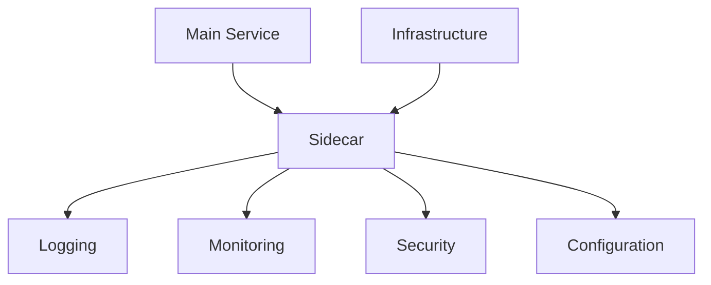
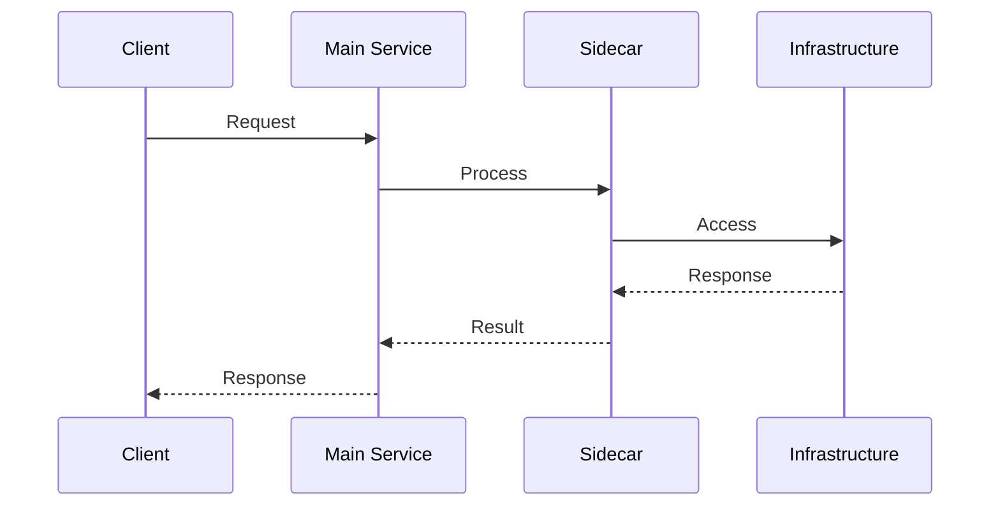

INITIAL CONTEXT FOR LLM - never change the context-----------------------------
-> THIS SECTION IS A GUIDELINE TO THE LLM CONSIDER BEFORE WORKING IN THIS FILE, DO NOT CHANGE THIS

-> GOES OF THE SIDECAR PATTERN:

- This document describes the Sidecar pattern used in the microservices architecture
- It covers service augmentation, cross-cutting concerns, and infrastructure integration
- Includes implementation details and configuration examples
- All patterns are implemented and tested in the current architecture
- For LLM-specific guidelines, refer to [LLM Integration Guide](../../../docs/llm/README.md)

-> CONSIDERER BEFORE UPDATING THIS FILE:

- This is a documentation file about the Sidecar pattern
- Never add fictional dates, version numbers, or metrics
- Changes should be incremental and based on verified information
- Add comments for clarification when needed
- Maintain LLM-friendly format

---

# Sidecar Pattern

## Context

- When to use: For extending service functionality without modifying the main application
- Problem it solves: Separates cross-cutting concerns from the main service logic
- Related patterns: Ambassador Pattern, Service Mesh, Proxy Pattern

## Solution

### Service Augmentation

- Logging
- Monitoring
- Security
- Configuration

Implementation:

```yaml
service_augmentation:
  logging:
    type: fluentd
    format: json
    destination: elasticsearch
  monitoring:
    type: prometheus
    metrics:
      - http_requests
      - response_time
      - error_rate
  security:
    type: istio
    features:
      - mTLS
      - authorization
  configuration:
    type: consul
    watch: true
```

### Cross-Cutting Concerns

- Service discovery
- Load balancing
- Circuit breaking
- Rate limiting

Implementation:

```yaml
cross_cutting_concerns:
  service_discovery:
    type: consul
    health_check: true
  load_balancing:
    type: envoy
    strategy: round_robin
  circuit_breaking:
    max_requests: 100
    max_retries: 3
  rate_limiting:
    requests_per_second: 100
    burst: 200
```

### Infrastructure Integration

- Network proxy
- Storage proxy
- Cache proxy
- Message broker

Implementation:

```yaml
infrastructure_integration:
  network_proxy:
    type: envoy
    protocol: http2
  storage_proxy:
    type: minio
    bucket: profiles
  cache_proxy:
    type: redis
    max_connections: 100
  message_broker:
    type: rabbitmq
    vhost: profiles
```

### Lifecycle Management

- Startup coordination
- Health checking
- Graceful shutdown
- Resource cleanup

Implementation:

```yaml
lifecycle_management:
  startup:
    order: after_main
    timeout: 30s
  health_check:
    endpoint: /health
    interval: 10s
  shutdown:
    grace_period: 30s
    cleanup: true
  resources:
    limits:
      cpu: 0.5
      memory: 512Mi
```

## Benefits

- Service isolation
- Reusable components
- Simplified maintenance
- Independent scaling
- Technology flexibility

## Drawbacks

- Resource overhead
- Deployment complexity
- Version management
- Testing complexity
- Operational overhead

## Examples

### Sidecar Architecture



### Service Flow



## Related Patterns

- Ambassador Pattern: For service proxying
- Service Mesh: For service-to-service communication
- Proxy Pattern: For request forwarding
- Adapter Pattern: For interface translation
- Decorator Pattern: For functionality extension

## Notes

- Monitor sidecar health
- Manage resource usage
- Handle failures gracefully
- Test integration points
- Document configurations
