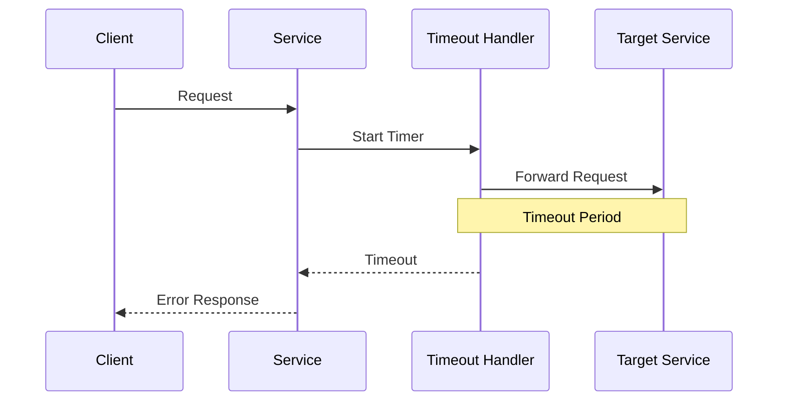
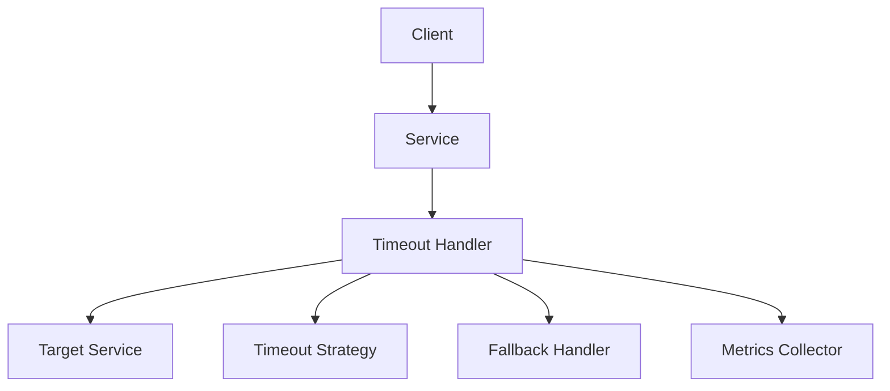

INITIAL CONTEXT FOR LLM - never change the context-----------------------------
-> THIS SECTION IS A GUIDELINE TO THE LLM CONSIDER BEFORE WORKING IN THIS FILE, DO NOT CHANGE THIS

-> GOES OF THE TIMEOUT PATTERN:

- This document describes the Timeout pattern used in the microservices architecture
- It covers request timeouts, connection timeouts, and timeout handling
- Includes implementation details and configuration examples
- All patterns are implemented and tested in the current architecture
- For LLM-specific guidelines, refer to [LLM Integration Guide](../../../docs/llm/README.md)

-> CONSIDERER BEFORE UPDATING THIS FILE:

- This is a documentation file about the Timeout pattern
- Never add fictional dates, version numbers, or metrics
- Changes should be incremental and based on verified information
- Add comments for clarification when needed
- Maintain LLM-friendly format

---

# Timeout Pattern

## Context

- When to use: For preventing indefinite waiting in distributed systems
- Problem it solves: Ensures system responsiveness and resource management
- Related patterns: Circuit Breaker, Retry Pattern, Fallback Pattern

## Solution

### Request Timeouts

- Global timeouts
- Per-request timeouts
- Timeout propagation
- Timeout handling

Implementation:

```yaml
request_timeouts:
  global:
    default: 30s
    max: 60s
  per_request:
    profile_read: 5s
    profile_write: 10s
    auth_check: 3s
  propagation:
    enabled: true
    header: x-timeout
  handling:
    strategy: fail_fast
    fallback: true
```

### Connection Timeouts

- Connection establishment
- Connection idle
- Connection keep-alive
- Connection cleanup

Implementation:

```yaml
connection_timeouts:
  establishment:
    timeout: 5s
    retries: 3
  idle:
    timeout: 60s
    check_interval: 10s
  keep_alive:
    enabled: true
    interval: 30s
  cleanup:
    timeout: 5s
    force: true
```

### Timeout Strategies

- Fail fast
- Graceful degradation
- Partial results
- Timeout cascading

Implementation:

```yaml
timeout_strategies:
  fail_fast:
    enabled: true
    threshold: 100ms
  graceful_degradation:
    enabled: true
    fallback_data: cached
  partial_results:
    enabled: true
    min_required: 2
  cascading:
    enabled: true
    propagation: true
```

### Monitoring and Alerts

- Timeout metrics
- Performance impact
- Resource usage
- Alert thresholds

Implementation:

```yaml
monitoring:
  metrics:
    - timeout_count
    - timeout_rate
    - response_time
    - resource_usage
  alerts:
    - high_timeout_rate
    - slow_responses
    - resource_exhaustion
  thresholds:
    timeout_rate: 0.1
    response_time: 1s
```

## Benefits

- System responsiveness
- Resource management
- Failure prevention
- Better user experience
- System stability

## Drawbacks

- Potential data loss
- Increased complexity
- Testing challenges
- Monitoring overhead
- Configuration management

## Examples

### Timeout Flow



### Timeout Architecture



## Related Patterns

- Circuit Breaker: For failure detection
- Retry Pattern: For error recovery
- Fallback Pattern: For graceful degradation
- Bulkhead: For resource isolation
- Rate Limiting: For request throttling

## Notes

- Monitor timeout patterns
- Tune timeout values
- Handle timeouts gracefully
- Test timeout scenarios
- Document timeout strategies
