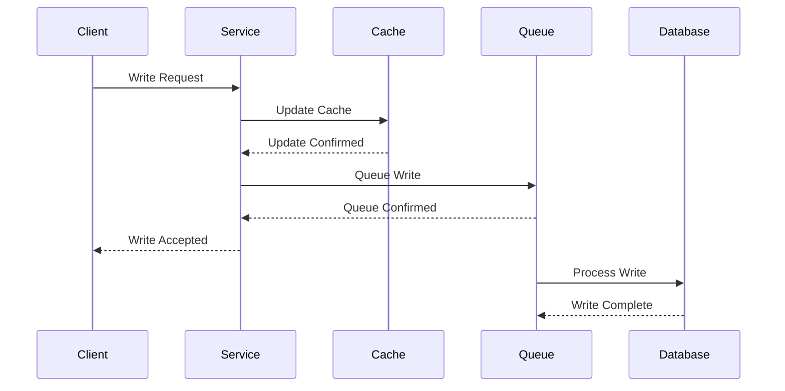
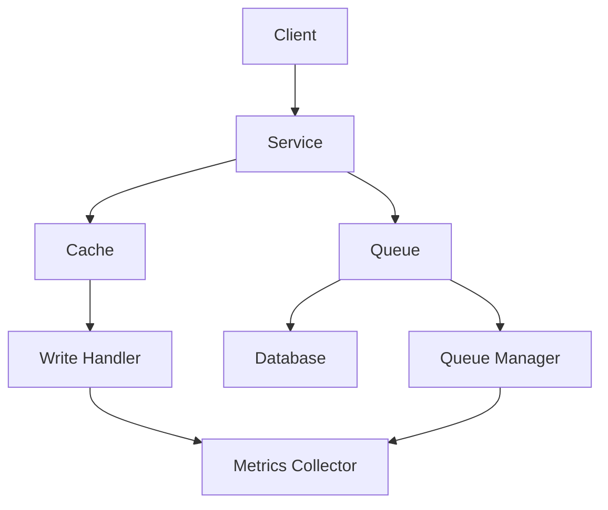

INITIAL CONTEXT FOR LLM - never change the context-----------------------------
-> THIS SECTION IS A GUIDELINE TO THE LLM CONSIDER BEFORE WORKING IN THIS FILE, DO NOT CHANGE THIS

-> GOES OF THE WRITE-BEHIND PATTERN:

- This document describes the Write-Behind pattern used in the microservices architecture
- It covers asynchronous cache updates, write buffering, and performance optimization
- Includes implementation details and configuration examples
- All patterns are implemented and tested in the current architecture
- For LLM-specific guidelines, refer to [LLM Integration Guide](../../../docs/llm/README.md)

-> CONSIDERER BEFORE UPDATING THIS FILE:

- This is a documentation file about the Write-Behind pattern
- Never add fictional dates, version numbers, or metrics
- Changes should be incremental and based on verified information
- Add comments for clarification when needed
- Maintain LLM-friendly format

---

# Write-Behind Pattern

## Context

- When to use: For optimizing write performance and reducing database load
- Problem it solves: Improves write throughput and system responsiveness
- Related patterns: Write-Through, Cache-Aside, Read-Through

## Solution

### Write Operations

- Asynchronous writes
- Write buffering
- Batch processing
- Error handling

Implementation:

```yaml
write_operations:
  asynchronous:
    enabled: true
    queue_size: 1000
    workers: 4
  buffering:
    strategy: memory
    max_size: 100MB
    flush_interval: 5s
  batch_processing:
    enabled: true
    batch_size: 100
    max_delay: 10s
  error_handling:
    retry: true
    max_retries: 3
    dead_letter: true
```

### Cache Management

- Cache updates
- Cache persistence
- Cache recovery
- Cache synchronization

Implementation:

```yaml
cache_management:
  updates:
    strategy: immediate
    persistence: true
    priority: high
  persistence:
    type: disk
    path: /cache/data
    compression: true
  recovery:
    strategy: replay
    checkpoint: true
  synchronization:
    enabled: true
    interval: 60s
```

### Queue Management

- Queue configuration
- Message handling
- Queue monitoring
- Queue recovery

Implementation:

```yaml
queue_management:
  configuration:
    type: kafka
    partitions: 4
    replication: 2
  message_handling:
    batch_size: 100
    timeout: 5s
    retry: true
  monitoring:
    metrics: true
    alerts: true
  recovery:
    strategy: replay
    checkpoint: true
```

### Monitoring and Metrics

- Write latency
- Queue metrics
- Error rates
- Performance impact

Implementation:

```yaml
monitoring:
  metrics:
    - write_latency
    - queue_size
    - error_rate
    - performance_impact
  alerts:
    - queue_full
    - high_latency
    - error_threshold
  thresholds:
    queue_size: 0.8
    latency: 100ms
    error_rate: 0.01
```

## Benefits

- Improved write performance
- Reduced database load
- Better scalability
- System responsiveness
- Resource optimization

## Drawbacks

- Eventual consistency
- Data loss risk
- Complexity
- Monitoring overhead
- Recovery complexity

## Examples

### Write-Behind Flow



### Write-Behind Architecture



## Related Patterns

- Write-Through: For strong consistency
- Cache-Aside: For read-heavy workloads
- Read-Through: For automatic cache population
- Write-Behind: For write optimization
- Cache-Aside with Write-Behind: For hybrid approach

## Notes

- Monitor queue performance
- Handle errors gracefully
- Implement recovery strategies
- Optimize batch processing
- Document write strategies
