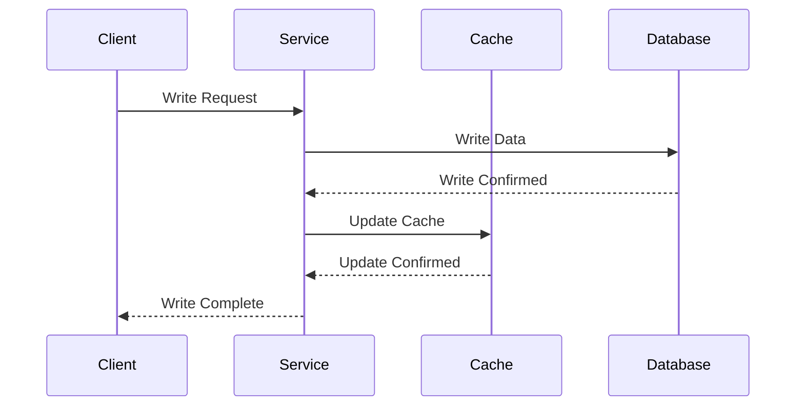
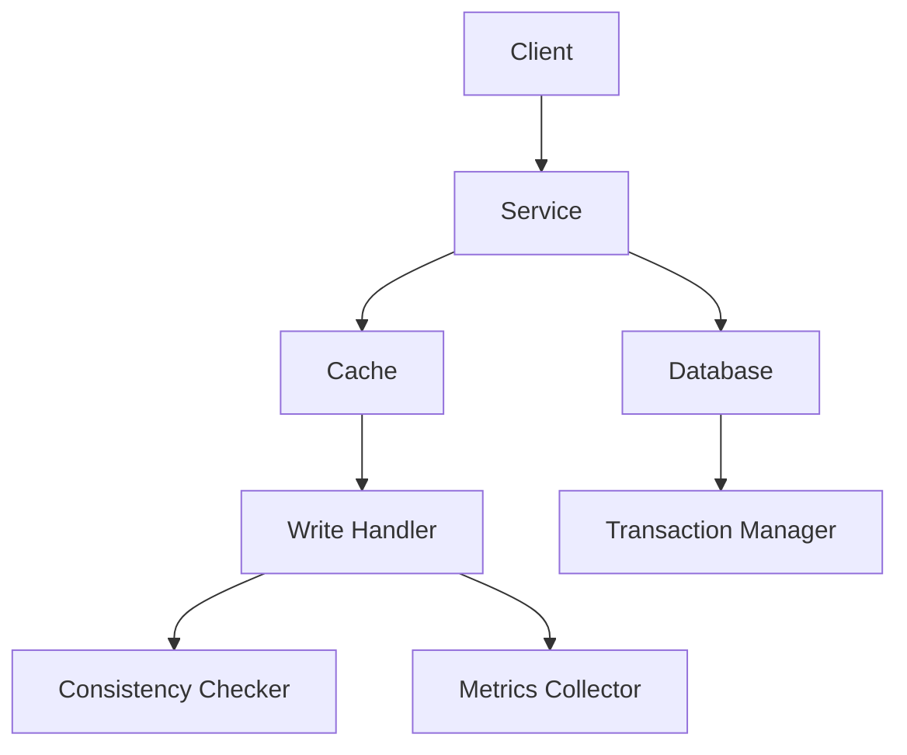

INITIAL CONTEXT FOR LLM - never change the context-----------------------------
-> THIS SECTION IS A GUIDELINE TO THE LLM CONSIDER BEFORE WORKING IN THIS FILE, DO NOT CHANGE THIS

-> GOES OF THE WRITE-THROUGH PATTERN:

- This document describes the Write-Through pattern used in the microservices architecture
- It covers synchronous cache updates, data consistency, and write performance
- Includes implementation details and configuration examples
- All patterns are implemented and tested in the current architecture
- For LLM-specific guidelines, refer to [LLM Integration Guide](../../../docs/llm/README.md)

-> CONSIDERER BEFORE UPDATING THIS FILE:

- This is a documentation file about the Write-Through pattern
- Never add fictional dates, version numbers, or metrics
- Changes should be incremental and based on verified information
- Add comments for clarification when needed
- Maintain LLM-friendly format

---

# Write-Through Pattern

## Context

- When to use: For ensuring immediate cache consistency with the database
- Problem it solves: Maintains strong consistency between cache and database
- Related patterns: Cache-Aside, Write-Behind, Read-Through

## Solution

### Write Operations

- Synchronous writes
- Atomic updates
- Consistency guarantees
- Error handling

Implementation:

```yaml
write_operations:
  synchronous:
    enabled: true
    timeout: 5s
    retry: true
  atomic_updates:
    enabled: true
    transaction: true
  consistency:
    level: strong
    verification: true
  error_handling:
    rollback: true
    notification: true
```

### Cache Management

- Cache updates
- Cache invalidation
- Cache synchronization
- Cache recovery

Implementation:

```yaml
cache_management:
  updates:
    strategy: immediate
    batch_size: 1
    priority: high
  invalidation:
    strategy: none
    event_based: false
  synchronization:
    enabled: true
    check_interval: 30s
  recovery:
    strategy: rebuild
    source: database
```

### Database Operations

- Write operations
- Transaction handling
- Consistency checks
- Performance optimization

Implementation:

```yaml
database_operations:
  writes:
    batch_size: 1
    timeout: 5s
    retry: true
  transactions:
    isolation: serializable
    timeout: 10s
  consistency:
    checks: true
    repair: true
  optimization:
    indexes: true
    compression: true
```

### Monitoring and Metrics

- Write latency
- Cache consistency
- Error rates
- Performance impact

Implementation:

```yaml
monitoring:
  metrics:
    - write_latency
    - cache_consistency
    - error_rate
    - performance_impact
  alerts:
    - high_latency
    - consistency_breach
    - error_threshold
  thresholds:
    latency: 100ms
    error_rate: 0.01
    consistency: 1.0
```

## Benefits

- Strong consistency
- Immediate updates
- Predictable behavior
- Simplified debugging
- Data integrity

## Drawbacks

- Higher write latency
- Increased database load
- Resource consumption
- Complexity
- Performance impact

## Examples

### Write-Through Flow



### Write-Through Architecture



## Related Patterns

- Cache-Aside: For read-heavy workloads
- Write-Behind: For write-heavy workloads
- Read-Through: For automatic cache population
- Write-Through: For strong consistency
- Cache-Aside with Write-Through: For hybrid approach

## Notes

- Monitor write performance
- Handle errors gracefully
- Maintain consistency
- Optimize database operations
- Document write strategies
