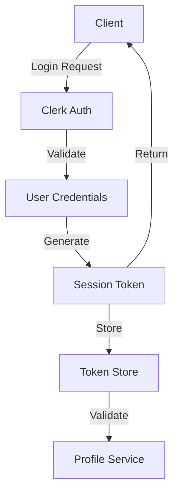
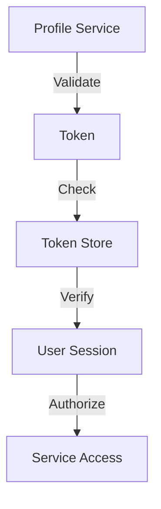

# Authentication Architecture

## Overview

This document outlines the authentication architecture used in the Profile Service Microservices architecture, focusing on Clerk integration and token management.

## Authentication Flow

### 1. User Authentication



#### Authentication Configuration

```yaml
authentication:
  provider: clerk
  configuration:
    - name: clerk_config
      environment: production
      settings:
        api_key: ${CLERK_API_KEY}
        jwt_secret: ${CLERK_JWT_SECRET}
        session_duration: 86400
        token_issuer: clerk.profile-service
        allowed_origins:
          - https://profile-service.com
          - https://api.profile-service.com

  - name: token_config
    settings:
      token_type: JWT
      algorithm: RS256
      expiration: 3600
      refresh_threshold: 300
```

### 2. Token Management



#### Token Configuration

```yaml
token_management:
  - name: token_validation
    type: JWT
    validation:
      - verify_signature
      - check_expiration
      - validate_issuer
      - validate_audience
    claims:
      - sub: user_id
      - iss: clerk.profile-service
      - aud: profile-service
      - exp: expiration_time
      - iat: issued_at

  - name: token_refresh
    type: automatic
    conditions:
      - token_expiring_soon
      - valid_refresh_token
    actions:
      - generate_new_token
      - invalidate_old_token
      - update_session
```

## Authentication Components

### 1. Clerk Integration

```yaml
clerk_integration:
  - name: auth_service
    type: service
    responsibilities:
      - user_authentication
      - session_management
      - token_validation
    endpoints:
      - /auth/login
      - /auth/logout
      - /auth/refresh
      - /auth/validate

  - name: token_service
    type: service
    responsibilities:
      - token_generation
      - token_validation
      - token_refresh
    endpoints:
      - /token/generate
      - /token/validate
      - /token/refresh
```

### 2. Session Management

```yaml
session_management:
  - name: session_store
    type: redis
    configuration:
      - ttl: 86400
      - max_sessions: 1000
      - cleanup_interval: 3600
    data:
      - user_id
      - session_id
      - token
      - created_at
      - expires_at

  - name: session_validation
    type: middleware
    checks:
      - session_exists
      - session_valid
      - token_valid
    actions:
      - refresh_if_needed
      - update_last_active
```

## Security Measures

### 1. Token Security

```yaml
token_security:
  - name: token_protection
    measures:
      - secure_storage
      - http_only_cookies
      - csrf_protection
      - rate_limiting
    configuration:
      - max_attempts: 5
      - window: 300
      - block_duration: 1800

  - name: token_rotation
    policy:
      - rotate_on_compromise
      - rotate_on_period
      - rotate_on_privilege_change
    configuration:
      - rotation_period: 86400
      - max_age: 604800
```

### 2. Access Control

```yaml
access_control:
  - name: rate_limiting
    type: distributed
    limits:
      - endpoint: /auth/login
        rate: 5
        period: 300
      - endpoint: /auth/refresh
        rate: 10
        period: 300

  - name: ip_restrictions
    type: whitelist
    rules:
      - allow: internal_network
      - allow: vpn_network
      - deny: all
```

## Authentication Monitoring

### 1. Authentication Metrics

```yaml
authentication_metrics:
  - name: auth_attempts
    type: counter
    labels:
      - endpoint
      - status
      - user_id
    thresholds:
      warning: 100
      critical: 1000

  - name: token_operations
    type: counter
    labels:
      - operation
      - status
      - user_id
    thresholds:
      warning: 1000
      critical: 10000

  - name: session_metrics
    type: gauge
    labels:
      - status
      - user_id
    thresholds:
      warning: 100
      critical: 1000
```

### 2. Authentication Alerts

```yaml
authentication_alerts:
  - name: auth_failures
    condition: auth_attempts{status="failure"} > 100
    severity: warning
    action: notify_team

  - name: token_abuse
    condition: token_operations{status="invalid"} > 1000
    severity: critical
    action: notify_team

  - name: session_anomaly
    condition: session_metrics{status="active"} > 1000
    severity: warning
    action: notify_team
```

## Authentication Recovery

### 1. Recovery Procedures

```yaml
recovery_procedures:
  - name: token_compromise
    trigger: token_abuse
    steps:
      - invalidate_tokens
      - notify_users
      - force_reauthentication
    timeout: 300s

  - name: session_recovery
    trigger: session_anomaly
    steps:
      - validate_sessions
      - cleanup_invalid
      - notify_affected
    timeout: 600s
```

### 2. Authentication Verification

```yaml
authentication_verification:
  - name: token_verification
    type: validation
    checks:
      - token_validity
      - signature_verification
      - claim_validation
    schedule: real_time

  - name: session_verification
    type: validation
    checks:
      - session_validity
      - token_association
      - user_activity
    schedule: hourly
```

## Notes

- Keep documentation up to date
- Maintain cross-references
- Add practical examples
- Document decisions
- Track changes
- Ensure alignment with global architecture
