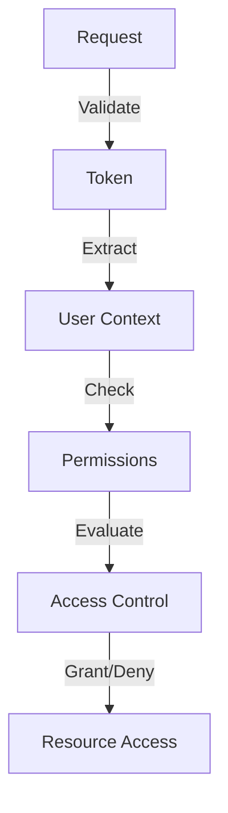
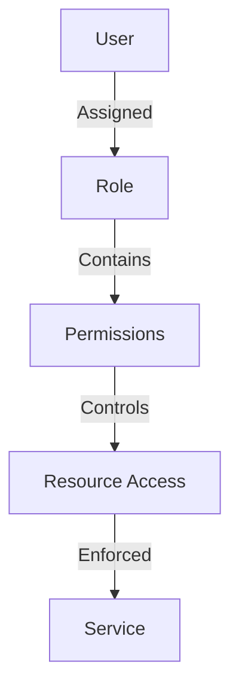

# Authorization Architecture

## Overview

This document outlines the authorization architecture used in the Profile Service Microservices architecture, focusing on role-based access control and permission management.

## Authorization Flow

### 1. Permission Evaluation



#### Authorization Configuration

```yaml
authorization:
  provider: custom
  configuration:
    - name: rbac_config
      environment: production
      settings:
        role_hierarchy: true
        permission_inheritance: true
        default_role: user
        admin_role: admin
        roles:
          - name: admin
            permissions:
              - profile:*
              - settings:*
              - users:*
          - name: user
            permissions:
              - profile:read
              - profile:write
              - settings:read
```

### 2. Role Management



#### Role Configuration

```yaml
role_management:
  - name: role_definitions
    type: hierarchical
    roles:
      - name: admin
        level: 100
        permissions:
          - resource: profile
            actions: [create, read, update, delete]
          - resource: settings
            actions: [read, write]
          - resource: users
            actions: [manage]

      - name: moderator
        level: 50
        permissions:
          - resource: profile
            actions: [read, update]
          - resource: settings
            actions: [read]

      - name: user
        level: 10
        permissions:
          - resource: profile
            actions: [read, update]
          - resource: settings
            actions: [read]
```

## Authorization Components

### 1. Permission Service

```yaml
permission_service:
  - name: permission_manager
    type: service
    responsibilities:
      - permission_evaluation
      - role_management
      - access_control
    endpoints:
      - /permissions/check
      - /permissions/grant
      - /permissions/revoke
      - /roles/assign

  - name: policy_enforcer
    type: service
    responsibilities:
      - policy_evaluation
      - access_decision
      - audit_logging
    endpoints:
      - /policy/evaluate
      - /policy/audit
      - /policy/log
```

### 2. Access Control

```yaml
access_control:
  - name: resource_policies
    type: policy
    resources:
      - name: profile
        actions:
          - read:
              roles: [user, moderator, admin]
              conditions:
                - owner
                - public
          - write:
              roles: [user, admin]
              conditions:
                - owner
          - delete:
              roles: [admin]
              conditions:
                - owner

      - name: settings
        actions:
          - read:
              roles: [user, moderator, admin]
          - write:
              roles: [admin]
```

## Security Measures

### 1. Permission Security

```yaml
permission_security:
  - name: permission_protection
    measures:
      - role_validation
      - permission_verification
      - access_auditing
    configuration:
      - max_roles: 10
      - max_permissions: 100
      - audit_logging: true

  - name: role_protection
    policy:
      - validate_assignments
      - audit_changes
      - enforce_hierarchy
    configuration:
      - min_role_level: 1
      - max_role_level: 100
      - require_approval: true
```

### 2. Access Enforcement

```yaml
access_enforcement:
  - name: policy_enforcement
    type: distributed
    rules:
      - resource: profile
        action: read
        enforcement: immediate
      - resource: profile
        action: write
        enforcement: immediate
      - resource: settings
        action: read
        enforcement: cached

  - name: access_validation
    type: middleware
    checks:
      - role_valid
      - permission_valid
      - conditions_met
    actions:
      - enforce_policy
      - log_access
```

## Authorization Monitoring

### 1. Authorization Metrics

```yaml
authorization_metrics:
  - name: permission_checks
    type: counter
    labels:
      - resource
      - action
      - result
    thresholds:
      warning: 1000
      critical: 10000

  - name: role_operations
    type: counter
    labels:
      - operation
      - role
      - status
    thresholds:
      warning: 100
      critical: 1000

  - name: access_decisions
    type: counter
    labels:
      - decision
      - resource
      - user
    thresholds:
      warning: 1000
      critical: 10000
```

### 2. Authorization Alerts

```yaml
authorization_alerts:
  - name: permission_violations
    condition: permission_checks{result="denied"} > 100
    severity: warning
    action: notify_team

  - name: role_abuse
    condition: role_operations{status="invalid"} > 10
    severity: critical
    action: notify_team

  - name: access_anomaly
    condition: access_decisions{decision="deny"} > 1000
    severity: warning
    action: notify_team
```

## Authorization Recovery

### 1. Recovery Procedures

```yaml
recovery_procedures:
  - name: permission_recovery
    trigger: permission_violation
    steps:
      - revoke_permissions
      - notify_users
      - force_reauthorization
    timeout: 300s

  - name: role_recovery
    trigger: role_abuse
    steps:
      - validate_roles
      - cleanup_invalid
      - notify_affected
    timeout: 600s
```

### 2. Authorization Verification

```yaml
authorization_verification:
  - name: permission_verification
    type: validation
    checks:
      - permission_validity
      - role_assignment
      - access_rights
    schedule: real_time

  - name: role_verification
    type: validation
    checks:
      - role_validity
      - permission_assignment
      - hierarchy_compliance
    schedule: hourly
```

## Notes

- Keep documentation up to date
- Maintain cross-references
- Add practical examples
- Document decisions
- Track changes
- Ensure alignment with global architecture
