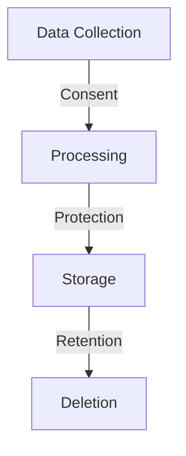

# Compliance Requirements

## Overview

This document outlines the compliance requirements for the Profile Service Microservices architecture, focusing on regulatory compliance, data protection standards, and audit requirements.

## Regulatory Compliance

### 1. Data Protection Regulations



#### GDPR Compliance

```yaml
gdpr_compliance:
  - name: data_protection
    requirements:
      - data_minimization
      - purpose_limitation
      - storage_limitation
    implementation:
      - consent_management:
          - explicit_consent
          - consent_tracking
          - withdrawal_process
      - data_retention:
          - retention_periods
          - deletion_policy
          - data_export

  - name: user_rights
    requirements:
      - right_to_access
      - right_to_rectification
      - right_to_erasure
    implementation:
      - access_mechanism:
          - data_export
          - data_correction
          - data_deletion
      - response_time:
          - access: 30d
          - rectification: 15d
          - erasure: 30d
```

### 2. Industry Standards

```yaml
industry_standards:
  - name: iso_27001
    requirements:
      - information_security
      - risk_management
      - asset_management
    controls:
      - access_control
      - cryptography
      - operations_security

  - name: pci_dss
    requirements:
      - secure_network
      - data_protection
      - access_control
    implementation:
      - network_security:
          - firewall_configuration
          - encryption_standards
      - data_protection:
          - encryption_requirements
          - key_management
```

## Data Protection

### 1. Data Classification

```yaml
data_classification:
  - name: classification_levels
    levels:
      - public:
          - definition: publicly_accessible
          - handling: standard_security
      - internal:
          - definition: company_internal
          - handling: enhanced_security
      - confidential:
          - definition: sensitive_data
          - handling: strict_security
      - restricted:
          - definition: highly_sensitive
          - handling: maximum_security

  - name: data_handling
    requirements:
      - classification_marking
      - access_controls
      - encryption_requirements
    implementation:
      - marking_system:
          - metadata_tags
          - visual_indicators
      - handling_procedures:
          - storage_requirements
          - transmission_requirements
```

### 2. Data Privacy

```yaml
data_privacy:
  - name: privacy_controls
    requirements:
      - data_minimization
      - purpose_limitation
      - storage_limitation
    implementation:
      - data_collection:
          - consent_required
          - purpose_specified
          - minimum_necessary
      - data_processing:
          - authorized_use
          - access_controls
          - audit_trail

  - name: privacy_by_design
    principles:
      - proactive_not_reactive
      - privacy_as_default
      - privacy_embedded
    implementation:
      - system_design:
          - privacy_first
          - data_protection
          - user_control
      - development:
          - privacy_requirements
          - security_measures
          - user_interface
```

## Audit Requirements

### 1. Audit Trail

```yaml
audit_trail:
  - name: logging_requirements
    requirements:
      - comprehensive_logging
      - secure_storage
      - retention_period
    implementation:
      - log_events:
          - authentication
          - authorization
          - data_access
          - configuration_changes
      - log_attributes:
          - timestamp
          - user_id
          - action
          - resource
          - result

  - name: audit_review
    requirements:
      - regular_review
      - anomaly_detection
      - incident_investigation
    implementation:
      - review_process:
          - automated_analysis
          - manual_review
          - incident_response
      - reporting:
          - compliance_reports
          - security_reports
          - incident_reports
```

### 2. Compliance Monitoring

```yaml
compliance_monitoring:
  - name: continuous_monitoring
    requirements:
      - real_time_monitoring
      - automated_checks
      - alert_generation
    implementation:
      - monitoring_areas:
          - security_controls
          - access_patterns
          - data_usage
      - alert_conditions:
          - policy_violations
          - security_breaches
          - compliance_issues

  - name: compliance_reporting
    requirements:
      - regular_reporting
      - evidence_collection
      - documentation
    implementation:
      - report_types:
          - compliance_status
          - security_status
          - incident_reports
      - reporting_frequency:
          - daily: security_alerts
          - weekly: compliance_status
          - monthly: detailed_reports
```

## Compliance Documentation

### 1. Policy Documentation

```yaml
policy_documentation:
  - name: security_policies
    requirements:
      - comprehensive_coverage
      - clear_language
      - regular_updates
    policies:
      - data_protection
      - access_control
      - incident_response
      - security_awareness

  - name: procedure_documentation
    requirements:
      - step_by_step
      - practical_examples
      - regular_review
    procedures:
      - incident_handling
      - access_management
      - data_processing
      - security_controls
```

### 2. Compliance Records

```yaml
compliance_records:
  - name: evidence_collection
    requirements:
      - comprehensive_records
      - secure_storage
      - easy_retrieval
    records:
      - audit_logs
      - security_incidents
      - policy_changes
      - training_records

  - name: record_management
    requirements:
      - retention_periods
      - secure_storage
      - access_controls
    implementation:
      - storage:
          - encrypted_storage
          - backup_procedures
          - access_controls
      - retention:
          - minimum_periods
          - disposal_procedures
          - archive_policy
```

## Notes

- Keep documentation up to date
- Maintain cross-references
- Add practical examples
- Document decisions
- Track changes
- Ensure alignment with global architecture
