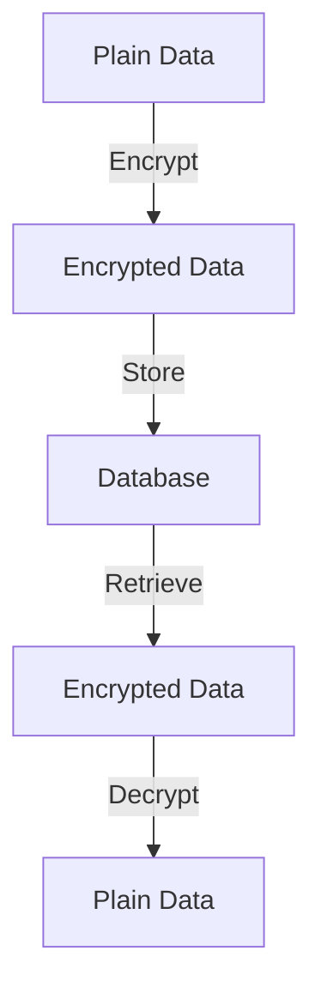
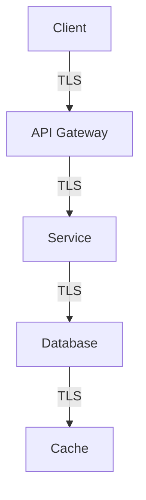

# Encryption Patterns

## Overview

This document outlines the encryption patterns used in the Profile Service Microservices architecture, focusing on data protection and secure communication.

## Encryption Types

### 1. Data Encryption



#### Data Encryption Configuration

```yaml
data_encryption:
  - name: profile_data
    type: aes_256_gcm
    configuration:
      - algorithm: AES-256-GCM
      - key_size: 256
      - iv_size: 96
      - tag_size: 128
    storage:
      - encrypted_fields:
          - email
          - phone
          - address
      - key_rotation: 90d
      - backup_keys: true

  - name: sensitive_data
    type: field_level
    configuration:
      - algorithm: AES-256-GCM
      - key_size: 256
      - iv_size: 96
    fields:
      - name: ssn
        type: string
        encryption: required
      - name: credit_card
        type: string
        encryption: required
```

### 2. Transport Encryption



#### Transport Configuration

```yaml
transport_encryption:
  - name: tls_config
    type: tls_1_3
    configuration:
      - min_version: TLSv1.3
      - cipher_suites:
          - TLS_AES_256_GCM_SHA384
          - TLS_CHACHA20_POLY1305_SHA256
      - certificate_authority: internal
      - client_authentication: required

  - name: service_tls
    type: mutual_tls
    configuration:
      - certificate_rotation: 30d
      - key_size: 4096
      - signature_algorithm: SHA-512
```

## Key Management

### 1. Key Storage

```yaml
key_management:
  - name: key_store
    type: hsm
    configuration:
      - provider: aws_kms
      - region: us-west-2
      - key_type: symmetric
      - rotation: automatic
    security:
      - access_control: strict
      - audit_logging: enabled
      - backup: enabled

  - name: key_rotation
    type: automatic
    configuration:
      - interval: 90d
      - overlap: 7d
      - backup: true
    process:
      - generate_new_key
      - reencrypt_data
      - verify_encryption
      - archive_old_key
```

### 2. Key Access

```yaml
key_access:
  - name: key_policy
    type: iam
    configuration:
      - access_levels:
          - admin: full_access
          - operator: read_only
          - service: limited_access
      - audit_logging: enabled
      - mfa_required: true

  - name: key_usage
    type: restricted
    configuration:
      - max_operations: 1000
      - time_window: 3600
      - rate_limiting: enabled
```

## Encryption Patterns

### 1. Data at Rest

```yaml
data_at_rest:
  - name: database_encryption
    type: transparent
    configuration:
      - algorithm: AES-256
      - key_management: kms
      - encryption_mode: cbc
    tables:
      - name: profiles
        encrypted_columns:
          - email
          - phone
          - address

  - name: file_encryption
    type: file_system
    configuration:
      - algorithm: AES-256-GCM
      - key_management: kms
      - file_types:
          - .pem
          - .key
          - .cert
```

### 2. Data in Transit

```yaml
data_in_transit:
  - name: service_encryption
    type: tls
    configuration:
      - protocol: tls_1_3
      - certificate_authority: internal
      - client_authentication: required
    services:
      - name: profile_service
        endpoints:
          - /api/v1/*
          - /internal/*

  - name: message_encryption
    type: end_to_end
    configuration:
      - algorithm: AES-256-GCM
      - key_exchange: ECDH
      - perfect_forward_secrecy: true
```

## Security Measures

### 1. Encryption Security

```yaml
encryption_security:
  - name: key_protection
    measures:
      - hardware_security_module
      - access_control
      - audit_logging
    configuration:
      - max_attempts: 3
      - lockout_duration: 3600
      - require_mfa: true

  - name: data_protection
    policy:
      - encrypt_sensitive_data
      - secure_key_storage
      - regular_audits
    configuration:
      - encryption_required: true
      - key_rotation: 90d
      - audit_frequency: 30d
```

### 2. Compliance Requirements

```yaml
compliance_requirements:
  - name: data_protection
    standards:
      - gdpr
      - hipaa
      - pci_dss
    requirements:
      - encryption_at_rest
      - encryption_in_transit
      - key_management
      - audit_logging

  - name: security_controls
    measures:
      - access_control
      - monitoring
      - incident_response
    documentation:
      - policies
      - procedures
      - audit_trails
```

## Encryption Monitoring

### 1. Encryption Metrics

```yaml
encryption_metrics:
  - name: encryption_operations
    type: counter
    labels:
      - operation
      - algorithm
      - status
    thresholds:
      warning: 1000
      critical: 10000

  - name: key_operations
    type: counter
    labels:
      - operation
      - key_id
      - status
    thresholds:
      warning: 100
      critical: 1000

  - name: encryption_errors
    type: counter
    labels:
      - error_type
      - severity
    thresholds:
      warning: 10
      critical: 100
```

### 2. Encryption Alerts

```yaml
encryption_alerts:
  - name: encryption_failures
    condition: encryption_operations{status="failure"} > 10
    severity: critical
    action: notify_team

  - name: key_issues
    condition: key_operations{status="error"} > 5
    severity: critical
    action: notify_team

  - name: compliance_violation
    condition: encryption_errors{severity="high"} > 0
    severity: critical
    action: notify_team
```

## Encryption Recovery

### 1. Recovery Procedures

```yaml
recovery_procedures:
  - name: key_recovery
    trigger: key_compromise
    steps:
      - revoke_key
      - generate_new_key
      - reencrypt_data
      - verify_encryption
    timeout: 3600s

  - name: data_recovery
    trigger: encryption_failure
    steps:
      - identify_affected
      - restore_backup
      - verify_integrity
      - resume_operations
    timeout: 7200s
```

### 2. Encryption Verification

```yaml
encryption_verification:
  - name: key_verification
    type: validation
    checks:
      - key_validity
      - key_usage
      - key_rotation
    schedule: daily

  - name: data_verification
    type: validation
    checks:
      - encryption_status
      - data_integrity
      - compliance_status
    schedule: weekly
```

## Notes

- Keep documentation up to date
- Maintain cross-references
- Add practical examples
- Document decisions
- Track changes
- Ensure alignment with global architecture
