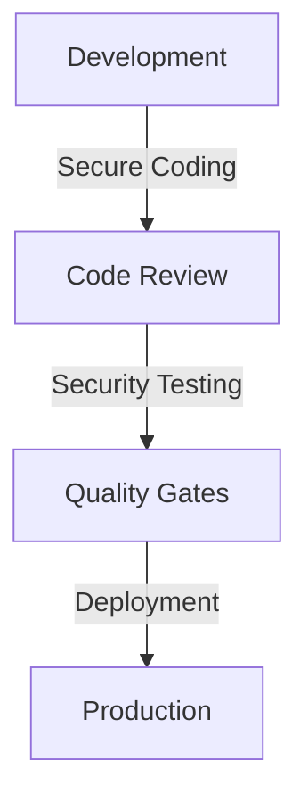

# Security Best Practices

## Overview

This document outlines the security best practices used in the Profile Service Microservices architecture, focusing on secure development, deployment, and operations.

## Secure Development

### 1. Code Security



#### Secure Coding Standards

```yaml
secure_coding:
  - name: input_validation
    rules:
      - validate_all_inputs
      - sanitize_user_data
      - prevent_injection
    examples:
      - sql_injection:
          pattern: "SELECT.*FROM.*WHERE.*=.*"
          prevention: parameterized_queries
      - xss:
          pattern: "<script>.*</script>"
          prevention: output_encoding

  - name: authentication_checks
    rules:
      - verify_identity
      - validate_tokens
      - check_permissions
    implementation:
      - middleware: auth_check
      - validation: token_verify
      - enforcement: permission_check
```

### 2. Dependency Management

```yaml
dependency_security:
  - name: package_management
    tools:
      - npm_audit
      - snyk
      - dependabot
    configuration:
      - auto_update: true
      - security_scan: daily
      - vulnerability_check: true

  - name: container_security
    tools:
      - trivy
      - clair
      - anchore
    configuration:
      - base_image: distroless
      - scan_frequency: daily
      - severity_threshold: high
```

## Secure Configuration

### 1. Environment Security

```yaml
environment_security:
  - name: secrets_management
    provider: vault
    configuration:
      - encryption: aes_256_gcm
      - rotation: 90d
      - access_control: rbac
    secrets:
      - api_keys
      - certificates
      - credentials

  - name: configuration_security
    rules:
      - no_hardcoded_secrets
      - encrypted_configs
      - secure_defaults
    implementation:
      - config_encryption: true
      - secret_injection: true
      - audit_logging: true
```

### 2. Network Security

```yaml
network_security:
  - name: network_policies
    type: kubernetes
    configuration:
      - ingress_rules:
          - allow: /api/v1/*
          - deny: /internal/*
      - egress_rules:
          - allow: required_services
          - deny: all

  - name: service_mesh
    type: istio
    configuration:
      - mTLS: required
      - traffic_encryption: true
      - access_control: enabled
```

## Secure Operations

### 1. Monitoring and Logging

```yaml
security_monitoring:
  - name: security_logs
    type: centralized
    configuration:
      - collection: fluentd
      - storage: elasticsearch
      - analysis: kibana
    logs:
      - authentication
      - authorization
      - access_control

  - name: security_alerts
    type: real_time
    configuration:
      - detection: wazuh
      - notification: pagerduty
      - response: automated
    alerts:
      - failed_logins
      - permission_changes
      - configuration_changes
```

### 2. Incident Response

```yaml
incident_response:
  - name: response_plan
    type: automated
    configuration:
      - detection: automated
      - response: automated
      - recovery: manual
    procedures:
      - identify_incident
      - contain_threat
      - eradicate_cause
      - recover_systems

  - name: security_playbooks
    type: documented
    configuration:
      - format: markdown
      - versioning: git
      - review: monthly
    playbooks:
      - data_breach
      - service_compromise
      - configuration_breach
```

## Security Testing

### 1. Automated Testing

```yaml
security_testing:
  - name: static_analysis
    tools:
      - sonarqube
      - codeql
      - bandit
    configuration:
      - scan_frequency: daily
      - severity_threshold: high
      - auto_fix: true

  - name: dynamic_analysis
    tools:
      - zap
      - burp
      - nikto
    configuration:
      - scan_frequency: weekly
      - coverage: full
      - reporting: automated
```

### 2. Penetration Testing

```yaml
penetration_testing:
  - name: security_assessment
    type: regular
    configuration:
      - frequency: quarterly
      - scope: full
      - reporting: detailed
    areas:
      - api_security
      - authentication
      - authorization
      - data_protection

  - name: vulnerability_management
    type: continuous
    configuration:
      - scanning: automated
      - prioritization: risk_based
      - remediation: tracked
    process:
      - identify
      - assess
      - remediate
      - verify
```

## Security Training

### 1. Developer Training

```yaml
security_training:
  - name: secure_coding
    type: mandatory
    configuration:
      - frequency: quarterly
      - format: online
      - assessment: required
    topics:
      - input_validation
      - authentication
      - authorization
      - encryption

  - name: security_awareness
    type: ongoing
    configuration:
      - frequency: monthly
      - format: newsletter
      - engagement: tracked
    content:
      - best_practices
      - case_studies
      - security_updates
```

### 2. Operational Training

```yaml
operational_training:
  - name: incident_response
    type: hands_on
    configuration:
      - frequency: bi_annual
      - format: workshop
      - simulation: required
    scenarios:
      - data_breach
      - service_compromise
      - configuration_breach

  - name: security_procedures
    type: documented
    configuration:
      - format: wiki
      - review: monthly
      - update: as_needed
    procedures:
      - access_management
      - configuration_management
      - incident_handling
```

## Notes

- Keep documentation up to date
- Maintain cross-references
- Add practical examples
- Document decisions
- Track changes
- Ensure alignment with global architecture
