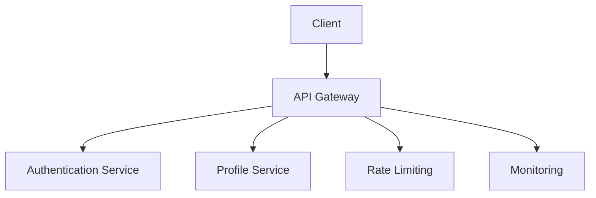
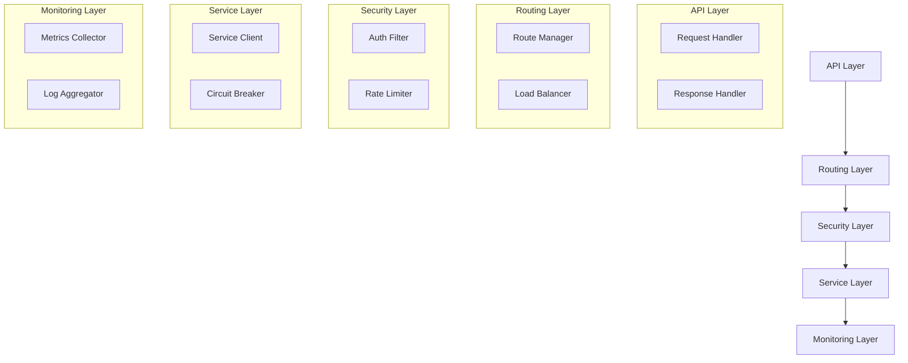
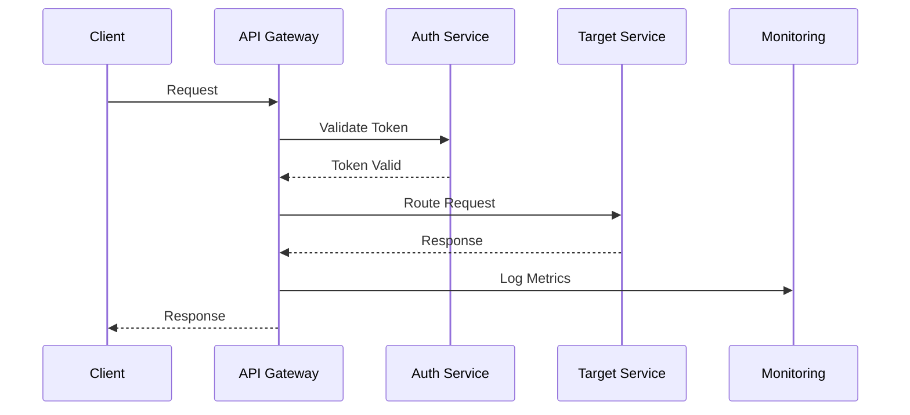

INITIAL CONTEXT FOR LLM - never change the context-----------------------------
-> THIS SECTION IS A GUIDELINE TO THE LLM CONSIDER BEFORE WORKING IN THIS FILE, DO NOT CHANGE THIS

-> GOES OF THE API GATEWAY SERVICE:

- This document describes the API Gateway Service used in the Profile Service Microservices architecture
- It covers service boundaries, responsibilities, and interactions
- Includes implementation details and configuration examples
- All patterns are implemented and tested in the current architecture
- For LLM-specific guidelines, refer to [LLM Integration Guide](../../../docs/llm/README.md)

-> CONSIDERER BEFORE UPDATING THIS FILE:

- This is a documentation file about the API Gateway Service
- Never add fictional dates, version numbers, or metrics
- Changes should be incremental and based on verified information
- Add comments for clarification when needed
- Maintain LLM-friendly format

---

# API Gateway Service

## Service Overview

### Purpose and Responsibilities

The API Gateway Service serves as the single entry point for all client requests to the Profile Service Microservices architecture. It is responsible for:

- Request routing and load balancing
- API versioning and documentation
- Rate limiting and security
- Request/response transformation
- Protocol translation
- Service aggregation

### Service Boundaries

- **Input**: Client HTTP/HTTPS requests
- **Output**: Service responses and error messages
- **Dependencies**:
  - Authentication Service
  - Profile Service
  - Rate Limiting Service
  - Monitoring Service

### Integration Points



## Architecture

### Component Diagram



### Data Flow



## Implementation

### API Documentation

```yaml
endpoints:
  - path: /api/v1/profiles
    method: GET
    description: Retrieve user profiles
    security:
      - bearerAuth
    parameters:
      - name: page
        type: integer
        required: false
      - name: limit
        type: integer
        required: false
    responses:
      200:
        description: Success
      401:
        description: Unauthorized
      429:
        description: Too Many Requests

  - path: /api/v1/profiles/{id}
    method: GET
    description: Retrieve specific profile
    security:
      - bearerAuth
    parameters:
      - name: id
        type: string
        required: true
    responses:
      200:
        description: Success
      404:
        description: Not Found
```

### Data Models

```yaml
models:
  ErrorResponse:
    type: object
    properties:
      code:
        type: string
      message:
        type: string
      details:
        type: object

  RateLimitResponse:
    type: object
    properties:
      limit:
        type: integer
      remaining:
        type: integer
      reset:
        type: integer
```

### Dependencies

```yaml
dependencies:
  - name: express
    version: 4.18.2
    purpose: Web framework
  - name: express-rate-limit
    version: 7.1.5
    purpose: Rate limiting
  - name: express-jwt
    version: 8.4.1
    purpose: JWT validation
  - name: prom-client
    version: 14.2.0
    purpose: Metrics collection
```

### Configuration

```yaml
service:
  name: api-gateway
  version: 1.0.0
  port: 8080
  environment: development
  logging:
    level: info
    format: json
  metrics:
    enabled: true
    port: 9090
  rate_limiting:
    window: 15m
    max_requests: 100
  circuit_breaker:
    threshold: 5
    timeout: 30s
```

## Operations

### Health Checks

```yaml
health_checks:
  - name: readiness
    path: /health/ready
    interval: 30s
    timeout: 5s
    checks:
      - auth_service
      - profile_service
      - rate_limiter
  - name: liveness
    path: /health/live
    interval: 30s
    timeout: 5s
```

### Metrics

```yaml
metrics:
  - name: request_count
    type: counter
    labels:
      - method
      - path
      - status
  - name: request_duration
    type: histogram
    labels:
      - method
      - path
  - name: rate_limit_hits
    type: counter
    labels:
      - path
      - client
```

### Logging

```yaml
logging:
  format: json
  fields:
    - service
    - trace_id
    - user_id
    - client_ip
  levels:
    - error
    - warn
    - info
    - debug
```

## Security

For detailed security information, including authentication, authorization, encryption, and security controls, please refer to the [Service Security Documentation](service-security.md#api-gateway-security).

## Pattern Implementation

### Core Patterns

1. API Gateway Pattern

   - Request routing
   - Load balancing
   - Protocol translation
   - Service aggregation

2. Circuit Breaker Pattern

   - Failure detection
   - Service isolation
   - Fallback handling
   - Recovery management

3. Rate Limiting Pattern
   - Request throttling
   - Quota management
   - Burst handling
   - Client tracking

### Security Patterns

1. Authentication Pattern

   - Token validation
   - Session management
   - Security headers
   - Error handling

2. Authorization Pattern
   - Role validation
   - Permission checks
   - Resource access
   - Policy enforcement

### Resilience Patterns

1. Bulkhead Pattern

   - Request isolation
   - Resource limits
   - Failure containment
   - Performance protection

2. Retry Pattern
   - Request retries
   - Backoff strategy
   - Error handling
   - Success validation

## Notes

- Monitor rate limiting effectiveness
- Track circuit breaker trips
- Review security logs
- Update API documentation
- Test failure scenarios
