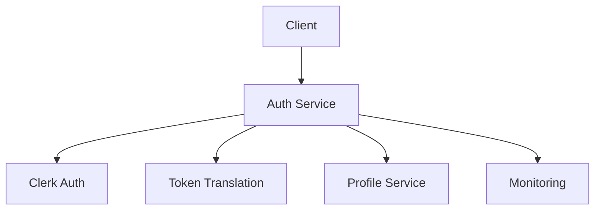
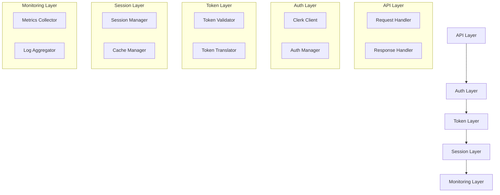
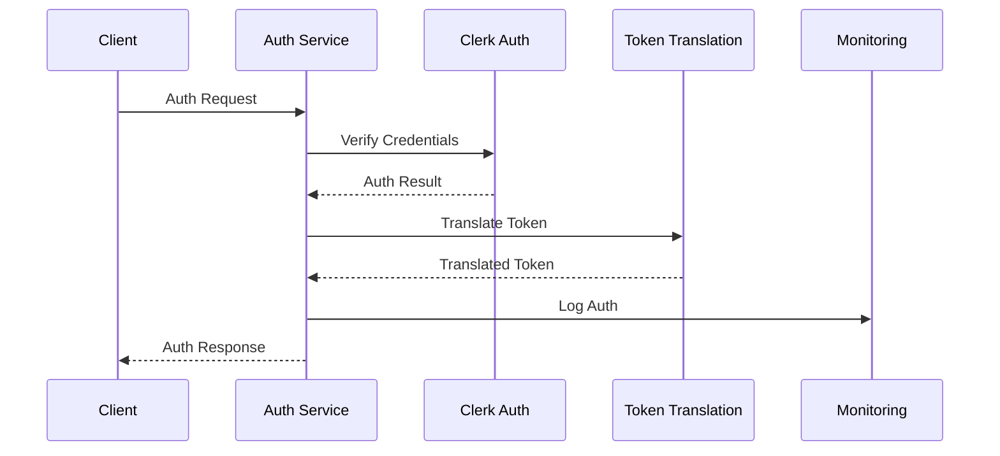

INITIAL CONTEXT FOR LLM - never change the context-----------------------------
-> THIS SECTION IS A GUIDELINE TO THE LLM CONSIDER BEFORE WORKING IN THIS FILE, DO NOT CHANGE THIS

-> GOES OF THE AUTHENTICATION SERVICE:

- This document describes the Authentication Service used in the Profile Service Microservices architecture
- It covers service boundaries, responsibilities, and interactions
- Includes implementation details and configuration examples
- All patterns are implemented and tested in the current architecture
- For LLM-specific guidelines, refer to [LLM Integration Guide](../../../docs/llm/README.md)

-> CONSIDERER BEFORE UPDATING THIS FILE:

- This is a documentation file about the Authentication Service
- Never add fictional dates, version numbers, or metrics
- Changes should be incremental and based on verified information
- Add comments for clarification when needed
- Maintain LLM-friendly format

---

# Authentication Service

## Service Overview

### Purpose and Responsibilities

The Authentication Service manages user authentication and authorization in the Profile Service Microservices architecture. It is responsible for:

- Clerk-based authentication
- Token management and validation
- User session handling
- Security enforcement
- Identity verification
- Access control

### Service Boundaries

- **Input**: Authentication requests, token validation requests
- **Output**: Authentication responses, token validation results
- **Dependencies**:
  - Clerk Authentication
  - Token Translation Service
  - Profile Service
  - Monitoring Service

### Integration Points



## Architecture

### Component Diagram



### Data Flow



## Implementation

### API Documentation

```yaml
endpoints:
  - path: /api/v1/auth/login
    method: POST
    description: User login
    request:
      type: object
      properties:
        email:
          type: string
        password:
          type: string
    responses:
      200:
        description: Success
      401:
        description: Invalid credentials
      429:
        description: Too many attempts

  - path: /api/v1/auth/validate
    method: POST
    description: Validate token
    request:
      type: object
      properties:
        token:
          type: string
    responses:
      200:
        description: Valid token
      401:
        description: Invalid token
```

### Data Models

```yaml
models:
  AuthRequest:
    type: object
    properties:
      email:
        type: string
      password:
        type: string

  AuthResponse:
    type: object
    properties:
      token:
        type: string
      refresh_token:
        type: string
      expires_in:
        type: integer

  TokenValidation:
    type: object
    properties:
      valid:
        type: boolean
      user_id:
        type: string
      permissions:
        type: array
        items:
          type: string
```

### Dependencies

```yaml
dependencies:
  - name: @clerk/clerk-sdk-node
    version: 4.0.0
    purpose: Clerk integration
  - name: jsonwebtoken
    version: 9.0.0
    purpose: JWT handling
  - name: redis
    version: 4.6.0
    purpose: Session storage
  - name: prom-client
    version: 14.2.0
    purpose: Metrics collection
```

### Configuration

```yaml
service:
  name: auth-service
  version: 1.0.0
  port: 8081
  environment: development
  clerk:
    secret_key: ${CLERK_SECRET_KEY}
    publishable_key: ${CLERK_PUBLISHABLE_KEY}
  token:
    algorithm: RS256
    expires_in: 3600
    refresh_expires_in: 604800
  session:
    storage: redis
    ttl: 3600
  logging:
    level: info
    format: json
  metrics:
    enabled: true
    port: 9091
```

## Operations

### Health Checks

```yaml
health_checks:
  - name: readiness
    path: /health/ready
    interval: 30s
    timeout: 5s
    checks:
      - clerk_connection
      - redis_connection
      - token_service
  - name: liveness
    path: /health/live
    interval: 30s
    timeout: 5s
```

### Metrics

```yaml
metrics:
  - name: auth_attempts
    type: counter
    labels:
      - method
      - status
  - name: token_validations
    type: counter
    labels:
      - status
  - name: session_operations
    type: counter
    labels:
      - operation
      - status
```

### Logging

```yaml
logging:
  format: json
  fields:
    - service
    - trace_id
    - user_id
    - auth_method
  levels:
    - error
    - warn
    - info
    - debug
```

## Security

For detailed security information, including authentication, authorization, encryption, and security controls, please refer to the [Service Security Documentation](service-security.md#auth-service-security).

## Pattern Implementation

### Core Patterns

1. Authentication Pattern

   - Identity verification
   - Session management
   - Token handling
   - Security enforcement

2. Token Translation Pattern
   - Token conversion
   - Format adaptation
   - Validation rules
   - Error handling

### Security Patterns

1. Authentication Pattern

   - Multi-factor auth
   - Session management
   - Token validation
   - Security headers

2. Authorization Pattern
   - Role validation
   - Permission checks
   - Resource access
   - Policy enforcement

### Resilience Patterns

1. Circuit Breaker Pattern

   - Failure detection
   - Service isolation
   - Fallback handling
   - Recovery management

2. Retry Pattern
   - Auth retries
   - Backoff strategy
   - Error handling
   - Success validation

## Notes

- Monitor auth attempts
- Track token validations
- Review security logs
- Update auth policies
- Test failure scenarios
