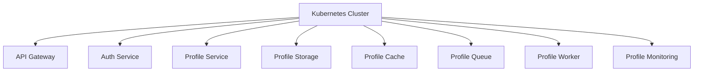

INITIAL CONTEXT FOR LLM - never change the context-----------------------------
-> THIS SECTION IS A GUIDELINE TO THE LLM CONSIDER BEFORE WORKING IN THIS FILE, DO NOT CHANGE THIS

-> GOES OF THE SERVICE DEPLOYMENT DOCUMENTATION:

- This document describes the deployment of services in the Profile Service Microservices project
- Each service's deployment should be clearly defined
- Documentation should be clear, concise, and LLM-friendly
- All deployment configurations should be well-documented with examples
- Cross-references should be maintained between related services

-> CONSIDERER BEFORE UPDATING THIS FILE:

- This is a documentation file about service deployment
- Never add fictional dates, version numbers, or metrics
- Changes should be incremental and based on verified information
- Add comments for clarification when needed
- Maintain LLM-friendly format

---

# Service Deployment

## Deployment Overview



## Deployment Configurations

### 1. API Gateway Deployment

```yaml
apiVersion: apps/v1
kind: Deployment
metadata:
  name: api-gateway
spec:
  replicas: 3
  selector:
    matchLabels:
      app: api-gateway
  template:
    metadata:
      labels:
        app: api-gateway
    spec:
      containers:
        - name: api-gateway
          image: profile-service/api-gateway:latest
          ports:
            - containerPort: 8080
          resources:
            requests:
              cpu: "100m"
              memory: "128Mi"
            limits:
              cpu: "500m"
              memory: "512Mi"
          env:
            - name: AUTH_SERVICE_URL
              value: "http://auth-service:8080"
            - name: PROFILE_SERVICE_URL
              value: "http://profile-service:8080"
          livenessProbe:
            httpGet:
              path: /health
              port: 8080
          readinessProbe:
            httpGet:
              path: /ready
              port: 8080
```

### 2. Auth Service Deployment

```yaml
apiVersion: apps/v1
kind: Deployment
metadata:
  name: auth-service
spec:
  replicas: 3
  selector:
    matchLabels:
      app: auth-service
  template:
    metadata:
      labels:
        app: auth-service
    spec:
      containers:
        - name: auth-service
          image: profile-service/auth-service:latest
          ports:
            - containerPort: 8080
          resources:
            requests:
              cpu: "100m"
              memory: "128Mi"
            limits:
              cpu: "500m"
              memory: "512Mi"
          env:
            - name: JWT_SECRET
              valueFrom:
                secretKeyRef:
                  name: auth-secrets
                  key: jwt-secret
          livenessProbe:
            httpGet:
              path: /health
              port: 8080
          readinessProbe:
            httpGet:
              path: /ready
              port: 8080
```

### 3. Profile Service Deployment

```yaml
apiVersion: apps/v1
kind: Deployment
metadata:
  name: profile-service
spec:
  replicas: 3
  selector:
    matchLabels:
      app: profile-service
  template:
    metadata:
      labels:
        app: profile-service
    spec:
      containers:
        - name: profile-service
          image: profile-service/profile-service:latest
          ports:
            - containerPort: 8080
          resources:
            requests:
              cpu: "100m"
              memory: "128Mi"
            limits:
              cpu: "500m"
              memory: "512Mi"
          env:
            - name: STORAGE_SERVICE_URL
              value: "profile-storage:8080"
            - name: CACHE_SERVICE_URL
              value: "redis://profile-cache:6379"
            - name: QUEUE_SERVICE_URL
              value: "amqp://profile-queue:5672"
          livenessProbe:
            httpGet:
              path: /health
              port: 8080
          readinessProbe:
            httpGet:
              path: /ready
              port: 8080
```

### 4. Profile Storage Deployment

```yaml
apiVersion: apps/v1
kind: StatefulSet
metadata:
  name: profile-storage
spec:
  serviceName: profile-storage
  replicas: 3
  selector:
    matchLabels:
      app: profile-storage
  template:
    metadata:
      labels:
        app: profile-storage
    spec:
      containers:
        - name: profile-storage
          image: profile-service/profile-storage:latest
          ports:
            - containerPort: 8080
          resources:
            requests:
              cpu: "200m"
              memory: "256Mi"
            limits:
              cpu: "1000m"
              memory: "1Gi"
          volumeMounts:
            - name: data
              mountPath: /data
          livenessProbe:
            grpc:
              port: 8080
          readinessProbe:
            grpc:
              port: 8080
  volumeClaimTemplates:
    - metadata:
        name: data
      spec:
        accessModes: ["ReadWriteOnce"]
        resources:
          requests:
            storage: 10Gi
```

### 5. Profile Cache Deployment

```yaml
apiVersion: apps/v1
kind: StatefulSet
metadata:
  name: profile-cache
spec:
  serviceName: profile-cache
  replicas: 3
  selector:
    matchLabels:
      app: profile-cache
  template:
    metadata:
      labels:
        app: profile-cache
    spec:
      containers:
        - name: profile-cache
          image: redis:6.2-alpine
          ports:
            - containerPort: 6379
          resources:
            requests:
              cpu: "100m"
              memory: "128Mi"
            limits:
              cpu: "500m"
              memory: "512Mi"
          volumeMounts:
            - name: data
              mountPath: /data
          livenessProbe:
            exec:
              command:
                - redis-cli
                - ping
          readinessProbe:
            exec:
              command:
                - redis-cli
                - ping
  volumeClaimTemplates:
    - metadata:
        name: data
      spec:
        accessModes: ["ReadWriteOnce"]
        resources:
          requests:
            storage: 5Gi
```

### 6. Profile Queue Deployment

```yaml
apiVersion: apps/v1
kind: StatefulSet
metadata:
  name: profile-queue
spec:
  serviceName: profile-queue
  replicas: 3
  selector:
    matchLabels:
      app: profile-queue
  template:
    metadata:
      labels:
        app: profile-queue
    spec:
      containers:
        - name: profile-queue
          image: rabbitmq:3.9-management-alpine
          ports:
            - containerPort: 5672
            - containerPort: 15672
          resources:
            requests:
              cpu: "100m"
              memory: "128Mi"
            limits:
              cpu: "500m"
              memory: "512Mi"
          volumeMounts:
            - name: data
              mountPath: /var/lib/rabbitmq
          livenessProbe:
            exec:
              command:
                - rabbitmq-diagnostics
                - check_port_connectivity
          readinessProbe:
            exec:
              command:
                - rabbitmq-diagnostics
                - check_port_connectivity
  volumeClaimTemplates:
    - metadata:
        name: data
      spec:
        accessModes: ["ReadWriteOnce"]
        resources:
          requests:
            storage: 5Gi
```

### 7. Profile Worker Deployment

```yaml
apiVersion: apps/v1
kind: Deployment
metadata:
  name: profile-worker
spec:
  replicas: 3
  selector:
    matchLabels:
      app: profile-worker
  template:
    metadata:
      labels:
        app: profile-worker
    spec:
      containers:
        - name: profile-worker
          image: profile-service/profile-worker:latest
          resources:
            requests:
              cpu: "100m"
              memory: "128Mi"
            limits:
              cpu: "500m"
              memory: "512Mi"
          env:
            - name: STORAGE_SERVICE_URL
              value: "profile-storage:8080"
            - name: CACHE_SERVICE_URL
              value: "redis://profile-cache:6379"
            - name: QUEUE_SERVICE_URL
              value: "amqp://profile-queue:5672"
          livenessProbe:
            exec:
              command:
                - /bin/sh
                - -c
                - ps aux | grep worker
          readinessProbe:
            exec:
              command:
                - /bin/sh
                - -c
                - ps aux | grep worker
```

### 8. Profile Monitoring Deployment

```yaml
apiVersion: apps/v1
kind: Deployment
metadata:
  name: profile-monitoring
spec:
  replicas: 1
  selector:
    matchLabels:
      app: profile-monitoring
  template:
    metadata:
      labels:
        app: profile-monitoring
    spec:
      containers:
        - name: prometheus
          image: prom/prometheus:latest
          ports:
            - containerPort: 9090
          resources:
            requests:
              cpu: "100m"
              memory: "128Mi"
            limits:
              cpu: "500m"
              memory: "512Mi"
          volumeMounts:
            - name: config
              mountPath: /etc/prometheus
            - name: data
              mountPath: /prometheus
          livenessProbe:
            httpGet:
              path: /-/healthy
              port: 9090
          readinessProbe:
            httpGet:
              path: /-/ready
              port: 9090
        - name: grafana
          image: grafana/grafana:latest
          ports:
            - containerPort: 3000
          resources:
            requests:
              cpu: "100m"
              memory: "128Mi"
            limits:
              cpu: "500m"
              memory: "512Mi"
          volumeMounts:
            - name: grafana-data
              mountPath: /var/lib/grafana
          livenessProbe:
            httpGet:
              path: /api/health
              port: 3000
          readinessProbe:
            httpGet:
              path: /api/health
              port: 3000
      volumes:
        - name: config
          configMap:
            name: prometheus-config
        - name: data
          emptyDir: {}
        - name: grafana-data
          emptyDir: {}
```

## Service Dependencies

### 1. API Gateway Dependencies

- Auth Service
- Profile Service
- Monitoring Service

### 2. Auth Service Dependencies

- Monitoring Service

### 3. Profile Service Dependencies

- Storage Service
- Cache Service
- Queue Service
- Monitoring Service

### 4. Profile Storage Dependencies

- Monitoring Service

### 5. Profile Cache Dependencies

- Monitoring Service

### 6. Profile Queue Dependencies

- Worker Service
- Monitoring Service

### 7. Profile Worker Dependencies

- Storage Service
- Cache Service
- Monitoring Service

### 8. Profile Monitoring Dependencies

- None

## Notes

- Keep documentation up to date
- Maintain cross-references
- Add practical examples
- Document decisions
- Track changes
- Ensure alignment with architecture
