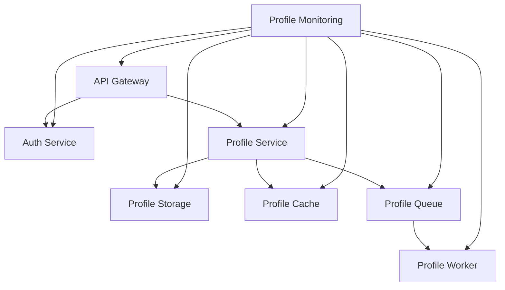

INITIAL CONTEXT FOR LLM - never change the context-----------------------------
-> THIS SECTION IS A GUIDELINE TO THE LLM CONSIDER BEFORE WORKING IN THIS FILE, DO NOT CHANGE THIS

-> GOES OF THE SERVICE BOUNDARIES DOCUMENTATION:

- This document describes the boundaries and responsibilities of each service in the Profile Service Microservices project
- Each service's boundaries and responsibilities should be clearly defined
- Documentation should be clear, concise, and LLM-friendly
- All boundaries and responsibilities should be well-documented with examples
- Cross-references should be maintained between related services

-> CONSIDERER BEFORE UPDATING THIS FILE:

- This is a documentation file about service boundaries and responsibilities
- Never add fictional dates, version numbers, or metrics
- Changes should be incremental and based on verified information
- Add comments for clarification when needed
- Maintain LLM-friendly format

---

# Service Boundaries and Responsibilities

## Service Overview

## Service Boundaries

### 1. API Gateway Service

#### Boundaries

- Entry point for all client requests
- Request routing and load balancing
- Authentication and authorization
- Rate limiting and throttling
- Request/response transformation

#### Responsibilities

- Route requests to appropriate services
- Validate and authenticate requests
- Apply rate limiting and throttling
- Transform requests and responses
- Handle cross-cutting concerns

### 2. Auth Service

#### Boundaries

- User authentication
- Token management
- Session handling
- User authorization
- Identity verification

#### Responsibilities

- Authenticate users
- Generate and validate tokens
- Manage user sessions
- Handle user authorization
- Verify user identity

### 3. Profile Service

#### Boundaries

- Profile management
- Profile data validation
- Profile operations
- Profile event handling
- Profile state management

#### Responsibilities

- Create and update profiles
- Validate profile data
- Handle profile operations
- Manage profile events
- Maintain profile state

### 4. Profile Storage Service

#### Boundaries

- Profile data persistence
- Data storage operations
- Data consistency
- Data backup
- Data recovery

#### Responsibilities

- Store profile data
- Handle storage operations
- Maintain data consistency
- Perform data backups
- Handle data recovery

### 5. Profile Cache Service

#### Boundaries

- Profile data caching
- Cache invalidation
- Cache consistency
- Cache operations
- Cache monitoring

#### Responsibilities

- Cache profile data
- Invalidate cache entries
- Maintain cache consistency
- Handle cache operations
- Monitor cache performance

### 6. Profile Queue Service

#### Boundaries

- Message queuing
- Event handling
- Message persistence
- Queue operations
- Queue monitoring

#### Responsibilities

- Queue messages
- Handle events
- Persist messages
- Manage queue operations
- Monitor queue performance

### 7. Profile Worker Service

#### Boundaries

- Message processing
- Background tasks
- Task scheduling
- Task monitoring
- Error handling

#### Responsibilities

- Process messages
- Execute background tasks
- Schedule tasks
- Monitor task execution
- Handle task errors

### 8. Profile Monitoring Service

#### Boundaries

- System monitoring
- Performance monitoring
- Health monitoring
- Alert management
- Metrics collection

#### Responsibilities

- Monitor system health
- Track performance metrics
- Manage health checks
- Handle alerts
- Collect metrics

## Service Dependencies

### 1. API Gateway Dependencies

- Auth Service (for authentication)
- Profile Service (for profile operations)
- Profile Monitoring Service (for metrics)

### 2. Auth Service Dependencies

- Profile Monitoring Service (for metrics)

### 3. Profile Service Dependencies

- Profile Storage Service (for data persistence)
- Profile Cache Service (for caching)
- Profile Queue Service (for events)
- Profile Monitoring Service (for metrics)

### 4. Profile Storage Dependencies

- Profile Monitoring Service (for metrics)

### 5. Profile Cache Dependencies

- Profile Monitoring Service (for metrics)

### 6. Profile Queue Dependencies

- Profile Worker Service (for processing)
- Profile Monitoring Service (for metrics)

### 7. Profile Worker Dependencies

- Profile Storage Service (for updates)
- Profile Cache Service (for cache updates)
- Profile Monitoring Service (for metrics)

### 8. Profile Monitoring Dependencies

- No dependencies on other services

## Notes

- Keep documentation up to date
- Maintain cross-references
- Add practical examples
- Document decisions
- Track changes
- Ensure alignment with architecture
