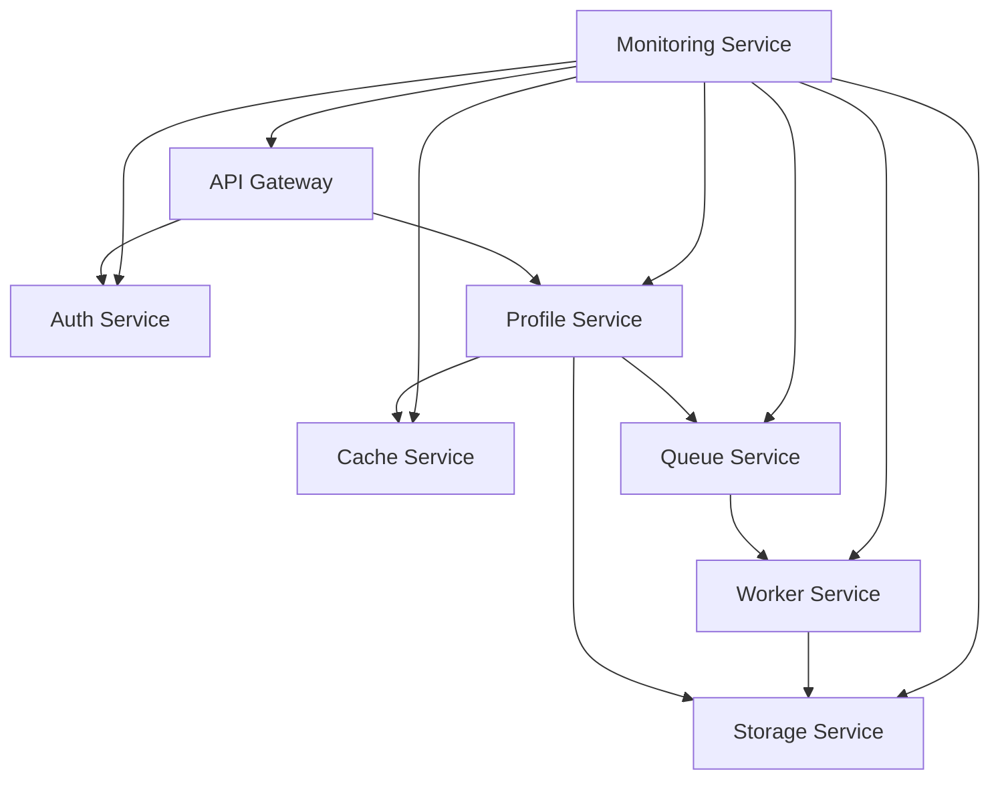

INITIAL CONTEXT FOR LLM - never change the context-----------------------------
-> THIS SECTION IS A GUIDELINE TO THE LLM CONSIDER BEFORE WORKING IN THIS FILE, DO NOT CHANGE THIS

-> GOES OF THE SERVICE DEPENDENCIES:

- This document describes the service dependencies in the Profile Service Microservices architecture
- It covers service relationships, dependencies, and integration points
- Includes implementation details and configuration examples
- All patterns are implemented and tested in the current architecture
- For LLM-specific guidelines, refer to [LLM Integration Guide](../../../docs/llm/README.md)

-> CONSIDERER BEFORE UPDATING THIS FILE:

- This is a documentation file about service dependencies
- Never add fictional dates, version numbers, or metrics
- Changes should be incremental and based on verified information
- Add comments for clarification when needed
- Maintain LLM-friendly format

---

# Service Dependencies

## Overview

### Purpose and Scope

The Service Dependencies documentation describes the relationships and dependencies between services in the Profile Service Microservices architecture. It covers:

- Service relationships
- Dependency management
- Integration points
- Error handling
- Service discovery
- Load balancing

### Dependency Map



## Service Relationships

### Direct Dependencies

```yaml
dependencies:
  api_gateway:
    - auth_service:
        type: synchronous
        protocol: http
        port: 8081
    - profile_service:
        type: synchronous
        protocol: http
        port: 8082

  profile_service:
    - storage_service:
        type: synchronous
        protocol: http
        port: 8083
    - cache_service:
        type: synchronous
        protocol: http
        port: 8084
    - queue_service:
        type: asynchronous
        protocol: amqp
        port: 5672

  worker_service:
    - storage_service:
        type: synchronous
        protocol: http
        port: 8083
    - queue_service:
        type: asynchronous
        protocol: amqp
        port: 5672

  monitoring_service:
    - all_services:
        type: synchronous
        protocol: http
        port: dynamic
```

### Indirect Dependencies

```yaml
indirect_dependencies:
  profile_service:
    - auth_service:
        through: api_gateway
        type: synchronous
    - monitoring_service:
        through: direct
        type: synchronous

  worker_service:
    - profile_service:
        through: queue_service
        type: asynchronous
    - monitoring_service:
        through: direct
        type: synchronous
```

## Dependency Management

### Service Discovery

```yaml
service_discovery:
  type: consul
  configuration:
    host: consul
    port: 8500
    datacenter: dc1
    services:
      - name: api-gateway
        port: 8080
      - name: auth-service
        port: 8081
      - name: profile-service
        port: 8082
      - name: storage-service
        port: 8083
      - name: cache-service
        port: 8084
      - name: queue-service
        port: 5672
      - name: worker-service
        port: 8085
      - name: monitoring-service
        port: 8086
```

### Load Balancing

```yaml
load_balancing:
  type: nginx
  configuration:
    upstream:
      api_gateway:
        - server: api-gateway:8080
          weight: 1
      auth_service:
        - server: auth-service:8081
          weight: 1
      profile_service:
        - server: profile-service:8082
          weight: 1
      storage_service:
        - server: storage-service:8083
          weight: 1
      cache_service:
        - server: cache-service:8084
          weight: 1
      queue_service:
        - server: queue-service:5672
          weight: 1
      worker_service:
        - server: worker-service:8085
          weight: 1
      monitoring_service:
        - server: monitoring-service:8086
          weight: 1
```

## Integration Points

### API Integration

```yaml
api_integration:
  api_gateway:
    endpoints:
      - path: /auth/*
        service: auth_service
        method: all
      - path: /profile/*
        service: profile_service
        method: all

  profile_service:
    endpoints:
      - path: /storage/*
        service: storage_service
        method: all
      - path: /cache/*
        service: cache_service
        method: all
      - path: /queue/*
        service: queue_service
        method: all
```

### Message Integration

```yaml
message_integration:
  queue_service:
    exchanges:
      - name: profile_events
        type: topic
        bindings:
          - queue: profile_created
            routing_key: profile.created
          - queue: profile_updated
            routing_key: profile.updated
          - queue: profile_deleted
            routing_key: profile.deleted

  worker_service:
    queues:
      - name: profile_created
        handler: handle_profile_created
      - name: profile_updated
        handler: handle_profile_updated
      - name: profile_deleted
        handler: handle_profile_deleted
```

## Error Handling

### Circuit Breaker

```yaml
circuit_breaker:
  profile_service:
    storage_service:
      failure_threshold: 5
      reset_timeout: 30s
      half_open_timeout: 10s
    cache_service:
      failure_threshold: 5
      reset_timeout: 30s
      half_open_timeout: 10s
    queue_service:
      failure_threshold: 5
      reset_timeout: 30s
      half_open_timeout: 10s

  worker_service:
    storage_service:
      failure_threshold: 5
      reset_timeout: 30s
      half_open_timeout: 10s
    queue_service:
      failure_threshold: 5
      reset_timeout: 30s
      half_open_timeout: 10s
```

### Retry Policy

```yaml
retry_policy:
  profile_service:
    storage_service:
      max_attempts: 3
      initial_interval: 1s
      multiplier: 2
      max_interval: 10s
    cache_service:
      max_attempts: 3
      initial_interval: 1s
      multiplier: 2
      max_interval: 10s
    queue_service:
      max_attempts: 3
      initial_interval: 1s
      multiplier: 2
      max_interval: 10s

  worker_service:
    storage_service:
      max_attempts: 3
      initial_interval: 1s
      multiplier: 2
      max_interval: 10s
    queue_service:
      max_attempts: 3
      initial_interval: 1s
      multiplier: 2
      max_interval: 10s
```

## Pattern Implementation

### Service Discovery Pattern

1. Service Registration

   - Health checks
   - Metadata
   - Tags
   - Versioning

2. Service Lookup
   - DNS resolution
   - Load balancing
   - Health filtering
   - Version routing

### Circuit Breaker Pattern

1. Circuit States

   - Closed
   - Open
   - Half-open
   - Forced open

2. Failure Detection
   - Error counting
   - Timeout detection
   - Health checks
   - Metrics collection

### Retry Pattern

1. Retry Strategy

   - Exponential backoff
   - Jitter
   - Max attempts
   - Timeout

2. Error Handling
   - Error classification
   - Retry conditions
   - Fallback behavior
   - Metrics collection

## Notes

- Monitor dependencies
- Track service health
- Review error rates
- Update configurations
- Test integrations
