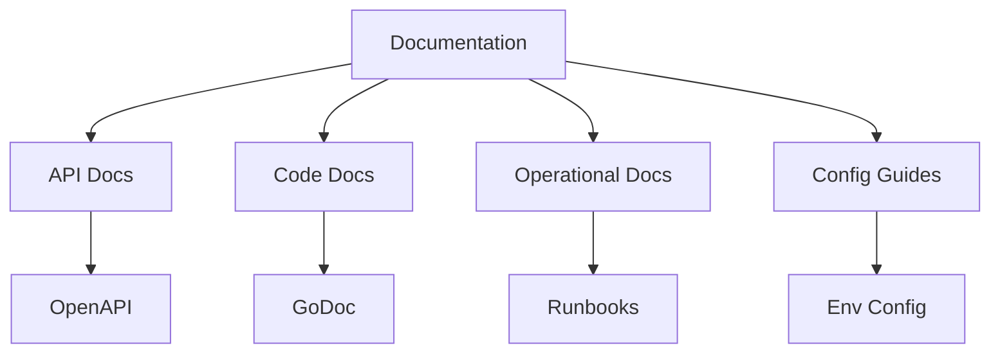

INITIAL CONTEXT FOR LLM - never change the context-----------------------------
-> THIS SECTION IS A GUIDELINE TO THE LLM CONSIDER BEFORE WORKING IN THIS FILE, DO NOT CHANGE THIS

-> GOES OF THE SERVICE DOCUMENTATION:

- This document describes the documentation standards and practices in the Profile Service Microservices architecture
- It covers API documentation, code documentation, operational documentation, configuration guides, architecture documentation, development guides, deployment guides, and monitoring guides
- Includes implementation details and configuration examples
- All patterns are implemented and tested in the current architecture
- For LLM-specific guidelines, refer to [LLM Integration Guide](../../../docs/llm/README.md)

-> CONSIDERER BEFORE UPDATING THIS FILE:

- This is a documentation file about service documentation
- Never add fictional dates, version numbers, or metrics
- Changes should be incremental and based on verified information
- Add comments for clarification when needed
- Maintain LLM-friendly format

---

# Service Documentation

## Overview

### Purpose and Scope

The Service Documentation describes the documentation standards and practices implemented across the Profile Service Microservices architecture. It covers:

- API documentation
- Code documentation
- Operational documentation
- Configuration guides
- Architecture documentation
- Development guides
- Deployment guides
- Monitoring guides

### Documentation Architecture



## API Documentation

### OpenAPI Specification

```yaml
openapi: 3.0.0
info:
  title: Profile Service API
  version: 1.0.0
  description: API documentation for the Profile Service

paths:
  /api/v1/profiles:
    get:
      summary: List profiles
      description: Retrieve a list of profiles
      parameters:
        - name: page
          in: query
          schema:
            type: integer
            default: 1
        - name: limit
          in: query
          schema:
            type: integer
            default: 10
      responses:
        "200":
          description: Successful response
          content:
            application/json:
              schema:
                type: object
                properties:
                  data:
                    type: array
                    items:
                      $ref: "#/components/schemas/Profile"
                  total:
                    type: integer
                  page:
                    type: integer
                  limit:
                    type: integer
        "400":
          description: Bad request
        "401":
          description: Unauthorized
        "500":
          description: Internal server error

    post:
      summary: Create profile
      description: Create a new profile
      requestBody:
        required: true
        content:
          application/json:
            schema:
              $ref: "#/components/schemas/ProfileCreate"
      responses:
        "201":
          description: Profile created
          content:
            application/json:
              schema:
                $ref: "#/components/schemas/Profile"
        "400":
          description: Bad request
        "401":
          description: Unauthorized
        "500":
          description: Internal server error

components:
  schemas:
    Profile:
      type: object
      properties:
        id:
          type: string
          format: uuid
        name:
          type: string
        email:
          type: string
          format: email
        created_at:
          type: string
          format: date-time
        updated_at:
          type: string
          format: date-time

    ProfileCreate:
      type: object
      required:
        - name
        - email
      properties:
        name:
          type: string
        email:
          type: string
          format: email
```

## Code Documentation

### Code Standards

```yaml
code_documentation:
  - name: profile_service
    standards:
      - name: package_documentation
        description: "Package documentation should include purpose and usage"
        example: |
          // Package profile provides functionality for managing user profiles.
          // It includes operations for creating, reading, updating, and deleting profiles.
          package profile

      - name: function_documentation
        description: "Function documentation should include purpose, parameters, and return values"
        example: |
          // CreateProfile creates a new user profile.
          // It validates the input data and stores it in the database.
          // Returns the created profile or an error if the operation fails.
          func CreateProfile(ctx context.Context, input ProfileInput) (*Profile, error) {
              // Implementation
          }

      - name: type_documentation
        description: "Type documentation should include purpose and field descriptions"
        example: |
          // Profile represents a user profile in the system.
          // It contains basic user information and metadata.
          type Profile struct {
              // ID is the unique identifier for the profile
              ID string `json:"id"`
              // Name is the user's full name
              Name string `json:"name"`
              // Email is the user's email address
              Email string `json:"email"`
              // CreatedAt is the timestamp when the profile was created
              CreatedAt time.Time `json:"created_at"`
              // UpdatedAt is the timestamp when the profile was last updated
              UpdatedAt time.Time `json:"updated_at"`
          }

  - name: api_gateway
    standards:
      - name: package_documentation
        description: "Package documentation should include purpose and usage"
        example: |
          // Package gateway provides functionality for routing and managing API requests.
          // It includes authentication, authorization, and request/response handling.
          package gateway

      - name: function_documentation
        description: "Function documentation should include purpose, parameters, and return values"
        example: |
          // HandleRequest processes an incoming API request.
          // It authenticates the request, routes it to the appropriate service,
          // and returns the service response.
          func HandleRequest(ctx context.Context, req *Request) (*Response, error) {
              // Implementation
          }

      - name: type_documentation
        description: "Type documentation should include purpose and field descriptions"
        example: |
          // Request represents an incoming API request.
          // It contains the request method, path, headers, and body.
          type Request struct {
              // Method is the HTTP method (GET, POST, etc.)
              Method string `json:"method"`
              // Path is the request path
              Path string `json:"path"`
              // Headers contains the request headers
              Headers map[string]string `json:"headers"`
              // Body contains the request body
              Body []byte `json:"body"`
          }
```

## Operational Documentation

### Runbooks

```yaml
operational_documentation:
  - name: profile_service
    runbooks:
      - name: deployment
        description: "Profile Service deployment procedure"
        steps:
          - name: prepare_environment
            description: "Prepare the deployment environment"
            commands:
              - name: check_dependencies
                command: "kubectl get pods -n profile-service"
              - name: backup_database
                command: "pg_dump -U postgres profile_db > backup.sql"
          - name: deploy_service
            description: "Deploy the service"
            commands:
              - name: apply_config
                command: "kubectl apply -f k8s/profile-service.yaml"
              - name: verify_deployment
                command: "kubectl rollout status deployment/profile-service"
          - name: verify_service
            description: "Verify the service is running correctly"
            commands:
              - name: check_health
                command: "curl -f http://profile-service:8080/health"
              - name: check_metrics
                command: "curl -f http://profile-service:8080/metrics"

      - name: troubleshooting
        description: "Profile Service troubleshooting guide"
        steps:
          - name: check_logs
            description: "Check service logs for errors"
            commands:
              - name: view_logs
                command: "kubectl logs -n profile-service deployment/profile-service"
          - name: check_metrics
            description: "Check service metrics for issues"
            commands:
              - name: view_metrics
                command: "curl -f http://profile-service:8080/metrics"
          - name: check_database
            description: "Check database connection and health"
            commands:
              - name: check_connection
                command: "psql -U postgres -d profile_db -c 'SELECT 1'"

  - name: api_gateway
    runbooks:
      - name: deployment
        description: "API Gateway deployment procedure"
        steps:
          - name: prepare_environment
            description: "Prepare the deployment environment"
            commands:
              - name: check_dependencies
                command: "kubectl get pods -n api-gateway"
              - name: backup_config
                command: "cp config.yaml config.yaml.backup"
          - name: deploy_service
            description: "Deploy the service"
            commands:
              - name: apply_config
                command: "kubectl apply -f k8s/api-gateway.yaml"
              - name: verify_deployment
                command: "kubectl rollout status deployment/api-gateway"
          - name: verify_service
            description: "Verify the service is running correctly"
            commands:
              - name: check_health
                command: "curl -f http://api-gateway:8080/health"
              - name: check_metrics
                command: "curl -f http://api-gateway:8080/metrics"

      - name: troubleshooting
        description: "API Gateway troubleshooting guide"
        steps:
          - name: check_logs
            description: "Check service logs for errors"
            commands:
              - name: view_logs
                command: "kubectl logs -n api-gateway deployment/api-gateway"
          - name: check_metrics
            description: "Check service metrics for issues"
            commands:
              - name: view_metrics
                command: "curl -f http://api-gateway:8080/metrics"
          - name: check_routes
            description: "Check route configuration"
            commands:
              - name: view_routes
                command: "curl -f http://api-gateway:8080/routes"
```

## Configuration Guides

### Environment Configuration

```yaml
configuration_guides:
  - name: profile_service
    environment:
      - name: development
        variables:
          - name: DB_HOST
            value: "localhost"
            description: "Database host"
          - name: DB_PORT
            value: "5432"
            description: "Database port"
          - name: DB_NAME
            value: "profile_db"
            description: "Database name"
          - name: DB_USER
            value: "postgres"
            description: "Database user"
          - name: DB_PASSWORD
            value: "postgres"
            description: "Database password"
          - name: REDIS_HOST
            value: "localhost"
            description: "Redis host"
          - name: REDIS_PORT
            value: "6379"
            description: "Redis port"
          - name: LOG_LEVEL
            value: "debug"
            description: "Log level"

      - name: production
        variables:
          - name: DB_HOST
            value: "postgres.production"
            description: "Database host"
          - name: DB_PORT
            value: "5432"
            description: "Database port"
          - name: DB_NAME
            value: "profile_db"
            description: "Database name"
          - name: DB_USER
            value: "${DB_USER}"
            description: "Database user"
          - name: DB_PASSWORD
            value: "${DB_PASSWORD}"
            description: "Database password"
          - name: REDIS_HOST
            value: "redis.production"
            description: "Redis host"
          - name: REDIS_PORT
            value: "6379"
            description: "Redis port"
          - name: LOG_LEVEL
            value: "info"
            description: "Log level"

  - name: api_gateway
    environment:
      - name: development
        variables:
          - name: PROFILE_SERVICE_URL
            value: "http://localhost:8081"
            description: "Profile Service URL"
          - name: AUTH_SERVICE_URL
            value: "http://localhost:8082"
            description: "Auth Service URL"
          - name: LOG_LEVEL
            value: "debug"
            description: "Log level"
          - name: RATE_LIMIT
            value: "1000"
            description: "Rate limit per minute"

      - name: production
        variables:
          - name: PROFILE_SERVICE_URL
            value: "http://profile-service.production"
            description: "Profile Service URL"
          - name: AUTH_SERVICE_URL
            value: "http://auth-service.production"
            description: "Auth Service URL"
          - name: LOG_LEVEL
            value: "info"
            description: "Log level"
          - name: RATE_LIMIT
            value: "10000"
            description: "Rate limit per minute"
```

## Architecture Documentation

### System Architecture

````yaml
architecture_documentation:
  - name: profile_service
    architecture:
      - name: components
        description: "Profile Service components"
        diagram: |
          ```mermaid
          graph TD
              A[API Layer] --> B[Service Layer]
              B --> C[Data Layer]
              B --> D[Cache Layer]
              A --> E[Auth Layer]
              B --> F[Event Layer]
          ```
        components:
          - name: api_layer
            description: "Handles HTTP requests and responses"
            responsibilities:
              - "Request validation"
              - "Response formatting"
              - "Error handling"
          - name: service_layer
            description: "Implements business logic"
            responsibilities:
              - "Profile management"
              - "Data validation"
              - "Event publishing"
          - name: data_layer
            description: "Manages data persistence"
            responsibilities:
              - "Database operations"
              - "Data consistency"
              - "Transaction management"
          - name: cache_layer
            description: "Manages caching"
            responsibilities:
              - "Profile caching"
              - "Cache invalidation"
              - "Cache consistency"
          - name: auth_layer
            description: "Handles authentication"
            responsibilities:
              - "Token validation"
              - "Permission checking"
              - "User context"
          - name: event_layer
            description: "Manages events"
            responsibilities:
              - "Event publishing"
              - "Event handling"
              - "Event consistency"

  - name: api_gateway
    architecture:
      - name: components
        description: "API Gateway components"
        diagram: |
          ```mermaid
          graph TD
              A[Router] --> B[Auth]
              A --> C[Rate Limiter]
              A --> D[Load Balancer]
              B --> E[Services]
              C --> E
              D --> E
          ```
        components:
          - name: router
            description: "Routes requests to services"
            responsibilities:
              - "Request routing"
              - "Path matching"
              - "Service discovery"
          - name: auth
            description: "Handles authentication"
            responsibilities:
              - "Token validation"
              - "Permission checking"
              - "User context"
          - name: rate_limiter
            description: "Manages request rates"
            responsibilities:
              - "Rate limiting"
              - "Quota management"
              - "Throttling"
          - name: load_balancer
            description: "Distributes load"
            responsibilities:
              - "Load balancing"
              - "Health checking"
              - "Service discovery"
````

## Pattern Implementation

### Documentation Pattern

1. API Documentation Pattern

   - OpenAPI specification
   - Endpoint documentation
   - Request/response examples
   - Error handling

2. Code Documentation Pattern

   - Package documentation
   - Function documentation
   - Type documentation
   - Examples

3. Operational Documentation Pattern

   - Deployment procedures
   - Troubleshooting guides
   - Monitoring procedures
   - Maintenance tasks

4. Configuration Pattern
   - Environment variables
   - Configuration files
   - Secrets management
   - Deployment configs

## Notes

- Keep documentation up to date
- Review documentation regularly
- Update examples as needed
- Maintain consistency
