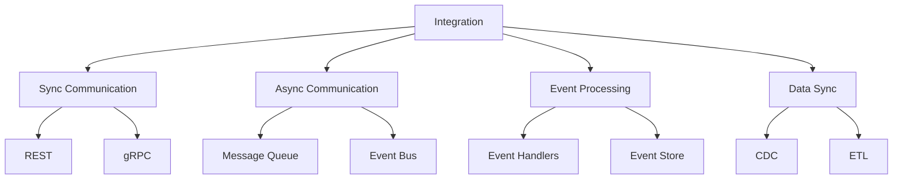

INITIAL CONTEXT FOR LLM - never change the context-----------------------------
-> THIS SECTION IS A GUIDELINE TO THE LLM CONSIDER BEFORE WORKING IN THIS FILE, DO NOT CHANGE THIS

-> GOES OF THE SERVICE INTEGRATION:

- This document describes the integration patterns and practices in the Profile Service Microservices architecture
- It covers service-to-service communication, event handling, data synchronization, and error handling
- Includes implementation details and configuration examples
- All patterns are implemented and tested in the current architecture
- For LLM-specific guidelines, refer to [LLM Integration Guide](../../../docs/llm/README.md)

-> CONSIDERER BEFORE UPDATING THIS FILE:

- This is a documentation file about service integration
- Never add fictional dates, version numbers, or metrics
- Changes should be incremental and based on verified information
- Add comments for clarification when needed
- Maintain LLM-friendly format

---

# Service Integration

## Overview

### Purpose and Scope

The Service Integration describes the integration patterns and practices implemented across the Profile Service Microservices architecture. It covers:

- Service-to-service communication
- Event handling
- Data synchronization
- Error handling
- Security measures
- Integration patterns

### Integration Architecture



## Service Communication

### Synchronous Communication

```yaml
sync_communication:
  - name: profile_service
    rest:
      - name: get_profile
        method: GET
        path: /api/v1/profiles/{id}
        description: "Get profile by ID"
        request:
          parameters:
            - name: id
              type: string
              required: true
        response:
          type: object
          properties:
            id:
              type: string
            name:
              type: string
            email:
              type: string
        error_codes:
          - code: 404
            description: "Profile not found"
          - code: 500
            description: "Internal server error"

      - name: create_profile
        method: POST
        path: /api/v1/profiles
        description: "Create new profile"
        request:
          body:
            type: object
            properties:
              name:
                type: string
              email:
                type: string
        response:
          type: object
          properties:
            id:
              type: string
            name:
              type: string
            email:
              type: string
        error_codes:
          - code: 400
            description: "Invalid input"
          - code: 500
            description: "Internal server error"

    grpc:
      - name: profile_service
        service: ProfileService
        methods:
          - name: GetProfile
            request:
              type: GetProfileRequest
              fields:
                id:
                  type: string
            response:
              type: GetProfileResponse
              fields:
                profile:
                  type: Profile
            error_codes:
              - code: NOT_FOUND
                description: "Profile not found"
              - code: INTERNAL
                description: "Internal server error"

          - name: CreateProfile
            request:
              type: CreateProfileRequest
              fields:
                name:
                  type: string
                email:
                  type: string
            response:
              type: CreateProfileResponse
              fields:
                profile:
                  type: Profile
            error_codes:
              - code: INVALID_ARGUMENT
                description: "Invalid input"
              - code: INTERNAL
                description: "Internal server error"

  - name: api_gateway
    rest:
      - name: route_request
        method: ANY
        path: /api/v1/{service}/{resource}
        description: "Route request to service"
        request:
          parameters:
            - name: service
              type: string
              required: true
            - name: resource
              type: string
              required: true
        response:
          type: object
          properties:
            data:
              type: object
        error_codes:
          - code: 400
            description: "Invalid request"
          - code: 404
            description: "Service not found"
          - code: 500
            description: "Internal server error"

    grpc:
      - name: gateway_service
        service: GatewayService
        methods:
          - name: RouteRequest
            request:
              type: RouteRequestRequest
              fields:
                service:
                  type: string
                resource:
                  type: string
            response:
              type: RouteRequestResponse
              fields:
                data:
                  type: bytes
            error_codes:
              - code: INVALID_ARGUMENT
                description: "Invalid request"
              - code: NOT_FOUND
                description: "Service not found"
              - code: INTERNAL
                description: "Internal server error"
```

### Asynchronous Communication

```yaml
async_communication:
  - name: profile_service
    message_queue:
      - name: profile_events
        type: topic
        messages:
          - name: profile_created
            schema:
              type: object
              properties:
                id:
                  type: string
                name:
                  type: string
                email:
                  type: string
                timestamp:
                  type: string
                  format: date-time
          - name: profile_updated
            schema:
              type: object
              properties:
                id:
                  type: string
                name:
                  type: string
                email:
                  type: string
                timestamp:
                  type: string
                  format: date-time
          - name: profile_deleted
            schema:
              type: object
              properties:
                id:
                  type: string
                timestamp:
                  type: string
                  format: date-time

    event_bus:
      - name: profile_events
        type: topic
        events:
          - name: profile_created
            schema:
              type: object
              properties:
                id:
                  type: string
                name:
                  type: string
                email:
                  type: string
                timestamp:
                  type: string
                  format: date-time
          - name: profile_updated
            schema:
              type: object
              properties:
                id:
                  type: string
                name:
                  type: string
                email:
                  type: string
                timestamp:
                  type: string
                  format: date-time
          - name: profile_deleted
            schema:
              type: object
              properties:
                id:
                  type: string
                timestamp:
                  type: string
                  format: date-time

  - name: api_gateway
    message_queue:
      - name: gateway_events
        type: topic
        messages:
          - name: request_received
            schema:
              type: object
              properties:
                service:
                  type: string
                resource:
                  type: string
                method:
                  type: string
                timestamp:
                  type: string
                  format: date-time
          - name: request_completed
            schema:
              type: object
              properties:
                service:
                  type: string
                resource:
                  type: string
                method:
                  type: string
                status:
                  type: integer
                timestamp:
                  type: string
                  format: date-time

    event_bus:
      - name: gateway_events
        type: topic
        events:
          - name: request_received
            schema:
              type: object
              properties:
                service:
                  type: string
                resource:
                  type: string
                method:
                  type: string
                timestamp:
                  type: string
                  format: date-time
          - name: request_completed
            schema:
              type: object
              properties:
                service:
                  type: string
                resource:
                  type: string
                method:
                  type: string
                status:
                  type: integer
                timestamp:
                  type: string
                  format: date-time
```

## Event Handling

### Event Flows

```yaml
event_flows:
  - name: profile_service
    flows:
      - name: profile_creation
        events:
          - name: profile_created
            handlers:
              - name: notify_user
                service: notification_service
                action: send_welcome_email
              - name: update_search
                service: search_service
                action: index_profile
              - name: update_analytics
                service: analytics_service
                action: track_profile_creation

      - name: profile_update
        events:
          - name: profile_updated
            handlers:
              - name: update_search
                service: search_service
                action: update_index
              - name: update_analytics
                service: analytics_service
                action: track_profile_update

      - name: profile_deletion
        events:
          - name: profile_deleted
            handlers:
              - name: cleanup_data
                service: storage_service
                action: delete_profile_data
              - name: update_search
                service: search_service
                action: remove_from_index
              - name: update_analytics
                service: analytics_service
                action: track_profile_deletion

  - name: api_gateway
    flows:
      - name: request_handling
        events:
          - name: request_received
            handlers:
              - name: log_request
                service: logging_service
                action: log_request_details
              - name: update_metrics
                service: metrics_service
                action: track_request

      - name: request_completion
        events:
          - name: request_completed
            handlers:
              - name: log_response
                service: logging_service
                action: log_response_details
              - name: update_metrics
                service: metrics_service
                action: track_response
```

### Event Handlers

```yaml
event_handlers:
  - name: profile_service
    handlers:
      - name: profile_created
        implementation:
          type: function
          code: |
            func handleProfileCreated(event ProfileCreatedEvent) error {
              // Notify user
              if err := notifyUser(event); err != nil {
                return err
              }

              // Update search index
              if err := updateSearchIndex(event); err != nil {
                return err
              }

              // Update analytics
              if err := updateAnalytics(event); err != nil {
                return err
              }

              return nil
            }
        error_handling:
          - type: retry
            max_attempts: 3
            backoff: exponential
          - type: dead_letter
            queue: profile_events_dlq

      - name: profile_updated
        implementation:
          type: function
          code: |
            func handleProfileUpdated(event ProfileUpdatedEvent) error {
              // Update search index
              if err := updateSearchIndex(event); err != nil {
                return err
              }

              // Update analytics
              if err := updateAnalytics(event); err != nil {
                return err
              }

              return nil
            }
        error_handling:
          - type: retry
            max_attempts: 3
            backoff: exponential
          - type: dead_letter
            queue: profile_events_dlq

  - name: api_gateway
    handlers:
      - name: request_received
        implementation:
          type: function
          code: |
            func handleRequestReceived(event RequestReceivedEvent) error {
              // Log request
              if err := logRequest(event); err != nil {
                return err
              }

              // Update metrics
              if err := updateMetrics(event); err != nil {
                return err
              }

              return nil
            }
        error_handling:
          - type: retry
            max_attempts: 3
            backoff: exponential
          - type: dead_letter
            queue: gateway_events_dlq

      - name: request_completed
        implementation:
          type: function
          code: |
            func handleRequestCompleted(event RequestCompletedEvent) error {
              // Log response
              if err := logResponse(event); err != nil {
                return err
              }

              // Update metrics
              if err := updateMetrics(event); err != nil {
                return err
              }

              return nil
            }
        error_handling:
          - type: retry
            max_attempts: 3
            backoff: exponential
          - type: dead_letter
            queue: gateway_events_dlq
```

## Data Synchronization

### Change Data Capture

```yaml
change_data_capture:
  - name: profile_service
    cdc:
      - name: profile_changes
        source: profiles
        events:
          - name: insert
            handler: handleProfileInsert
          - name: update
            handler: handleProfileUpdate
          - name: delete
            handler: handleProfileDelete
        configuration:
          batch_size: 100
          poll_interval: 1s
          max_retries: 3
        error_handling:
          - type: retry
            max_attempts: 3
            backoff: exponential
          - type: dead_letter
            queue: cdc_events_dlq

  - name: api_gateway
    cdc:
      - name: gateway_changes
        source: requests
        events:
          - name: insert
            handler: handleRequestInsert
          - name: update
            handler: handleRequestUpdate
        configuration:
          batch_size: 100
          poll_interval: 1s
          max_retries: 3
        error_handling:
          - type: retry
            max_attempts: 3
            backoff: exponential
          - type: dead_letter
            queue: cdc_events_dlq
```

### Data Transformation

```yaml
data_transformation:
  - name: profile_service
    transformations:
      - name: profile_to_search
        source: profile
        target: search_index
        mapping:
          - source: id
            target: document_id
          - source: name
            target: name
          - source: email
            target: email
        validation:
          - field: name
            type: required
          - field: email
            type: email

      - name: profile_to_analytics
        source: profile
        target: analytics
        mapping:
          - source: id
            target: profile_id
          - source: created_at
            target: creation_date
          - source: updated_at
            target: update_date
        validation:
          - field: id
            type: required
          - field: created_at
            type: date

  - name: api_gateway
    transformations:
      - name: request_to_log
        source: request
        target: log_entry
        mapping:
          - source: service
            target: service_name
          - source: resource
            target: resource_path
          - source: method
            target: http_method
          - source: timestamp
            target: event_time
        validation:
          - field: service
            type: required
          - field: resource
            type: required
          - field: method
            type: required

      - name: request_to_metrics
        source: request
        target: metric
        mapping:
          - source: service
            target: service_name
          - source: status
            target: status_code
          - source: duration
            target: response_time
        validation:
          - field: service
            type: required
          - field: status
            type: required
```

## Error Handling

### Retry Policies

```yaml
retry_policies:
  - name: profile_service
    policies:
      - name: service_retry
        max_attempts: 3
        backoff:
          type: exponential
          initial_interval: 1s
          max_interval: 10s
          multiplier: 2
        conditions:
          - status: 500
          - status: 503
          - error: connection_refused
          - error: timeout

      - name: event_retry
        max_attempts: 3
        backoff:
          type: exponential
          initial_interval: 1s
          max_interval: 10s
          multiplier: 2
        conditions:
          - error: event_delivery_failed
          - error: event_processing_failed

  - name: api_gateway
    policies:
      - name: service_retry
        max_attempts: 3
        backoff:
          type: exponential
          initial_interval: 1s
          max_interval: 10s
          multiplier: 2
        conditions:
          - status: 500
          - status: 503
          - error: connection_refused
          - error: timeout

      - name: event_retry
        max_attempts: 3
        backoff:
          type: exponential
          initial_interval: 1s
          max_interval: 10s
          multiplier: 2
        conditions:
          - error: event_delivery_failed
          - error: event_processing_failed
```

### Circuit Breakers

```yaml
circuit_breakers:
  - name: profile_service
    breakers:
      - name: service_breaker
        failure_threshold: 5
        reset_timeout: 30s
        half_open_timeout: 5s
        conditions:
          - status: 500
          - status: 503
          - error: connection_refused
          - error: timeout

      - name: event_breaker
        failure_threshold: 5
        reset_timeout: 30s
        half_open_timeout: 5s
        conditions:
          - error: event_delivery_failed
          - error: event_processing_failed

  - name: api_gateway
    breakers:
      - name: service_breaker
        failure_threshold: 5
        reset_timeout: 30s
        half_open_timeout: 5s
        conditions:
          - status: 500
          - status: 503
          - error: connection_refused
          - error: timeout

      - name: event_breaker
        failure_threshold: 5
        reset_timeout: 30s
        half_open_timeout: 5s
        conditions:
          - error: event_delivery_failed
          - error: event_processing_failed
```

## Security Measures

### Service Authentication

```yaml
service_authentication:
  - name: profile_service
    methods:
      - name: mTLS
        configuration:
          ca_cert: /etc/certs/ca.crt
          cert: /etc/certs/service.crt
          key: /etc/certs/service.key
        validation:
          - field: common_name
            value: profile-service
          - field: organization
            value: example.com

      - name: JWT
        configuration:
          issuer: auth-service
          audience: profile-service
          public_key: /etc/certs/public.key
        validation:
          - field: issuer
            value: auth-service
          - field: audience
            value: profile-service

  - name: api_gateway
    methods:
      - name: mTLS
        configuration:
          ca_cert: /etc/certs/ca.crt
          cert: /etc/certs/service.crt
          key: /etc/certs/service.key
        validation:
          - field: common_name
            value: api-gateway
          - field: organization
            value: example.com

      - name: JWT
        configuration:
          issuer: auth-service
          audience: api-gateway
          public_key: /etc/certs/public.key
        validation:
          - field: issuer
            value: auth-service
          - field: audience
            value: api-gateway
```

### Service Authorization

```yaml
service_authorization:
  - name: profile_service
    rbac:
      - name: profile_management
        roles:
          - name: admin
            permissions:
              - action: create
                resource: profile
              - action: read
                resource: profile
              - action: update
                resource: profile
              - action: delete
                resource: profile
          - name: user
            permissions:
              - action: read
                resource: profile
              - action: update
                resource: own_profile

    oauth2:
      - name: profile_api
        scopes:
          - name: profile:read
            description: "Read profile information"
          - name: profile:write
            description: "Write profile information"
        clients:
          - name: web_app
            scopes:
              - profile:read
              - profile:write
          - name: mobile_app
            scopes:
              - profile:read
              - profile:write

  - name: api_gateway
    rbac:
      - name: gateway_management
        roles:
          - name: admin
            permissions:
              - action: route
                resource: any
              - action: monitor
                resource: any
          - name: service
            permissions:
              - action: route
                resource: own

    oauth2:
      - name: gateway_api
        scopes:
          - name: gateway:route
            description: "Route requests"
          - name: gateway:monitor
            description: "Monitor requests"
        clients:
          - name: profile_service
            scopes:
              - gateway:route
          - name: monitoring_service
            scopes:
              - gateway:monitor
```

## Pattern Implementation

### Integration Pattern

1. Service Communication Pattern

   - Synchronous communication
   - Asynchronous communication
   - Event handling
   - Data synchronization

2. Error Handling Pattern
   - Retry policies
   - Circuit breakers
   - Error propagation
   - Error recovery

## Notes

- Monitor integration points
- Test error scenarios
- Validate security measures
- Review performance
- Update documentation
