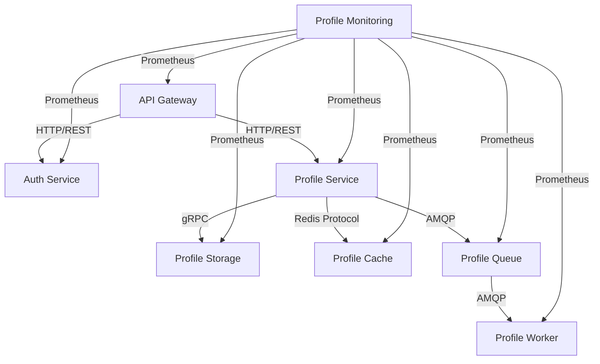

INITIAL CONTEXT FOR LLM - never change the context-----------------------------
-> THIS SECTION IS A GUIDELINE TO THE LLM CONSIDER BEFORE WORKING IN THIS FILE, DO NOT CHANGE THIS

-> GOES OF THE SERVICE INTERFACES DOCUMENTATION:

- This document describes the interfaces between services in the Profile Service Microservices project
- Each service's interfaces should be clearly defined
- Documentation should be clear, concise, and LLM-friendly
- All interfaces should be well-documented with examples
- Cross-references should be maintained between related services

-> CONSIDERER BEFORE UPDATING THIS FILE:

- This is a documentation file about service interfaces
- Never add fictional dates, version numbers, or metrics
- Changes should be incremental and based on verified information
- Add comments for clarification when needed
- Maintain LLM-friendly format

---

# Service Interfaces

## Interface Overview



## Service Interface Details

### 1. API Gateway Interfaces

#### External Interface

- Protocol: HTTP/REST
- Authentication: JWT
- Rate Limiting: Token Bucket
- CORS: Enabled
- Compression: gzip

#### Internal Interfaces

- Auth Service: HTTP/REST
- Profile Service: HTTP/REST
- Monitoring Service: Prometheus

### 2. Auth Service Interfaces

#### External Interface

- Protocol: HTTP/REST
- Authentication: JWT
- Rate Limiting: Token Bucket
- CORS: Enabled
- Compression: gzip

#### Internal Interfaces

- Monitoring Service: Prometheus

### 3. Profile Service Interfaces

#### External Interface

- Protocol: HTTP/REST
- Authentication: JWT
- Rate Limiting: Token Bucket
- CORS: Enabled
- Compression: gzip

#### Internal Interfaces

- Storage Service: gRPC
- Cache Service: Redis Protocol
- Queue Service: AMQP
- Monitoring Service: Prometheus

### 4. Profile Storage Interfaces

#### External Interface

- Protocol: gRPC
- Authentication: mTLS
- Rate Limiting: Token Bucket
- Compression: gzip

#### Internal Interfaces

- Monitoring Service: Prometheus

### 5. Profile Cache Interfaces

#### External Interface

- Protocol: Redis Protocol
- Authentication: Redis ACL
- Rate Limiting: Redis Max Clients
- Compression: None

#### Internal Interfaces

- Monitoring Service: Prometheus

### 6. Profile Queue Interfaces

#### External Interface

- Protocol: AMQP
- Authentication: SASL
- Rate Limiting: Channel Prefetch
- Compression: None

#### Internal Interfaces

- Worker Service: AMQP
- Monitoring Service: Prometheus

### 7. Profile Worker Interfaces

#### External Interface

- Protocol: AMQP
- Authentication: SASL
- Rate Limiting: Channel Prefetch
- Compression: None

#### Internal Interfaces

- Storage Service: gRPC
- Cache Service: Redis Protocol
- Monitoring Service: Prometheus

### 8. Profile Monitoring Interfaces

#### External Interface

- Protocol: Prometheus
- Authentication: Basic Auth
- Rate Limiting: None
- Compression: None

#### Internal Interfaces

- None

## Interface Specifications

### HTTP/REST Interface

```yaml
openapi: 3.0.0
info:
  title: Profile Service API
  version: 1.0.0
servers:
  - url: https://api.profile-service.com/v1
paths:
  /profiles:
    get:
      summary: Get profiles
      security:
        - bearerAuth: []
      parameters:
        - name: page
          in: query
          schema:
            type: integer
        - name: limit
          in: query
          schema:
            type: integer
      responses:
        "200":
          description: Success
        "401":
          description: Unauthorized
        "429":
          description: Too Many Requests
```

### gRPC Interface

```protobuf
syntax = "proto3";

package profile;

service ProfileStorage {
  rpc GetProfile(GetProfileRequest) returns (Profile) {}
  rpc CreateProfile(CreateProfileRequest) returns (Profile) {}
  rpc UpdateProfile(UpdateProfileRequest) returns (Profile) {}
  rpc DeleteProfile(DeleteProfileRequest) returns (Empty) {}
}

message Profile {
  string id = 1;
  string name = 2;
  string email = 3;
  string created_at = 4;
  string updated_at = 5;
}

message GetProfileRequest {
  string id = 1;
}

message CreateProfileRequest {
  string name = 1;
  string email = 2;
}

message UpdateProfileRequest {
  string id = 1;
  string name = 2;
  string email = 3;
}

message DeleteProfileRequest {
  string id = 1;
}

message Empty {}
```

### Redis Protocol Interface

```yaml
commands:
  GET:
    pattern: "profile:{id}"
    ttl: 3600
  SET:
    pattern: "profile:{id}"
    ttl: 3600
  DEL:
    pattern: "profile:{id}"
```

### AMQP Interface

```yaml
exchanges:
  profile_events:
    type: topic
    durable: true
    auto_delete: false

queues:
  profile_updates:
    durable: true
    auto_delete: false
    arguments:
      x-message-ttl: 86400000
      x-dead-letter-exchange: profile_events
      x-dead-letter-routing-key: profile_updates.dead

  profile_updates.dead:
    durable: true
    auto_delete: false
    arguments:
      x-message-ttl: 604800000
```

### Prometheus Interface

```yaml
metrics:
  - name: http_requests_total
    type: counter
    labels:
      - service
      - endpoint
      - method
      - status

  - name: http_request_duration_seconds
    type: histogram
    labels:
      - service
      - endpoint
      - method

  - name: active_connections
    type: gauge
    labels:
      - service
      - type
```

## Notes

- Keep documentation up to date
- Maintain cross-references
- Add practical examples
- Document decisions
- Track changes
- Ensure alignment with architecture
