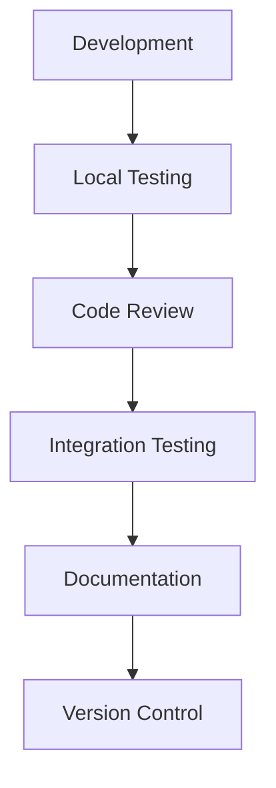
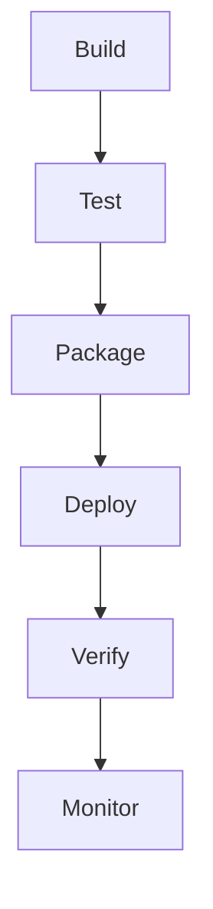
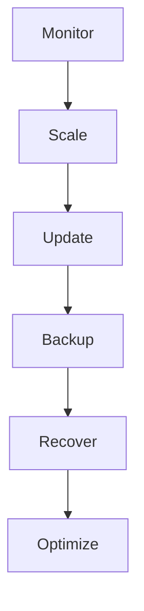
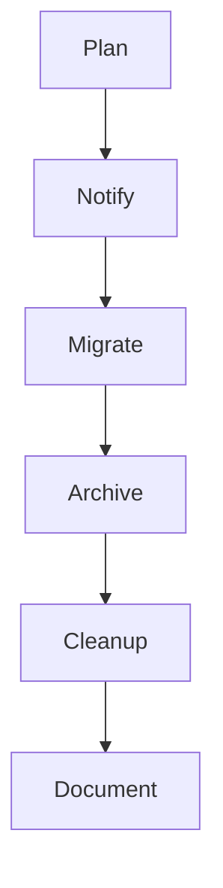

# Service Lifecycle Documentation

## Overview

This document outlines the lifecycle stages and management of services in the Profile Service Microservices architecture.

## Service Lifecycle Stages

### 1. Development Stage



#### Key Activities

- Local development and testing
- Code review and quality checks
- Integration testing with other services
- Documentation updates
- Version control management

### 2. Deployment Stage



#### Deployment Process

1. Build

   - Compile code
   - Run unit tests
   - Create Docker image
   - Tag and version

2. Test

   - Run integration tests
   - Perform security scans
   - Validate configurations
   - Check dependencies

3. Package

   - Create deployment artifacts
   - Generate manifests
   - Package configurations
   - Prepare documentation

4. Deploy

   - Apply configurations
   - Deploy to staging
   - Run smoke tests
   - Deploy to production

5. Verify
   - Check service health
   - Validate integrations
   - Monitor metrics
   - Verify security

### 3. Operation Stage



#### Operational Activities

1. Monitoring

   - Health checks
   - Performance metrics
   - Error tracking
   - Resource usage

2. Scaling

   - Load monitoring
   - Resource allocation
   - Auto-scaling rules
   - Capacity planning

3. Updates

   - Version management
   - Configuration updates
   - Security patches
   - Feature deployments

4. Maintenance
   - Backup procedures
   - Recovery testing
   - Performance optimization
   - Security updates

### 4. Retirement Stage



#### Retirement Process

1. Planning

   - Impact assessment
   - Migration strategy
   - Timeline definition
   - Resource allocation

2. Migration

   - Data migration
   - Service transition
   - Dependency updates
   - Integration changes

3. Cleanup
   - Resource decommissioning
   - Data archiving
   - Documentation updates
   - Access revocation

## Service Lifecycle Management

### Configuration Management

```yaml
# service-lifecycle-config.yaml
lifecycle:
  development:
    environments:
      - local
      - development
      - staging
    tools:
      - docker
      - kubernetes
      - helm
    metrics:
      - build_time
      - test_coverage
      - code_quality

  deployment:
    strategies:
      - rolling_update
      - blue_green
      - canary
    validations:
      - health_checks
      - integration_tests
      - security_scans

  operation:
    monitoring:
      - metrics
      - logs
      - traces
    scaling:
      - auto_scaling
      - manual_scaling
    maintenance:
      - backups
      - updates
      - optimization

  retirement:
    procedures:
      - migration
      - archiving
      - cleanup
    documentation:
      - decommissioning
      - handover
      - lessons_learned
```

### Lifecycle Metrics

1. Development Metrics

   - Build success rate
   - Test coverage
   - Code quality scores
   - Documentation completeness

2. Deployment Metrics

   - Deployment frequency
   - Deployment success rate
   - Rollback frequency
   - Deployment duration

3. Operation Metrics

   - Service availability
   - Response times
   - Error rates
   - Resource utilization

4. Retirement Metrics
   - Migration success rate
   - Data retention compliance
   - Resource cleanup
   - Documentation updates

## Service Lifecycle Tools

### Development Tools

- Docker for containerization
- Kubernetes for orchestration
- Helm for deployment
- Git for version control

### Deployment Tools

- CI/CD pipelines
- Configuration management
- Secret management
- Deployment automation

### Operation Tools

- Monitoring systems
- Logging systems
- Alerting systems
- Backup systems

### Retirement Tools

- Data migration tools
- Archive systems
- Cleanup scripts
- Documentation systems

## Notes

- Keep documentation up to date
- Maintain cross-references
- Add practical examples
- Document decisions
- Track changes
- Ensure alignment with global architecture
