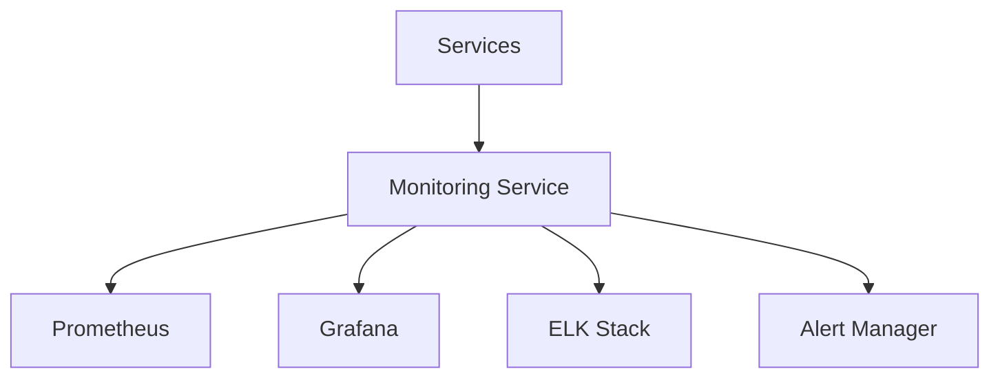
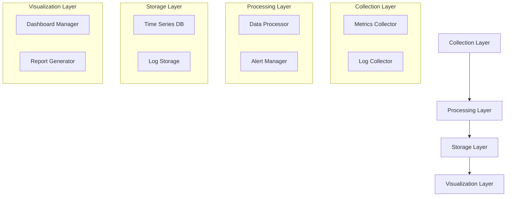
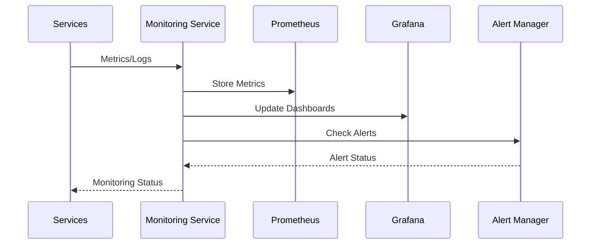

# Profile Monitoring Service Documentation

## Service Overview

### Purpose and Responsibilities

The Profile Monitoring Service manages system monitoring and observability in the Profile Service Microservices architecture. It is responsible for:

- Metrics collection
- Log aggregation
- Alert management
- Health monitoring
- Performance tracking
- System diagnostics

### Service Boundaries

- **Input**: Metrics data, log events, health checks
- **Output**: Monitoring data, alerts, reports
- **Dependencies**:
  - Prometheus
  - Grafana
  - ELK Stack
  - Alert Manager

### Integration Points



## Architecture

### Component Diagram



### Data Flow



## Implementation

### API Documentation

```yaml
endpoints:
  - path: /api/v1/monitoring/metrics
    method: POST
    description: Submit metrics
    request:
      type: object
      properties:
        service:
          type: string
        metrics:
          type: object
        timestamp:
          type: string
          format: date-time
    responses:
      202:
        description: Accepted
      400:
        description: Invalid metrics

  - path: /api/v1/monitoring/alerts
    method: GET
    description: Get active alerts
    responses:
      200:
        description: Success
      500:
        description: Server error
```

### Data Models

```yaml
models:
  MetricData:
    type: object
    properties:
      service:
        type: string
      name:
        type: string
      value:
        type: number
      labels:
        type: object
      timestamp:
        type: string
        format: date-time

  AlertRule:
    type: object
    properties:
      name:
        type: string
      condition:
        type: string
      threshold:
        type: number
      duration:
        type: string
      severity:
        type: string
        enum:
          - INFO
          - WARNING
          - CRITICAL
```

### Dependencies

```yaml
dependencies:
  - name: prom-client
    version: 14.2.0
    purpose: Metrics collection
  - name: winston
    version: 3.8.0
    purpose: Logging
  - name: elasticsearch
    version: 16.7.0
    purpose: Log storage
```

### Configuration

```yaml
service:
  name: profile-monitoring-service
  version: 1.0.0
  port: 8087
  environment: development
  prometheus:
    host: ${PROMETHEUS_HOST}
    port: ${PROMETHEUS_PORT}
    path: /metrics
  grafana:
    host: ${GRAFANA_HOST}
    port: ${GRAFANA_PORT}
    api_key: ${GRAFANA_API_KEY}
  elasticsearch:
    host: ${ELASTICSEARCH_HOST}
    port: ${ELASTICSEARCH_PORT}
  alerting:
    rules_path: /etc/monitoring/rules
    check_interval: 30s
  logging:
    level: info
    format: json
  metrics:
    enabled: true
    port: 9097
```

## Operations

### Health Checks

```yaml
health_checks:
  - name: readiness
    path: /health/ready
    interval: 30s
    timeout: 5s
    checks:
      - prometheus_connection
      - grafana_connection
      - elasticsearch_connection
  - name: liveness
    path: /health/live
    interval: 30s
    timeout: 5s
```

### Metrics

```yaml
metrics:
  - name: service_health
    type: gauge
    labels:
      - service
      - status
  - name: alert_status
    type: gauge
    labels:
      - alert
      - severity
  - name: metric_collection
    type: counter
    labels:
      - service
      - type
```

### Logging

```yaml
logging:
  format: json
  fields:
    - service
    - trace_id
    - alert_id
    - operation
  levels:
    - error
    - warn
    - info
    - debug
```

## Security

### Authentication

- Service authentication
- Dashboard authentication
- Access control
- Security headers

### Authorization

- Monitoring access control
- Dashboard permissions
- Alert management
- Policy enforcement

### Data Protection

- Metrics encryption
- Log encryption
- Audit logging
- Data validation

### Compliance

- GDPR compliance
- Data protection
- Monitoring compliance
- Security monitoring

## Pattern Implementation

### Monitoring Patterns

1. Metrics Collection Pattern

   - Metric gathering
   - Data processing
   - Storage management
   - Data retention

2. Alert Management Pattern
   - Alert rules
   - Alert processing
   - Alert notification
   - Alert resolution

### Visualization Patterns

1. Dashboard Pattern

   - Dashboard creation
   - Data visualization
   - User interaction
   - Dashboard sharing

2. Reporting Pattern
   - Report generation
   - Data aggregation
   - Report distribution
   - Report archiving

### Resilience Patterns

1. Circuit Breaker Pattern

   - Failure detection
   - Service isolation
   - Fallback handling
   - Recovery management

2. Retry Pattern
   - Data collection retries
   - Backoff strategy
   - Error handling
   - Success validation

## Notes

- Monitor system health
- Track alert patterns
- Review dashboard usage
- Update monitoring rules
- Test alert scenarios
