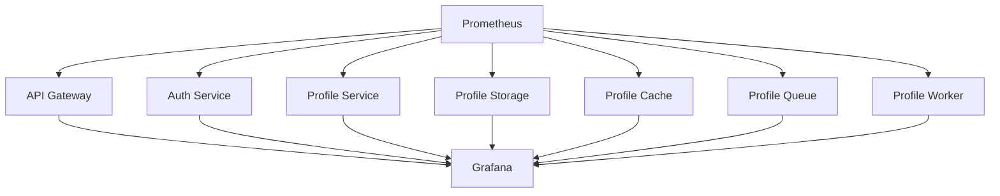

INITIAL CONTEXT FOR LLM - never change the context-----------------------------
-> THIS SECTION IS A GUIDELINE TO THE LLM CONSIDER BEFORE WORKING IN THIS FILE, DO NOT CHANGE THIS

-> GOES OF THE SERVICE MONITORING DOCUMENTATION:

- This document describes the monitoring of services in the Profile Service Microservices project
- Each service's monitoring should be clearly defined
- Documentation should be clear, concise, and LLM-friendly
- All monitoring configurations should be well-documented with examples
- Cross-references should be maintained between related services

-> CONSIDERER BEFORE UPDATING THIS FILE:

- This is a documentation file about service monitoring
- Never add fictional dates, version numbers, or metrics
- Changes should be incremental and based on verified information
- Add comments for clarification when needed
- Maintain LLM-friendly format

---

# Service Monitoring

## Monitoring Overview



## Monitoring Configurations

### 1. Prometheus Configuration

```yaml
global:
  scrape_interval: 15s
  evaluation_interval: 15s

scrape_configs:
  - job_name: "api-gateway"
    static_configs:
      - targets: ["api-gateway:8080"]
    metrics_path: "/metrics"

  - job_name: "auth-service"
    static_configs:
      - targets: ["auth-service:8080"]
    metrics_path: "/metrics"

  - job_name: "profile-service"
    static_configs:
      - targets: ["profile-service:8080"]
    metrics_path: "/metrics"

  - job_name: "profile-storage"
    static_configs:
      - targets: ["profile-storage:8080"]
    metrics_path: "/metrics"

  - job_name: "profile-cache"
    static_configs:
      - targets: ["profile-cache:6379"]
    metrics_path: "/metrics"

  - job_name: "profile-queue"
    static_configs:
      - targets: ["profile-queue:5672"]
    metrics_path: "/metrics"

  - job_name: "profile-worker"
    static_configs:
      - targets: ["profile-worker:8080"]
    metrics_path: "/metrics"
```

### 2. Grafana Configuration

```yaml
apiVersion: v1
kind: ConfigMap
metadata:
  name: grafana-datasources
data:
  prometheus.yaml: |-
    apiVersion: 1
    datasources:
      - name: Prometheus
        type: prometheus
        url: http://prometheus:9090
        access: proxy
        isDefault: true
```

### 3. Alert Manager Configuration

```yaml
global:
  resolve_timeout: 5m

route:
  group_by: ["alertname", "service"]
  group_wait: 30s
  group_interval: 5m
  repeat_interval: 4h
  receiver: "slack-notifications"

receivers:
  - name: "slack-notifications"
    slack_configs:
      - channel: "#alerts"
        send_resolved: true
```

## Service Metrics

### 1. API Gateway Metrics

```yaml
metrics:
  - name: http_requests_total
    type: counter
    labels:
      - service
      - endpoint
      - method
      - status

  - name: http_request_duration_seconds
    type: histogram
    labels:
      - service
      - endpoint
      - method

  - name: active_connections
    type: gauge
    labels:
      - service
      - type
```

### 2. Auth Service Metrics

```yaml
metrics:
  - name: auth_requests_total
    type: counter
    labels:
      - service
      - method
      - status

  - name: auth_request_duration_seconds
    type: histogram
    labels:
      - service
      - method

  - name: active_sessions
    type: gauge
    labels:
      - service
```

### 3. Profile Service Metrics

```yaml
metrics:
  - name: profile_operations_total
    type: counter
    labels:
      - service
      - operation
      - status

  - name: profile_operation_duration_seconds
    type: histogram
    labels:
      - service
      - operation

  - name: active_profiles
    type: gauge
    labels:
      - service
```

### 4. Profile Storage Metrics

```yaml
metrics:
  - name: storage_operations_total
    type: counter
    labels:
      - service
      - operation
      - status

  - name: storage_operation_duration_seconds
    type: histogram
    labels:
      - service
      - operation

  - name: storage_size_bytes
    type: gauge
    labels:
      - service
```

### 5. Profile Cache Metrics

```yaml
metrics:
  - name: cache_operations_total
    type: counter
    labels:
      - service
      - operation
      - status

  - name: cache_operation_duration_seconds
    type: histogram
    labels:
      - service
      - operation

  - name: cache_size_bytes
    type: gauge
    labels:
      - service
```

### 6. Profile Queue Metrics

```yaml
metrics:
  - name: queue_operations_total
    type: counter
    labels:
      - service
      - operation
      - status

  - name: queue_operation_duration_seconds
    type: histogram
    labels:
      - service
      - operation

  - name: queue_size
    type: gauge
    labels:
      - service
```

### 7. Profile Worker Metrics

```yaml
metrics:
  - name: worker_operations_total
    type: counter
    labels:
      - service
      - operation
      - status

  - name: worker_operation_duration_seconds
    type: histogram
    labels:
      - service
      - operation

  - name: active_workers
    type: gauge
    labels:
      - service
```

## Service Alerts

### 1. API Gateway Alerts

```yaml
alerts:
  - name: high_error_rate
    expr: rate(http_requests_total{status=~"5.."}[5m]) / rate(http_requests_total[5m]) > 0.05
    for: 5m
    labels:
      severity: critical
    annotations:
      summary: High error rate on API Gateway
      description: Error rate is above 5% for the last 5 minutes

  - name: high_latency
    expr: histogram_quantile(0.95, rate(http_request_duration_seconds_bucket[5m])) > 2
    for: 5m
    labels:
      severity: warning
    annotations:
      summary: High latency on API Gateway
      description: 95th percentile latency is above 2 seconds for the last 5 minutes
```

### 2. Auth Service Alerts

```yaml
alerts:
  - name: high_error_rate
    expr: rate(auth_requests_total{status=~"5.."}[5m]) / rate(auth_requests_total[5m]) > 0.05
    for: 5m
    labels:
      severity: critical
    annotations:
      summary: High error rate on Auth Service
      description: Error rate is above 5% for the last 5 minutes

  - name: high_latency
    expr: histogram_quantile(0.95, rate(auth_request_duration_seconds_bucket[5m])) > 2
    for: 5m
    labels:
      severity: warning
    annotations:
      summary: High latency on Auth Service
      description: 95th percentile latency is above 2 seconds for the last 5 minutes
```

### 3. Profile Service Alerts

```yaml
alerts:
  - name: high_error_rate
    expr: rate(profile_operations_total{status=~"5.."}[5m]) / rate(profile_operations_total[5m]) > 0.05
    for: 5m
    labels:
      severity: critical
    annotations:
      summary: High error rate on Profile Service
      description: Error rate is above 5% for the last 5 minutes

  - name: high_latency
    expr: histogram_quantile(0.95, rate(profile_operation_duration_seconds_bucket[5m])) > 2
    for: 5m
    labels:
      severity: warning
    annotations:
      summary: High latency on Profile Service
      description: 95th percentile latency is above 2 seconds for the last 5 minutes
```

### 4. Profile Storage Alerts

```yaml
alerts:
  - name: high_error_rate
    expr: rate(storage_operations_total{status=~"5.."}[5m]) / rate(storage_operations_total[5m]) > 0.05
    for: 5m
    labels:
      severity: critical
    annotations:
      summary: High error rate on Profile Storage
      description: Error rate is above 5% for the last 5 minutes

  - name: high_latency
    expr: histogram_quantile(0.95, rate(storage_operation_duration_seconds_bucket[5m])) > 2
    for: 5m
    labels:
      severity: warning
    annotations:
      summary: High latency on Profile Storage
      description: 95th percentile latency is above 2 seconds for the last 5 minutes
```

### 5. Profile Cache Alerts

```yaml
alerts:
  - name: high_error_rate
    expr: rate(cache_operations_total{status=~"5.."}[5m]) / rate(cache_operations_total[5m]) > 0.05
    for: 5m
    labels:
      severity: critical
    annotations:
      summary: High error rate on Profile Cache
      description: Error rate is above 5% for the last 5 minutes

  - name: high_latency
    expr: histogram_quantile(0.95, rate(cache_operation_duration_seconds_bucket[5m])) > 2
    for: 5m
    labels:
      severity: warning
    annotations:
      summary: High latency on Profile Cache
      description: 95th percentile latency is above 2 seconds for the last 5 minutes
```

### 6. Profile Queue Alerts

```yaml
alerts:
  - name: high_error_rate
    expr: rate(queue_operations_total{status=~"5.."}[5m]) / rate(queue_operations_total[5m]) > 0.05
    for: 5m
    labels:
      severity: critical
    annotations:
      summary: High error rate on Profile Queue
      description: Error rate is above 5% for the last 5 minutes

  - name: high_latency
    expr: histogram_quantile(0.95, rate(queue_operation_duration_seconds_bucket[5m])) > 2
    for: 5m
    labels:
      severity: warning
    annotations:
      summary: High latency on Profile Queue
      description: 95th percentile latency is above 2 seconds for the last 5 minutes
```

### 7. Profile Worker Alerts

```yaml
alerts:
  - name: high_error_rate
    expr: rate(worker_operations_total{status=~"5.."}[5m]) / rate(worker_operations_total[5m]) > 0.05
    for: 5m
    labels:
      severity: critical
    annotations:
      summary: High error rate on Profile Worker
      description: Error rate is above 5% for the last 5 minutes

  - name: high_latency
    expr: histogram_quantile(0.95, rate(worker_operation_duration_seconds_bucket[5m])) > 2
    for: 5m
    labels:
      severity: warning
    annotations:
      summary: High latency on Profile Worker
      description: 95th percentile latency is above 2 seconds for the last 5 minutes
```

## Service Dashboards

### 1. API Gateway Dashboard

```yaml
dashboard:
  title: API Gateway Dashboard
  panels:
    - title: Request Rate
      type: graph
      metrics:
        - expr: rate(http_requests_total[5m])
          legend: "{{method}} {{endpoint}}"

    - title: Error Rate
      type: graph
      metrics:
        - expr: rate(http_requests_total{status=~"5.."}[5m]) / rate(http_requests_total[5m])
          legend: "{{method}} {{endpoint}}"

    - title: Latency
      type: graph
      metrics:
        - expr: histogram_quantile(0.95, rate(http_request_duration_seconds_bucket[5m]))
          legend: "{{method}} {{endpoint}}"
```

### 2. Auth Service Dashboard

```yaml
dashboard:
  title: Auth Service Dashboard
  panels:
    - title: Request Rate
      type: graph
      metrics:
        - expr: rate(auth_requests_total[5m])
          legend: "{{method}}"

    - title: Error Rate
      type: graph
      metrics:
        - expr: rate(auth_requests_total{status=~"5.."}[5m]) / rate(auth_requests_total[5m])
          legend: "{{method}}"

    - title: Latency
      type: graph
      metrics:
        - expr: histogram_quantile(0.95, rate(auth_request_duration_seconds_bucket[5m]))
          legend: "{{method}}"
```

### 3. Profile Service Dashboard

```yaml
dashboard:
  title: Profile Service Dashboard
  panels:
    - title: Operation Rate
      type: graph
      metrics:
        - expr: rate(profile_operations_total[5m])
          legend: "{{operation}}"

    - title: Error Rate
      type: graph
      metrics:
        - expr: rate(profile_operations_total{status=~"5.."}[5m]) / rate(profile_operations_total[5m])
          legend: "{{operation}}"

    - title: Latency
      type: graph
      metrics:
        - expr: histogram_quantile(0.95, rate(profile_operation_duration_seconds_bucket[5m]))
          legend: "{{operation}}"
```

### 4. Profile Storage Dashboard

```yaml
dashboard:
  title: Profile Storage Dashboard
  panels:
    - title: Operation Rate
      type: graph
      metrics:
        - expr: rate(storage_operations_total[5m])
          legend: "{{operation}}"

    - title: Error Rate
      type: graph
      metrics:
        - expr: rate(storage_operations_total{status=~"5.."}[5m]) / rate(storage_operations_total[5m])
          legend: "{{operation}}"

    - title: Latency
      type: graph
      metrics:
        - expr: histogram_quantile(0.95, rate(storage_operation_duration_seconds_bucket[5m]))
          legend: "{{operation}}"
```

### 5. Profile Cache Dashboard

```yaml
dashboard:
  title: Profile Cache Dashboard
  panels:
    - title: Operation Rate
      type: graph
      metrics:
        - expr: rate(cache_operations_total[5m])
          legend: "{{operation}}"

    - title: Error Rate
      type: graph
      metrics:
        - expr: rate(cache_operations_total{status=~"5.."}[5m]) / rate(cache_operations_total[5m])
          legend: "{{operation}}"

    - title: Latency
      type: graph
      metrics:
        - expr: histogram_quantile(0.95, rate(cache_operation_duration_seconds_bucket[5m]))
          legend: "{{operation}}"
```

### 6. Profile Queue Dashboard

```yaml
dashboard:
  title: Profile Queue Dashboard
  panels:
    - title: Operation Rate
      type: graph
      metrics:
        - expr: rate(queue_operations_total[5m])
          legend: "{{operation}}"

    - title: Error Rate
      type: graph
      metrics:
        - expr: rate(queue_operations_total{status=~"5.."}[5m]) / rate(queue_operations_total[5m])
          legend: "{{operation}}"

    - title: Latency
      type: graph
      metrics:
        - expr: histogram_quantile(0.95, rate(queue_operation_duration_seconds_bucket[5m]))
          legend: "{{operation}}"
```

### 7. Profile Worker Dashboard

```yaml
dashboard:
  title: Profile Worker Dashboard
  panels:
    - title: Operation Rate
      type: graph
      metrics:
        - expr: rate(worker_operations_total[5m])
          legend: "{{operation}}"

    - title: Error Rate
      type: graph
      metrics:
        - expr: rate(worker_operations_total{status=~"5.."}[5m]) / rate(worker_operations_total[5m])
          legend: "{{operation}}"

    - title: Latency
      type: graph
      metrics:
        - expr: histogram_quantile(0.95, rate(worker_operation_duration_seconds_bucket[5m]))
          legend: "{{operation}}"
```

## Notes

- Keep documentation up to date
- Maintain cross-references
- Add practical examples
- Document decisions
- Track changes
- Ensure alignment with architecture
