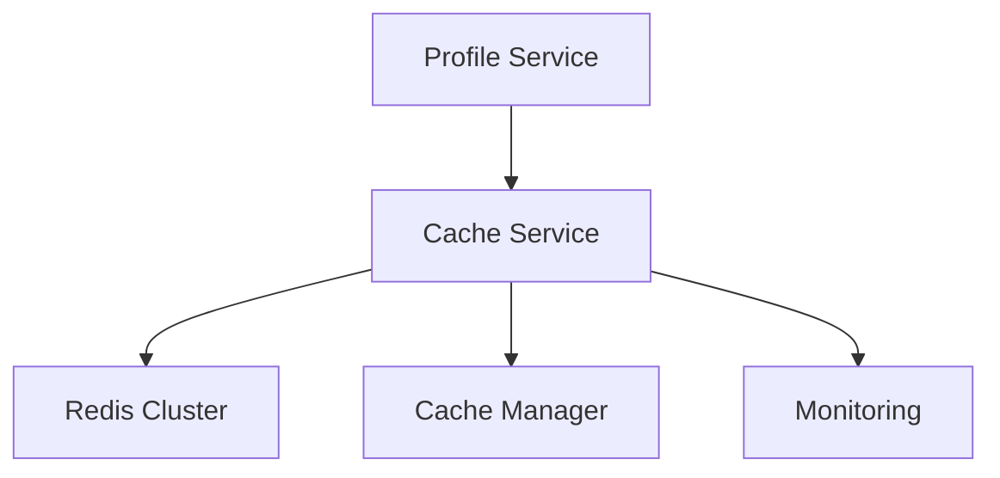
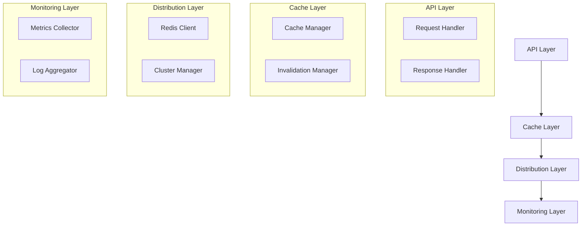
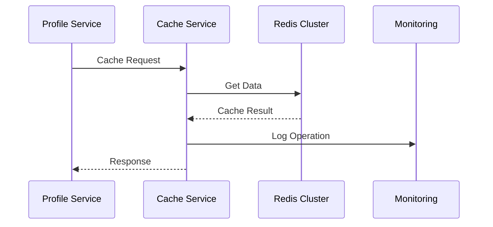

INITIAL CONTEXT FOR LLM - never change the context-----------------------------
-> THIS SECTION IS A GUIDELINE TO THE LLM CONSIDER BEFORE WORKING IN THIS FILE, DO NOT CHANGE THIS

-> GOES OF THE PROFILE CACHE SERVICE:

- This document describes the Profile Cache Service used in the Profile Service Microservices architecture
- It covers service boundaries, responsibilities, and interactions
- Includes implementation details and configuration examples
- All patterns are implemented and tested in the current architecture
- For LLM-specific guidelines, refer to [LLM Integration Guide](../../../docs/llm/README.md)

-> CONSIDERER BEFORE UPDATING THIS FILE:

- This is a documentation file about the Profile Cache Service
- Never add fictional dates, version numbers, or metrics
- Changes should be incremental and based on verified information
- Add comments for clarification when needed
- Maintain LLM-friendly format

---

# Profile Cache Service

## Service Overview

### Purpose and Responsibilities

The Profile Cache Service manages profile data caching in the Profile Service Microservices architecture. It is responsible for:

- Profile data caching
- Cache invalidation
- Cache consistency
- Cache distribution
- Cache monitoring
- Cache recovery

### Service Boundaries

- **Input**: Cache requests, invalidation requests
- **Output**: Cached data, cache status
- **Dependencies**:
  - Redis Cluster
  - Profile Service
  - Monitoring Service
  - Cache Manager

### Integration Points



## Architecture

### Component Diagram



### Data Flow



## Implementation

### API Documentation

```yaml
endpoints:
  - path: /api/v1/cache/profiles/{id}
    method: GET
    description: Get cached profile
    parameters:
      - name: id
        type: string
        required: true
    responses:
      200:
        description: Success
      404:
        description: Not found

  - path: /api/v1/cache/profiles/{id}
    method: PUT
    description: Update cache
    parameters:
      - name: id
        type: string
        required: true
    request:
      type: object
      properties:
        data:
          type: object
        ttl:
          type: integer
    responses:
      200:
        description: Updated
      400:
        description: Invalid data
```

### Data Models

```yaml
models:
  CacheEntry:
    type: object
    properties:
      key:
        type: string
      data:
        type: object
      ttl:
        type: integer
      created_at:
        type: string
        format: date-time
      updated_at:
        type: string
        format: date-time

  CacheStats:
    type: object
    properties:
      hits:
        type: integer
      misses:
        type: integer
      keys:
        type: integer
      memory:
        type: integer
```

### Dependencies

```yaml
dependencies:
  - name: redis
    version: 4.6.0
    purpose: Redis client
  - name: ioredis
    version: 5.3.0
    purpose: Redis cluster
  - name: prom-client
    version: 14.2.0
    purpose: Metrics collection
```

### Configuration

```yaml
service:
  name: profile-cache-service
  version: 1.0.0
  port: 8084
  environment: development
  redis:
    cluster:
      enabled: true
      nodes:
        - host: ${REDIS_HOST_1}
          port: ${REDIS_PORT_1}
        - host: ${REDIS_HOST_2}
          port: ${REDIS_PORT_2}
    options:
      max_retries: 3
      retry_delay: 1000
  cache:
    default_ttl: 3600
    max_ttl: 86400
    cleanup_interval: 300
  logging:
    level: info
    format: json
  metrics:
    enabled: true
    port: 9094
```

## Operations

### Health Checks

```yaml
health_checks:
  - name: readiness
    path: /health/ready
    interval: 30s
    timeout: 5s
    checks:
      - redis_connection
      - cluster_status
      - memory_usage
  - name: liveness
    path: /health/live
    interval: 30s
    timeout: 5s
```

### Metrics

```yaml
metrics:
  - name: cache_operations
    type: counter
    labels:
      - operation
      - status
  - name: cache_hits
    type: counter
    labels:
      - type
  - name: cache_misses
    type: counter
    labels:
      - type
  - name: memory_usage
    type: gauge
    labels:
      - node
```

### Logging

```yaml
logging:
  format: json
  fields:
    - service
    - trace_id
    - profile_id
    - operation
  levels:
    - error
    - warn
    - info
    - debug
```

## Security

For detailed security information, including authentication, authorization, encryption, and security controls, please refer to the [Service Security Documentation](service-security.md#profile-cache-service-security).

## Pattern Implementation

### Caching Patterns

1. Cache-Aside Pattern

   - Cache population
   - Cache invalidation
   - Cache consistency
   - Cache recovery

2. Write-Through Pattern
   - Cache updates
   - Storage updates
   - Consistency management
   - Error handling

### Resilience Patterns

1. Circuit Breaker Pattern

   - Failure detection
   - Service isolation
   - Fallback handling
   - Recovery management

2. Retry Pattern
   - Operation retries
   - Backoff strategy
   - Error handling
   - Success validation

### Distribution Patterns

1. Cache Distribution Pattern

   - Data sharding
   - Load balancing
   - Replication
   - Failover

2. Cache Invalidation Pattern
   - Time-based invalidation
   - Event-based invalidation
   - Manual invalidation
   - Batch invalidation

## Notes

- Monitor cache performance
- Track hit/miss ratios
- Review memory usage
- Update cache policies
- Test failure scenarios
