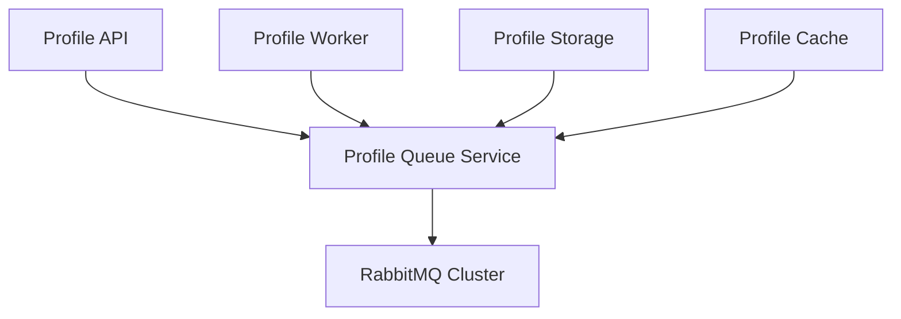
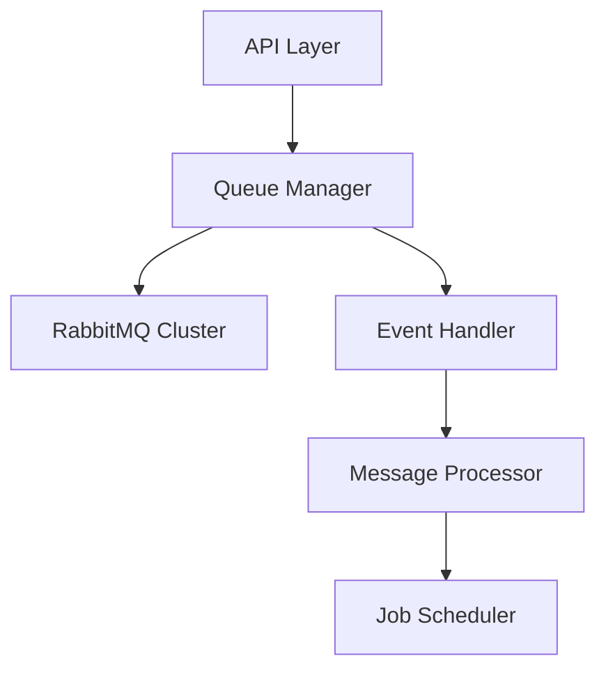
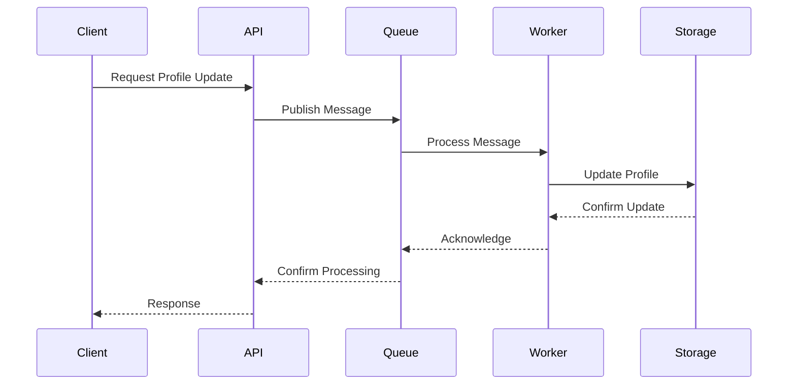

# Profile Queue Service Documentation

## Service Overview

### Description

The Profile Queue Service manages asynchronous message processing for profile-related operations. It provides reliable message queuing, event handling, and background job processing capabilities using RabbitMQ as the message broker.

### Service Context



### Service Boundaries

- **Input**:
  - Profile update requests
  - Cache invalidation events
  - Background job requests
- **Output**:
  - Processed messages
  - Event notifications
  - Job status updates
- **Dependencies**:
  - RabbitMQ Cluster
  - Profile Worker Service
  - Profile Storage Service
  - Profile Cache Service

## Architecture

### Component Diagram



### Data Flow



## API Documentation

### Endpoints

```yaml
endpoints:
  - path: /api/v1/queue/messages
    method: POST
    description: Publish a new message
    requestBody:
      type: object
      required: true
      content:
        application/json:
          schema:
            $ref: "#/components/schemas/QueueMessage"
    responses:
      202:
        description: Message accepted
      400:
        description: Invalid message format
      500:
        description: Internal server error

  - path: /api/v1/queue/status/{messageId}
    method: GET
    description: Get message status
    parameters:
      - name: messageId
        type: string
        required: true
    responses:
      200:
        description: Message status
      404:
        description: Message not found
      500:
        description: Internal server error
```

### Data Models

```yaml
models:
  QueueMessage:
    type: object
    properties:
      id:
        type: string
      type:
        type: string
        enum: [profile_update, cache_invalidation, background_job]
      payload:
        type: object
      priority:
        type: integer
        minimum: 1
        maximum: 10
      timestamp:
        type: string
        format: date-time
```

## Implementation Details

### Technology Stack

- **Language**: Go 1.21+
- **Framework**: Gin
- **Message Broker**: RabbitMQ 3.12
- **Monitoring**: Prometheus + Grafana

### Configuration

```yaml
service:
  name: profile-queue
  version: 1.0.0
  port: 8080
  environment: development
  rabbitmq:
    cluster:
      nodes:
        - host: rabbitmq-1
          port: 5672
        - host: rabbitmq-2
          port: 5672
        - host: rabbitmq-3
          port: 5672
    options:
      prefetch_count: 10
      reconnect_interval: 5s
      max_retries: 3
  logging:
    level: info
    format: json
  metrics:
    enabled: true
    port: 9090
```

### Dependencies

```yaml
dependencies:
  - name: github.com/gin-gonic/gin
    version: v1.9.1
    purpose: HTTP framework
  - name: github.com/streadway/amqp
    version: v1.0.0
    purpose: RabbitMQ client
  - name: github.com/prometheus/client_golang
    version: v1.17.0
    purpose: Metrics collection
```

## Operational Aspects

### Health Checks

```yaml
health_checks:
  - name: readiness
    path: /health/ready
    interval: 30s
    timeout: 5s
    checks:
      - rabbitmq_connection
      - message_processing
  - name: liveness
    path: /health/live
    interval: 30s
    timeout: 5s
```

### Metrics

```yaml
metrics:
  - name: queue_messages_total
    type: counter
    labels:
      - queue
      - type
  - name: queue_processing_duration_seconds
    type: histogram
    labels:
      - queue
      - type
  - name: queue_size
    type: gauge
    labels:
      - queue
```

### Logging

```yaml
logging:
  format: json
  fields:
    - service
    - trace_id
    - message_id
    - queue
  levels:
    - error
    - warn
    - info
    - debug
```

## Deployment

### Kubernetes Configuration

```yaml
deployment:
  replicas: 3
  resources:
    requests:
      cpu: 100m
      memory: 128Mi
    limits:
      cpu: 500m
      memory: 512Mi
  strategy:
    type: RollingUpdate
    rollingUpdate:
      maxSurge: 1
      maxUnavailable: 0
  volumes:
    - name: config
      configMap:
        name: profile-queue-config
```

### Environment Variables

```yaml
environment:
  - name: RABBITMQ_HOSTS
    valueFrom:
      configMapKeyRef:
        name: profile-queue-config
        key: rabbitmq_hosts
  - name: LOG_LEVEL
    value: info
```

## Development

### Local Development

```bash
# Start dependencies
docker-compose up -d rabbitmq

# Start service
go run cmd/main.go

# Run tests
go test ./...
```

### Testing

```yaml
testing:
  unit:
    command: go test ./...
    coverage: 80%
  integration:
    command: go test ./integration/...
    timeout: 5m
    requires:
      - rabbitmq
  e2e:
    command: go test ./e2e/...
    timeout: 10m
```

## Monitoring and Alerting

### Dashboards

```yaml
dashboards:
  - name: queue-overview
    metrics:
      - queue_messages_total
      - queue_processing_duration_seconds
      - queue_size
  - name: queue-resources
    metrics:
      - cpu_usage
      - memory_usage
      - rabbitmq_connections
```

### Alerts

```yaml
alerts:
  - name: high_queue_size
    condition: queue_size > 10000
    duration: 5m
    severity: warning
  - name: slow_message_processing
    condition: histogram_quantile(0.95, rate(queue_processing_duration_seconds_bucket[5m])) > 10
    duration: 5m
    severity: warning
```

## Maintenance

### Backup and Recovery

```yaml
backup:
  schedule: "0 0 * * *"
  retention: 7d
  location: s3://queue-backups
recovery:
  rto: 30m
  rpo: 1h
  verification: automated-tests
```

### Update Procedures

```yaml
updates:
  - type: minor
    procedure: rolling-update
    max_unavailable: 1
    verification: health-checks
  - type: major
    procedure: blue-green
    verification:
      - health-checks
      - performance-tests
```

## Troubleshooting

### Common Issues

```yaml
issues:
  - name: message_processing_delay
    symptoms:
      - High queue size
      - Slow processing
    causes:
      - Worker overload
      - Network issues
    solutions:
      - Scale workers
      - Check network
      - Review processing logic

  - name: rabbitmq_connection
    symptoms:
      - Connection errors
      - Message loss
    causes:
      - Network issues
      - RabbitMQ overload
    solutions:
      - Check network
      - Monitor RabbitMQ
      - Review connection pool
```

### Debug Procedures

```yaml
debug:
  - name: message_flow
    steps:
      - Check queue size
      - Analyze processing time
      - Review error logs
  - name: performance_issues
    steps:
      - Monitor metrics
      - Check resource usage
      - Review configuration
```

## Next Steps

1. [ ] Implement message prioritization
2. [ ] Add dead letter queues
3. [ ] Enhance monitoring
4. [ ] Implement retry policies
5. [ ] Add message validation

## Security

For detailed security information, including authentication, authorization, encryption, and security controls, please refer to the [Service Security Documentation](service-security.md#profile-queue-service-security).
