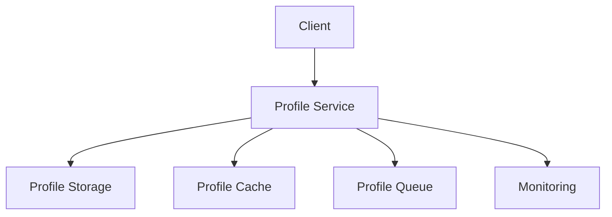
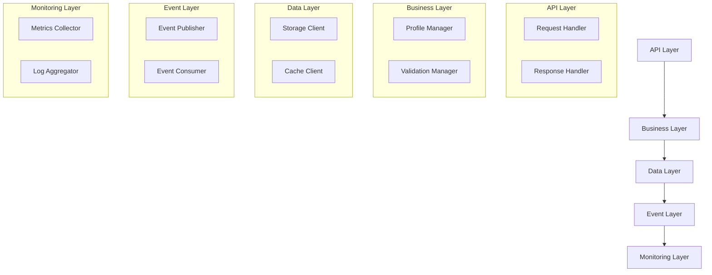
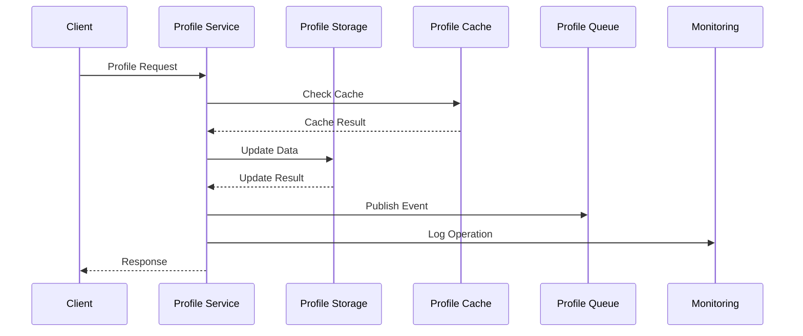

INITIAL CONTEXT FOR LLM - never change the context-----------------------------
-> THIS SECTION IS A GUIDELINE TO THE LLM CONSIDER BEFORE WORKING IN THIS FILE, DO NOT CHANGE THIS

-> GOES OF THE PROFILE SERVICE:

- This document describes the Profile Service used in the Profile Service Microservices architecture
- It covers service boundaries, responsibilities, and interactions
- Includes implementation details and configuration examples
- All patterns are implemented and tested in the current architecture
- For LLM-specific guidelines, refer to [LLM Integration Guide](../../../docs/llm/README.md)

-> CONSIDERER BEFORE UPDATING THIS FILE:

- This is a documentation file about the Profile Service
- Never add fictional dates, version numbers, or metrics
- Changes should be incremental and based on verified information
- Add comments for clarification when needed
- Maintain LLM-friendly format

---

# Profile Service

## Service Overview

### Purpose and Responsibilities

The Profile Service manages user profile data in the Profile Service Microservices architecture. It is responsible for:

- Profile data management
- Profile data validation
- Profile data synchronization
- Profile data caching
- Profile data events
- Profile data security

### Service Boundaries

- **Input**: Profile CRUD requests, profile validation requests
- **Output**: Profile data, validation results, events
- **Dependencies**:
  - Profile Storage Service
  - Profile Cache Service
  - Profile Queue Service
  - Monitoring Service

### Integration Points



## Architecture

### Component Diagram



### Data Flow



## Implementation

### API Documentation

```yaml
endpoints:
  - path: /api/v1/profiles
    method: POST
    description: Create profile
    request:
      type: object
      properties:
        user_id:
          type: string
        data:
          type: object
    responses:
      201:
        description: Created
      400:
        description: Invalid data
      409:
        description: Profile exists

  - path: /api/v1/profiles/{id}
    method: GET
    description: Get profile
    parameters:
      - name: id
        type: string
        required: true
    responses:
      200:
        description: Success
      404:
        description: Not found

  - path: /api/v1/profiles/{id}
    method: PUT
    description: Update profile
    parameters:
      - name: id
        type: string
        required: true
    request:
      type: object
      properties:
        data:
          type: object
    responses:
      200:
        description: Updated
      404:
        description: Not found
```

### Data Models

```yaml
models:
  Profile:
    type: object
    properties:
      id:
        type: string
      user_id:
        type: string
      data:
        type: object
      created_at:
        type: string
        format: date-time
      updated_at:
        type: string
        format: date-time

  ProfileEvent:
    type: object
    properties:
      type:
        type: string
        enum:
          - CREATED
          - UPDATED
          - DELETED
      profile_id:
        type: string
      data:
        type: object
      timestamp:
        type: string
        format: date-time
```

### Dependencies

```yaml
dependencies:
  - name: @prisma/client
    version: 5.0.0
    purpose: Database client
  - name: redis
    version: 4.6.0
    purpose: Cache client
  - name: bull
    version: 4.10.0
    purpose: Queue client
  - name: prom-client
    version: 14.2.0
    purpose: Metrics collection
```

### Configuration

```yaml
service:
  name: profile-service
  version: 1.0.0
  port: 8082
  environment: development
  database:
    url: ${DATABASE_URL}
    pool_size: 10
  cache:
    host: ${REDIS_HOST}
    port: ${REDIS_PORT}
    ttl: 3600
  queue:
    host: ${REDIS_HOST}
    port: ${REDIS_PORT}
    prefix: profile
  logging:
    level: info
    format: json
  metrics:
    enabled: true
    port: 9092
```

## Operations

### Health Checks

```yaml
health_checks:
  - name: readiness
    path: /health/ready
    interval: 30s
    timeout: 5s
    checks:
      - database_connection
      - cache_connection
      - queue_connection
  - name: liveness
    path: /health/live
    interval: 30s
    timeout: 5s
```

### Metrics

```yaml
metrics:
  - name: profile_operations
    type: counter
    labels:
      - operation
      - status
  - name: cache_operations
    type: counter
    labels:
      - operation
      - status
  - name: queue_operations
    type: counter
    labels:
      - operation
      - status
```

### Logging

```yaml
logging:
  format: json
  fields:
    - service
    - trace_id
    - user_id
    - operation
  levels:
    - error
    - warn
    - info
    - debug
```

## Security

For detailed security information, including authentication, authorization, encryption, and security controls, please refer to the [Service Security Documentation](service-security.md#profile-service-security).

## Pattern Implementation

### Core Patterns

1. CQRS Pattern

   - Command handling
   - Query handling
   - Event sourcing
   - Data consistency

2. Event Sourcing Pattern
   - Event storage
   - Event replay
   - State reconstruction
   - Event versioning

### Data Patterns

1. Cache-Aside Pattern

   - Cache population
   - Cache invalidation
   - Cache consistency
   - Cache recovery

2. Write-Through Pattern
   - Cache updates
   - Storage updates
   - Consistency management
   - Error handling

### Resilience Patterns

1. Circuit Breaker Pattern

   - Failure detection
   - Service isolation
   - Fallback handling
   - Recovery management

2. Retry Pattern
   - Operation retries
   - Backoff strategy
   - Error handling
   - Success validation

## Notes

- Monitor profile operations
- Track cache performance
- Review event processing
- Update data models
- Test failure scenarios
