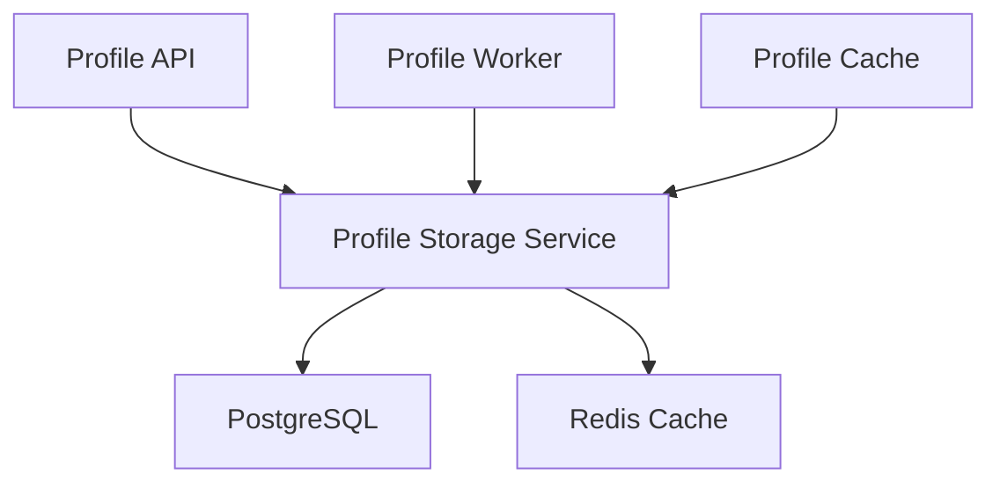
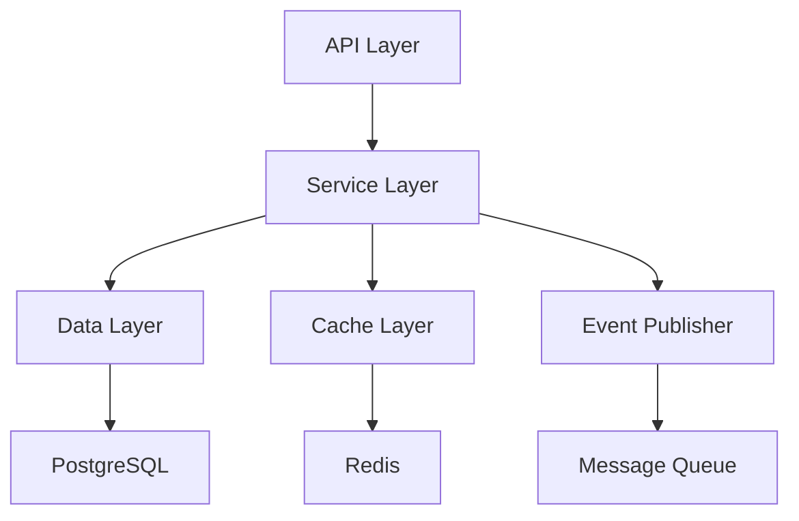
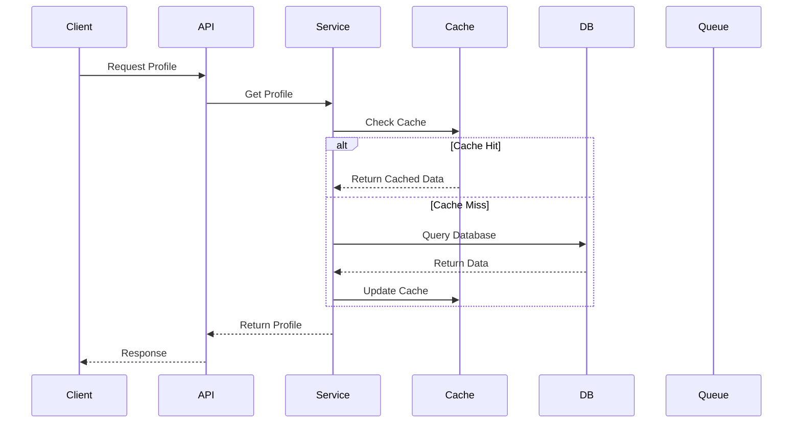

# Profile Storage Service Documentation

## Service Overview

### Description

The Profile Storage Service is responsible for persistent storage and management of user profile data. It provides a reliable and scalable data storage layer for the Profile Service microservices architecture, handling CRUD operations, data validation, and data integrity.

### Service Context



### Service Boundaries

- **Input**:
  - Profile data from Profile API
  - Data update requests from Profile Worker
  - Cache invalidation requests from Profile Cache
- **Output**:
  - Profile data to Profile API
  - Event notifications for data changes
  - Cache update notifications
- **Dependencies**:
  - PostgreSQL for persistent storage
  - Redis for caching
  - Message Queue for event publishing

## Architecture

### Component Diagram



### Data Flow



## API Documentation

### Endpoints

```yaml
endpoints:
  - path: /api/v1/profiles
    method: GET
    description: Retrieve profile by ID
    parameters:
      - name: id
        type: string
        required: true
    responses:
      200:
        description: Profile found
      404:
        description: Profile not found
      500:
        description: Internal server error

  - path: /api/v1/profiles
    method: POST
    description: Create new profile
    requestBody:
      type: object
      required: true
      content:
        application/json:
          schema:
            $ref: "#/components/schemas/Profile"
    responses:
      201:
        description: Profile created
      400:
        description: Invalid input
      500:
        description: Internal server error
```

### Data Models

```yaml
models:
  Profile:
    type: object
    properties:
      id:
        type: string
        format: uuid
      user_id:
        type: string
        format: uuid
      first_name:
        type: string
      last_name:
        type: string
      email:
        type: string
        format: email
      created_at:
        type: string
        format: date-time
      updated_at:
        type: string
        format: date-time
    required:
      - user_id
      - email
```

## Implementation Details

### Technology Stack

- **Language**: Go 1.21+
- **Framework**: Gin
- **Database**: PostgreSQL 15
- **Cache**: Redis 7
- **Message Queue**: RabbitMQ

### Configuration

```yaml
service:
  name: profile-storage
  version: 1.0.0
  port: 8080
  environment: development
  database:
    host: postgres
    port: 5432
    name: profiles
    user: profile_user
    ssl_mode: require
  cache:
    host: redis
    port: 6379
    db: 0
  message_queue:
    host: rabbitmq
    port: 5672
    vhost: profiles
  logging:
    level: info
    format: json
  metrics:
    enabled: true
    port: 9090
```

### Dependencies

```yaml
dependencies:
  - name: github.com/gin-gonic/gin
    version: v1.9.1
    purpose: HTTP framework
  - name: github.com/go-redis/redis
    version: v8.11.5
    purpose: Redis client
  - name: github.com/lib/pq
    version: v1.10.9
    purpose: PostgreSQL driver
  - name: github.com/streadway/amqp
    version: v1.0.0
    purpose: RabbitMQ client
```

## Operational Aspects

### Health Checks

```yaml
health_checks:
  - name: readiness
    path: /health/ready
    interval: 30s
    timeout: 5s
    checks:
      - database
      - cache
      - message_queue
  - name: liveness
    path: /health/live
    interval: 30s
    timeout: 5s
```

### Metrics

```yaml
metrics:
  - name: profile_operations_total
    type: counter
    labels:
      - operation
      - status
  - name: profile_operation_duration_seconds
    type: histogram
    labels:
      - operation
  - name: cache_hits_total
    type: counter
  - name: cache_misses_total
    type: counter
```

### Logging

```yaml
logging:
  format: json
  fields:
    - service
    - trace_id
    - user_id
    - operation
  levels:
    - error
    - warn
    - info
    - debug
```

## Deployment

### Kubernetes Configuration

```yaml
deployment:
  replicas: 3
  resources:
    requests:
      cpu: 200m
      memory: 256Mi
    limits:
      cpu: 1000m
      memory: 1Gi
  strategy:
    type: RollingUpdate
    rollingUpdate:
      maxSurge: 1
      maxUnavailable: 0
  volumes:
    - name: config
      configMap:
        name: profile-storage-config
    - name: secrets
      secret:
        secretName: profile-storage-secrets
```

### Environment Variables

```yaml
environment:
  - name: DB_HOST
    valueFrom:
      configMapKeyRef:
        name: profile-storage-config
        key: db_host
  - name: DB_PASSWORD
    valueFrom:
      secretKeyRef:
        name: profile-storage-secrets
        key: db_password
  - name: LOG_LEVEL
    value: info
```

## Development

### Local Development

```bash
# Start dependencies
docker-compose up -d postgres redis rabbitmq

# Run migrations
go run cmd/migrate/main.go

# Start service
go run cmd/main.go

# Run tests
go test ./...
```

### Testing

```yaml
testing:
  unit:
    command: go test ./...
    coverage: 80%
  integration:
    command: go test ./integration/...
    timeout: 5m
    requires:
      - postgres
      - redis
      - rabbitmq
  e2e:
    command: go test ./e2e/...
    timeout: 10m
```

## Monitoring and Alerting

### Dashboards

```yaml
dashboards:
  - name: storage-overview
    metrics:
      - profile_operations_total
      - profile_operation_duration_seconds
      - cache_hits_total
      - cache_misses_total
  - name: storage-resources
    metrics:
      - cpu_usage
      - memory_usage
      - disk_usage
```

### Alerts

```yaml
alerts:
  - name: high_error_rate
    condition: rate(profile_operations_total{status="error"}[5m]) > 0.05
    duration: 5m
    severity: critical
  - name: high_latency
    condition: histogram_quantile(0.95, rate(profile_operation_duration_seconds_bucket[5m])) > 1
    duration: 5m
    severity: warning
```

## Maintenance

### Backup and Recovery

```yaml
backup:
  schedule: "0 0 * * *"
  retention: 7d
  location: s3://profile-backups
  type: full
recovery:
  rto: 1h
  rpo: 24h
  verification: automated-tests
```

### Update Procedures

```yaml
updates:
  - type: minor
    procedure: rolling-update
    max_unavailable: 1
    verification: health-checks
  - type: major
    procedure: blue-green
    verification:
      - health-checks
      - automated-tests
      - performance-tests
```

## Troubleshooting

### Common Issues

```yaml
issues:
  - name: database_connection
    symptoms:
      - High error rate
      - Connection timeouts
    causes:
      - Database overload
      - Network issues
    solutions:
      - Check database metrics
      - Verify network connectivity
      - Review connection pool settings

  - name: cache_invalidation
    symptoms:
      - Stale data
      - Inconsistent reads
    causes:
      - Cache invalidation failures
      - Race conditions
    solutions:
      - Check cache logs
      - Verify message queue
      - Review cache policies
```

### Debug Procedures

```yaml
debug:
  - name: data_integrity
    steps:
      - Check database logs
      - Verify data consistency
      - Review transaction logs
  - name: performance_analysis
    steps:
      - Collect metrics
      - Analyze query patterns
      - Check resource usage
```

## Next Steps

1. [ ] Implement data versioning
2. [ ] Add data archiving
3. [ ] Enhance monitoring
4. [ ] Optimize query performance
5. [ ] Implement data validation

## Security

For detailed security information, including authentication, authorization, encryption, and security controls, please refer to the [Service Security Documentation](service-security.md#profile-storage-service-security).
