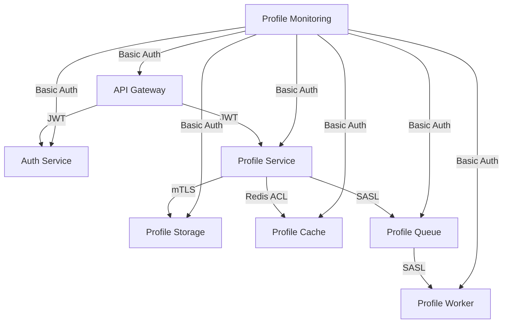

INITIAL CONTEXT FOR LLM - never change the context-----------------------------
-> THIS SECTION IS A GUIDELINE TO THE LLM CONSIDER BEFORE WORKING IN THIS FILE, DO NOT CHANGE THIS

-> GOES OF THE SERVICE SECURITY DOCUMENTATION:

- This document describes the security measures for services in the Profile Service Microservices project
- Each service's security should be clearly defined
- Documentation should be clear, concise, and LLM-friendly
- All security configurations should be well-documented with examples
- Cross-references should be maintained between related services

-> CONSIDERER BEFORE UPDATING THIS FILE:

- This is a documentation file about service security
- Never add fictional dates, version numbers, or metrics
- Changes should be incremental and based on verified information
- Add comments for clarification when needed
- Maintain LLM-friendly format

---

# Service Security

## Security Overview



## Security Configurations

### 1. API Gateway Security

```yaml
security:
  authentication:
    type: JWT
    configuration:
      issuer: auth-service
      audience: api-gateway
      signing_key: ${JWT_SIGNING_KEY}
      token_expiry: 3600
      refresh_token_expiry: 604800

  authorization:
    type: RBAC
    configuration:
      roles:
        - name: admin
          permissions:
            - "*"
        - name: user
          permissions:
            - "profile:read"
            - "profile:write"

  rate_limiting:
    type: token_bucket
    configuration:
      rate: 100
      burst: 200
      per_ip: true

  cors:
    enabled: true
    configuration:
      allowed_origins:
        - "https://example.com"
      allowed_methods:
        - GET
        - POST
        - PUT
        - DELETE
      allowed_headers:
        - Authorization
        - Content-Type
      max_age: 3600
```

### 2. Auth Service Security

```yaml
security:
  authentication:
    type: JWT
    configuration:
      issuer: auth-service
      audience: api-gateway
      signing_key: ${JWT_SIGNING_KEY}
      token_expiry: 3600
      refresh_token_expiry: 604800

  authorization:
    type: RBAC
    configuration:
      roles:
        - name: admin
          permissions:
            - "*"
        - name: user
          permissions:
            - "profile:read"
            - "profile:write"

  rate_limiting:
    type: token_bucket
    configuration:
      rate: 100
      burst: 200
      per_ip: true

  cors:
    enabled: true
    configuration:
      allowed_origins:
        - "https://example.com"
      allowed_methods:
        - GET
        - POST
        - PUT
        - DELETE
      allowed_headers:
        - Authorization
        - Content-Type
      max_age: 3600
```

### 3. Profile Service Security

```yaml
security:
  authentication:
    type: JWT
    configuration:
      issuer: auth-service
      audience: profile-service
      signing_key: ${JWT_SIGNING_KEY}
      token_expiry: 3600
      refresh_token_expiry: 604800

  authorization:
    type: RBAC
    configuration:
      roles:
        - name: admin
          permissions:
            - "*"
        - name: user
          permissions:
            - "profile:read"
            - "profile:write"

  rate_limiting:
    type: token_bucket
    configuration:
      rate: 100
      burst: 200
      per_ip: true

  cors:
    enabled: true
    configuration:
      allowed_origins:
        - "https://example.com"
      allowed_methods:
        - GET
        - POST
        - PUT
        - DELETE
      allowed_headers:
        - Authorization
        - Content-Type
      max_age: 3600
```

### 4. Profile Storage Security

```yaml
security:
  authentication:
    type: mTLS
    configuration:
      ca_cert: ${CA_CERT}
      server_cert: ${SERVER_CERT}
      server_key: ${SERVER_KEY}
      client_cert: ${CLIENT_CERT}
      client_key: ${CLIENT_KEY}

  authorization:
    type: RBAC
    configuration:
      roles:
        - name: admin
          permissions:
            - "*"
        - name: user
          permissions:
            - "profile:read"
            - "profile:write"

  rate_limiting:
    type: token_bucket
    configuration:
      rate: 100
      burst: 200
      per_ip: true
```

### 5. Profile Cache Security

```yaml
security:
  authentication:
    type: Redis ACL
    configuration:
      users:
        - username: profile-service
          password: ${REDIS_PASSWORD}
          commands:
            - "+@all"
            - "-@dangerous"
          keys:
            - "profile:*"

  authorization:
    type: Redis ACL
    configuration:
      users:
        - username: profile-service
          password: ${REDIS_PASSWORD}
          commands:
            - "+@all"
            - "-@dangerous"
          keys:
            - "profile:*"

  rate_limiting:
    type: Redis Max Clients
    configuration:
      max_clients: 100
```

### 6. Profile Queue Security

```yaml
security:
  authentication:
    type: SASL
    configuration:
      mechanism: PLAIN
      users:
        - username: profile-service
          password: ${RABBITMQ_PASSWORD}
          vhost: /
          permissions:
            - ".*"
            - ".*"
            - ".*"

  authorization:
    type: RabbitMQ Permissions
    configuration:
      users:
        - username: profile-service
          password: ${RABBITMQ_PASSWORD}
          vhost: /
          permissions:
            - ".*"
            - ".*"
            - ".*"

  rate_limiting:
    type: Channel Prefetch
    configuration:
      prefetch_count: 10
```

### 7. Profile Worker Security

```yaml
security:
  authentication:
    type: SASL
    configuration:
      mechanism: PLAIN
      users:
        - username: profile-worker
          password: ${RABBITMQ_PASSWORD}
          vhost: /
          permissions:
            - ".*"
            - ".*"
            - ".*"

  authorization:
    type: RabbitMQ Permissions
    configuration:
      users:
        - username: profile-worker
          password: ${RABBITMQ_PASSWORD}
          vhost: /
          permissions:
            - ".*"
            - ".*"
            - ".*"

  rate_limiting:
    type: Channel Prefetch
    configuration:
      prefetch_count: 10
```

### 8. Profile Monitoring Security

```yaml
security:
  authentication:
    type: Basic Auth
    configuration:
      users:
        - username: prometheus
          password: ${PROMETHEUS_PASSWORD}
        - username: grafana
          password: ${GRAFANA_PASSWORD}

  authorization:
    type: Basic Auth
    configuration:
      users:
        - username: prometheus
          password: ${PROMETHEUS_PASSWORD}
          roles:
            - admin
        - username: grafana
          password: ${GRAFANA_PASSWORD}
          roles:
            - admin

  rate_limiting:
    type: None
```

## Security Policies

### 1. Password Policy

```yaml
password_policy:
  min_length: 12
  require_uppercase: true
  require_lowercase: true
  require_numbers: true
  require_special_chars: true
  max_age_days: 90
  history_size: 5
  lockout_attempts: 5
  lockout_duration_minutes: 30
```

### 2. Token Policy

```yaml
token_policy:
  access_token:
    expiry_seconds: 3600
    refreshable: true
    refresh_threshold_seconds: 300
  refresh_token:
    expiry_seconds: 604800
    max_refresh_count: 10
  jwt:
    algorithm: RS256
    key_rotation_days: 30
```

### 3. TLS Policy

```yaml
tls_policy:
  min_version: TLSv1.2
  cipher_suites:
    - TLS_ECDHE_ECDSA_WITH_AES_256_GCM_SHA384
    - TLS_ECDHE_RSA_WITH_AES_256_GCM_SHA384
    - TLS_ECDHE_ECDSA_WITH_CHACHA20_POLY1305
    - TLS_ECDHE_RSA_WITH_CHACHA20_POLY1305
  certificate:
    validity_days: 365
    key_size: 4096
    signature_algorithm: SHA-256
```

### 4. Rate Limiting Policy

```yaml
rate_limiting_policy:
  api_gateway:
    rate: 100
    burst: 200
    per_ip: true
  auth_service:
    rate: 100
    burst: 200
    per_ip: true
  profile_service:
    rate: 100
    burst: 200
    per_ip: true
  profile_storage:
    rate: 100
    burst: 200
    per_ip: true
  profile_cache:
    max_clients: 100
  profile_queue:
    prefetch_count: 10
  profile_worker:
    prefetch_count: 10
```

### 5. CORS Policy

```yaml
cors_policy:
  allowed_origins:
    - "https://example.com"
  allowed_methods:
    - GET
    - POST
    - PUT
    - DELETE
  allowed_headers:
    - Authorization
    - Content-Type
  exposed_headers:
    - X-Request-ID
  max_age: 3600
  allow_credentials: true
```

## Security Monitoring

### 1. Security Metrics

```yaml
security_metrics:
  - name: auth_attempts_total
    type: counter
    labels:
      - service
      - status
      - method

  - name: token_validations_total
    type: counter
    labels:
      - service
      - status
      - token_type

  - name: rate_limit_hits_total
    type: counter
    labels:
      - service
      - limit_type
      - status
```

### 2. Security Alerts

```yaml
security_alerts:
  - name: high_auth_failures
    expr: rate(auth_attempts_total{status="failure"}[5m]) > 0.1
    for: 5m
    labels:
      severity: critical
    annotations:
      summary: High authentication failure rate
      description: Authentication failure rate is above 10% for the last 5 minutes

  - name: high_token_validation_failures
    expr: rate(token_validations_total{status="invalid"}[5m]) > 0.05
    for: 5m
    labels:
      severity: warning
    annotations:
      summary: High token validation failure rate
      description: Token validation failure rate is above 5% for the last 5 minutes

  - name: high_rate_limit_hits
    expr: rate(rate_limit_hits_total{status="limited"}[5m]) > 0.2
    for: 5m
    labels:
      severity: warning
    annotations:
      summary: High rate limit hits
      description: Rate limit hits are above 20% for the last 5 minutes
```

## Notes

- Keep documentation up to date
- Maintain cross-references
- Add practical examples
- Document decisions
- Track changes
- Ensure alignment with architecture
