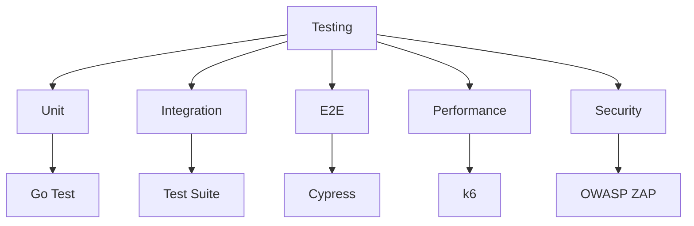

INITIAL CONTEXT FOR LLM - never change the context-----------------------------
-> THIS SECTION IS A GUIDELINE TO THE LLM CONSIDER BEFORE WORKING IN THIS FILE, DO NOT CHANGE THIS

-> GOES OF THE SERVICE TESTING:

- This document describes the testing strategies and practices in the Profile Service Microservices architecture
- It covers unit testing, integration testing, end-to-end testing, performance testing, security testing, and test automation
- Includes implementation details and configuration examples
- All patterns are implemented and tested in the current architecture
- For LLM-specific guidelines, refer to [LLM Integration Guide](../../../docs/llm/README.md)

-> CONSIDERER BEFORE UPDATING THIS FILE:

- This is a documentation file about service testing
- Never add fictional dates, version numbers, or metrics
- Changes should be incremental and based on verified information
- Add comments for clarification when needed
- Maintain LLM-friendly format

---

# Service Testing

## Overview

### Purpose and Scope

The Service Testing describes the testing strategies and practices implemented across the Profile Service Microservices architecture. It covers:

- Unit testing
- Integration testing
- End-to-end testing
- Performance testing
- Security testing
- Test automation

### Testing Architecture



## Unit Testing

### Test Configuration

```yaml
unit_testing:
  - name: profile_service
    configuration:
      framework: go test
      coverage: 80
      timeout: 5m
    test_cases:
      - name: profile_creation
        description: "Test profile creation functionality"
        steps:
          - name: create_profile
            input:
              name: "John Doe"
              email: "john@example.com"
            expected:
              status: 201
              data:
                name: "John Doe"
                email: "john@example.com"
      - name: profile_update
        description: "Test profile update functionality"
        steps:
          - name: update_profile
            input:
              id: "123"
              name: "John Updated"
            expected:
              status: 200
              data:
                name: "John Updated"

  - name: api_gateway
    configuration:
      framework: go test
      coverage: 80
      timeout: 5m
    test_cases:
      - name: request_routing
        description: "Test request routing functionality"
        steps:
          - name: route_request
            input:
              path: "/api/v1/profiles"
              method: "GET"
            expected:
              status: 200
              service: "profile-service"
      - name: request_validation
        description: "Test request validation functionality"
        steps:
          - name: validate_request
            input:
              path: "/api/v1/profiles"
              method: "POST"
              body: "invalid"
            expected:
              status: 400
              error: "Invalid request body"
```

## Integration Testing

### Test Configuration

```yaml
integration_testing:
  - name: profile_service
    configuration:
      framework: test suite
      dependencies:
        - name: postgres
          type: database
        - name: redis
          type: cache
      timeout: 10m
    test_cases:
      - name: profile_workflow
        description: "Test complete profile workflow"
        steps:
          - name: create_profile
            input:
              name: "John Doe"
              email: "john@example.com"
            expected:
              status: 201
          - name: get_profile
            input:
              id: "${create_profile.id}"
            expected:
              status: 200
              data:
                name: "John Doe"
          - name: update_profile
            input:
              id: "${create_profile.id}"
              name: "John Updated"
            expected:
              status: 200
          - name: delete_profile
            input:
              id: "${create_profile.id}"
            expected:
              status: 204

  - name: api_gateway
    configuration:
      framework: test suite
      dependencies:
        - name: profile_service
          type: service
        - name: auth_service
          type: service
      timeout: 10m
    test_cases:
      - name: api_workflow
        description: "Test complete API workflow"
        steps:
          - name: authenticate
            input:
              username: "test"
              password: "test"
            expected:
              status: 200
              token: "${token}"
          - name: create_profile
            input:
              token: "${token}"
              data:
                name: "John Doe"
            expected:
              status: 201
          - name: get_profile
            input:
              token: "${token}"
              id: "${create_profile.id}"
            expected:
              status: 200
```

## End-to-End Testing

### Test Configuration

```yaml
e2e_testing:
  - name: profile_service
    configuration:
      framework: cypress
      browser: chrome
      viewport: 1280x720
      timeout: 30s
    test_cases:
      - name: profile_management
        description: "Test profile management workflow"
        steps:
          - name: login
            action: visit
            url: "/login"
            input:
              username: "test"
              password: "test"
            expected:
              url: "/dashboard"
          - name: create_profile
            action: click
            selector: "#create-profile"
            input:
              name: "John Doe"
              email: "john@example.com"
            expected:
              selector: ".success-message"
          - name: view_profile
            action: click
            selector: "#view-profile"
            expected:
              selector: ".profile-details"
              text: "John Doe"

  - name: api_gateway
    configuration:
      framework: cypress
      browser: chrome
      viewport: 1280x720
      timeout: 30s
    test_cases:
      - name: api_workflow
        description: "Test API workflow"
        steps:
          - name: authenticate
            action: request
            method: POST
            url: "/api/v1/auth/login"
            input:
              username: "test"
              password: "test"
            expected:
              status: 200
              token: "${token}"
          - name: create_profile
            action: request
            method: POST
            url: "/api/v1/profiles"
            headers:
              Authorization: "Bearer ${token}"
            input:
              name: "John Doe"
            expected:
              status: 201
          - name: get_profile
            action: request
            method: GET
            url: "/api/v1/profiles/${create_profile.id}"
            headers:
              Authorization: "Bearer ${token}"
            expected:
              status: 200
              data:
                name: "John Doe"
```

## Performance Testing

### Test Configuration

```yaml
performance_testing:
  - name: profile_service
    configuration:
      framework: k6
      metrics:
        - name: http_req_duration
          threshold: p95 < 500
        - name: http_req_failed
          threshold: rate < 0.01
      scenarios:
        - name: load_test
          duration: 5m
          vus: 100
          ramp_up: 1m
    test_cases:
      - name: profile_operations
        description: "Test profile operations under load"
        steps:
          - name: create_profile
            method: POST
            url: "/api/v1/profiles"
            body:
              name: "John Doe"
              email: "john@example.com"
            expected:
              status: 201
          - name: get_profile
            method: GET
            url: "/api/v1/profiles/${create_profile.id}"
            expected:
              status: 200
          - name: update_profile
            method: PUT
            url: "/api/v1/profiles/${create_profile.id}"
            body:
              name: "John Updated"
            expected:
              status: 200

  - name: api_gateway
    configuration:
      framework: k6
      metrics:
        - name: http_req_duration
          threshold: p95 < 500
        - name: http_req_failed
          threshold: rate < 0.01
      scenarios:
        - name: load_test
          duration: 5m
          vus: 100
          ramp_up: 1m
    test_cases:
      - name: api_operations
        description: "Test API operations under load"
        steps:
          - name: authenticate
            method: POST
            url: "/api/v1/auth/login"
            body:
              username: "test"
              password: "test"
            expected:
              status: 200
          - name: create_profile
            method: POST
            url: "/api/v1/profiles"
            headers:
              Authorization: "Bearer ${token}"
            body:
              name: "John Doe"
            expected:
              status: 201
          - name: get_profile
            method: GET
            url: "/api/v1/profiles/${create_profile.id}"
            headers:
              Authorization: "Bearer ${token}"
            expected:
              status: 200
```

## Security Testing

### Test Configuration

```yaml
security_testing:
  - name: profile_service
    configuration:
      framework: OWASP ZAP
      scan_type: active
      target: http://profile-service:8080
      rules:
        - name: sql_injection
          enabled: true
        - name: xss
          enabled: true
        - name: csrf
          enabled: true
    test_cases:
      - name: authentication_security
        description: "Test authentication security"
        steps:
          - name: brute_force
            method: POST
            url: "/api/v1/auth/login"
            input:
              username: "admin"
              password: "password"
            iterations: 100
            expected:
              status: 401
          - name: token_validation
            method: GET
            url: "/api/v1/profiles"
            headers:
              Authorization: "Bearer invalid"
            expected:
              status: 401

  - name: api_gateway
    configuration:
      framework: OWASP ZAP
      scan_type: active
      target: http://api-gateway:8080
      rules:
        - name: sql_injection
          enabled: true
        - name: xss
          enabled: true
        - name: csrf
          enabled: true
    test_cases:
      - name: api_security
        description: "Test API security"
        steps:
          - name: rate_limiting
            method: GET
            url: "/api/v1/profiles"
            iterations: 1000
            expected:
              status: 429
          - name: input_validation
            method: POST
            url: "/api/v1/profiles"
            body:
              name: "<script>alert('xss')</script>"
            expected:
              status: 400
```

## Test Automation

### CI/CD Integration

```yaml
test_automation:
  - name: profile_service
    configuration:
      pipeline:
        - name: unit_tests
          stage: test
          steps:
            - name: run_tests
              command: go test ./...
              coverage: 80
            - name: run_integration_tests
              command: go test ./integration/...
            - name: run_e2e_tests
              command: cypress run
            - name: run_performance_tests
              command: k6 run performance.js
            - name: run_security_tests
              command: zap-cli quick-scan
      reports:
        - name: test_results
          type: junit
          path: test-results.xml
        - name: coverage_report
          type: cobertura
          path: coverage.xml
        - name: performance_report
          type: json
          path: performance.json
        - name: security_report
          type: html
          path: security.html

  - name: api_gateway
    configuration:
      pipeline:
        - name: unit_tests
          stage: test
          steps:
            - name: run_tests
              command: go test ./...
              coverage: 80
            - name: run_integration_tests
              command: go test ./integration/...
            - name: run_e2e_tests
              command: cypress run
            - name: run_performance_tests
              command: k6 run performance.js
            - name: run_security_tests
              command: zap-cli quick-scan
      reports:
        - name: test_results
          type: junit
          path: test-results.xml
        - name: coverage_report
          type: cobertura
          path: coverage.xml
        - name: performance_report
          type: json
          path: performance.json
        - name: security_report
          type: html
          path: security.html
```

## Pattern Implementation

### Testing Pattern

1. Unit Testing Pattern

   - Test isolation
   - Mocking
   - Coverage
   - Assertions

2. Integration Testing Pattern

   - Service integration
   - Data flow
   - Error handling
   - State management

3. End-to-End Testing Pattern

   - User workflows
   - UI interaction
   - API integration
   - Data validation

4. Performance Testing Pattern

   - Load testing
   - Stress testing
   - Scalability
   - Resource usage

5. Security Testing Pattern
   - Vulnerability scanning
   - Penetration testing
   - Authentication
   - Authorization

## Notes

- Monitor test coverage
- Review test results
- Update test cases
- Maintain documentation

## Service-Specific Testing

### API Gateway Testing

```yaml
api_gateway_testing:
  unit_tests:
    - name: request_routing
      description: Test request routing logic
      coverage: 90%
    - name: request_validation
      description: Test request validation
      coverage: 85%
    - name: response_transformation
      description: Test response transformation
      coverage: 85%
  integration_tests:
    - name: service_integration
      description: Test integration with other services
      coverage: 80%
    - name: authentication_flow
      description: Test authentication flow
      coverage: 85%
  e2e_tests:
    - name: api_workflow
      description: Test complete API workflow
      coverage: 75%
```

### Auth Service Testing

```yaml
auth_service_testing:
  unit_tests:
    - name: authentication
      description: Test authentication logic
      coverage: 90%
    - name: token_management
      description: Test token management
      coverage: 85%
    - name: authorization
      description: Test authorization logic
      coverage: 85%
  integration_tests:
    - name: user_management
      description: Test user management flow
      coverage: 80%
    - name: token_validation
      description: Test token validation flow
      coverage: 85%
  e2e_tests:
    - name: auth_workflow
      description: Test complete auth workflow
      coverage: 75%
```

### Profile Service Testing

```yaml
profile_service_testing:
  unit_tests:
    - name: profile_management
      description: Test profile management logic
      coverage: 90%
    - name: data_validation
      description: Test data validation
      coverage: 85%
    - name: business_rules
      description: Test business rules
      coverage: 85%
  integration_tests:
    - name: storage_integration
      description: Test storage integration
      coverage: 80%
    - name: cache_integration
      description: Test cache integration
      coverage: 80%
  e2e_tests:
    - name: profile_workflow
      description: Test complete profile workflow
      coverage: 75%
```

### Profile Storage Service Testing

```yaml
profile_storage_testing:
  unit_tests:
    - name: data_operations
      description: Test data operations
      coverage: 90%
    - name: data_validation
      description: Test data validation
      coverage: 85%
    - name: error_handling
      description: Test error handling
      coverage: 85%
  integration_tests:
    - name: database_integration
      description: Test database integration
      coverage: 80%
    - name: cache_integration
      description: Test cache integration
      coverage: 80%
  e2e_tests:
    - name: storage_workflow
      description: Test complete storage workflow
      coverage: 75%
```

### Profile Cache Service Testing

```yaml
profile_cache_testing:
  unit_tests:
    - name: cache_operations
      description: Test cache operations
      coverage: 90%
    - name: cache_invalidation
      description: Test cache invalidation
      coverage: 85%
    - name: error_handling
      description: Test error handling
      coverage: 85%
  integration_tests:
    - name: redis_integration
      description: Test Redis integration
      coverage: 80%
    - name: service_integration
      description: Test service integration
      coverage: 80%
  e2e_tests:
    - name: cache_workflow
      description: Test complete cache workflow
      coverage: 75%
```

### Profile Queue Service Testing

```yaml
profile_queue_testing:
  unit_tests:
    - name: queue_operations
      description: Test queue operations
      coverage: 90%
    - name: message_handling
      description: Test message handling
      coverage: 85%
    - name: error_handling
      description: Test error handling
      coverage: 85%
  integration_tests:
    - name: rabbitmq_integration
      description: Test RabbitMQ integration
      coverage: 80%
    - name: worker_integration
      description: Test worker integration
      coverage: 80%
  e2e_tests:
    - name: queue_workflow
      description: Test complete queue workflow
      coverage: 75%
```

### Profile Worker Service Testing

```yaml
profile_worker_testing:
  unit_tests:
    - name: job_processing
      description: Test job processing
      coverage: 90%
    - name: retry_logic
      description: Test retry logic
      coverage: 85%
    - name: error_handling
      description: Test error handling
      coverage: 85%
  integration_tests:
    - name: queue_integration
      description: Test queue integration
      coverage: 80%
    - name: storage_integration
      description: Test storage integration
      coverage: 80%
  e2e_tests:
    - name: worker_workflow
      description: Test complete worker workflow
      coverage: 75%
```

### Profile Monitoring Service Testing

```yaml
profile_monitoring_testing:
  unit_tests:
    - name: metrics_collection
      description: Test metrics collection
      coverage: 90%
    - name: alert_processing
      description: Test alert processing
      coverage: 85%
    - name: data_aggregation
      description: Test data aggregation
      coverage: 85%
  integration_tests:
    - name: prometheus_integration
      description: Test Prometheus integration
      coverage: 80%
    - name: service_integration
      description: Test service integration
      coverage: 80%
  e2e_tests:
    - name: monitoring_workflow
      description: Test complete monitoring workflow
      coverage: 75%
```
