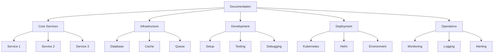
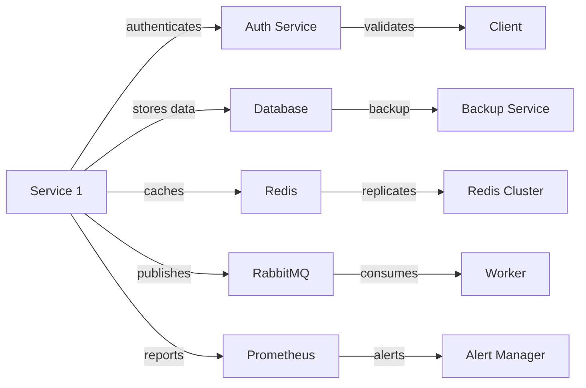
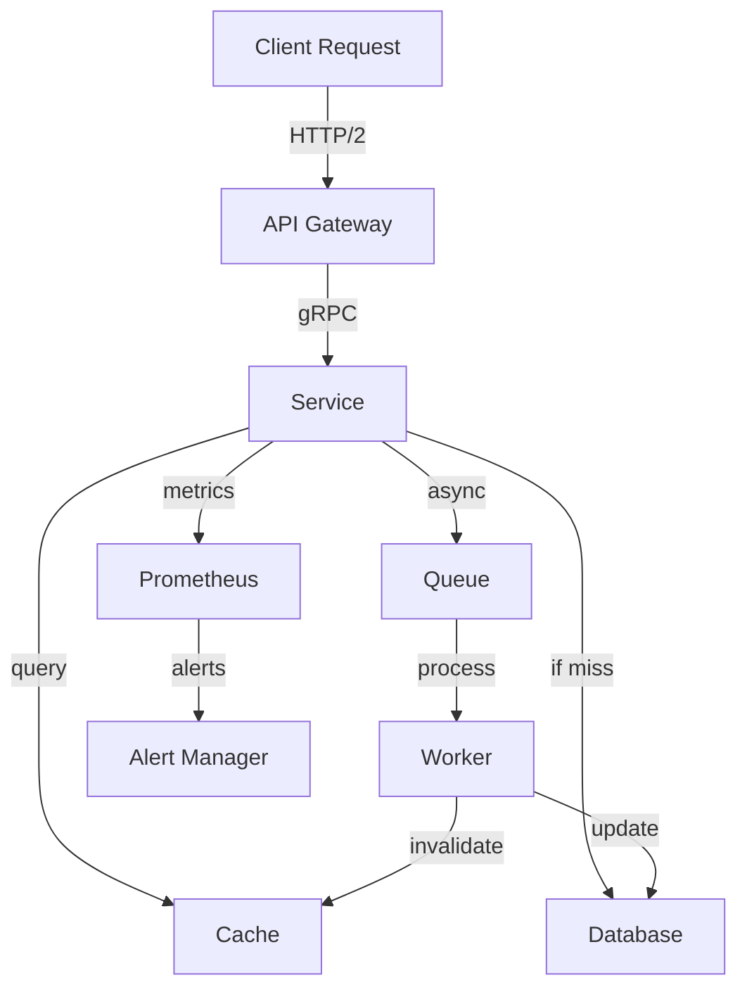

# Context Maps Template

-> IMPORTANT: Never add fictional dates, version numbers, or metrics. Only include real, verified information. If information is not available, mark it as "To be determined" or remove the section.

## Primary Purpose and Main Goals

### Primary Purpose

This template provides a structured approach to creating and maintaining context maps for microservices documentation, ensuring clear visualization of relationships, information flow, and navigation paths.

### Main Goals

1. Visualize documentation structure
2. Map component relationships
3. Document information flow
4. Establish navigation paths
5. Enable context-aware navigation

## Context Map Types

### 1. Documentation Structure Map



### 2. Component Relationship Map



### 3. Information Flow Map



## Implementation Guidelines

### 1. Map Structure

```yaml
# map-structure.yaml
context_maps:
  documentation:
    core:
      - service_1
      - service_2
      - service_3
    infrastructure:
      - database
      - cache
      - queue
    development:
      - setup
      - testing
      - debugging
    deployment:
      - kubernetes
      - helm
      - environment
    operations:
      - monitoring
      - logging
      - alerting
```

### 2. Navigation Structure

```markdown
# Navigation Map

## Core Services

- Service 1
  - API Documentation
  - Configuration
  - Dependencies
  - Security
- Service 2
  - Authentication
  - Authorization
  - Integration
- Service 3
  - Routing
  - Load Balancing
  - Security

## Infrastructure

- Database
  - Setup
  - Configuration
  - Maintenance
- Cache
  - Setup
  - Configuration
  - Optimization
- Queue
  - Setup
  - Configuration
  - Monitoring

## Development

- Setup
  - Environment
  - Dependencies
  - Tools
- Testing
  - Unit Tests
  - Integration Tests
  - E2E Tests
- Debugging
  - Tools
  - Techniques
  - Best Practices
```

### 3. Context Navigation

```yaml
# context-navigation.yaml
navigation:
  by_context:
    development:
      - setup_guide
      - testing_guide
      - debugging_guide
    deployment:
      - kubernetes_guide
      - helm_guide
      - environment_guide
    operations:
      - monitoring_guide
      - logging_guide
      - alerting_guide
  by_component:
    service_1:
      - api_docs
      - config_guide
      - security_guide
    service_2:
      - auth_guide
      - integration_guide
    service_3:
      - routing_guide
      - security_guide
```

## Best Practices

### 1. Map Creation

- Use consistent notation
- Include all components
- Show clear relationships
- Maintain hierarchy
- Update regularly

### 2. Map Management

- Regular updates
- Version control
- Change tracking
- Validation checks
- Documentation updates

### 3. Map Documentation

- Explain notation
- Document relationships
- Update guidelines
- Maintain logs
- Track changes

## Implementation Steps

### 1. Map Analysis

1. Review documentation
2. Identify components
3. Map relationships
4. Create structure
5. Validate maps

### 2. Map Implementation

1. Create templates
2. Generate maps
3. Validate structure
4. Update documentation
5. Document changes

### 3. Map Maintenance

1. Regular reviews
2. Update maps
3. Validate structure
4. Update documentation
5. Track changes
