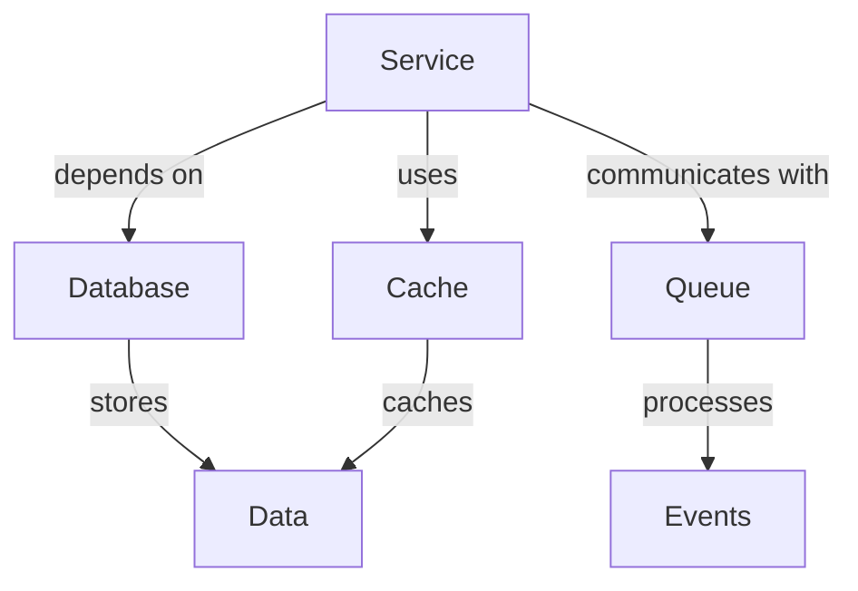
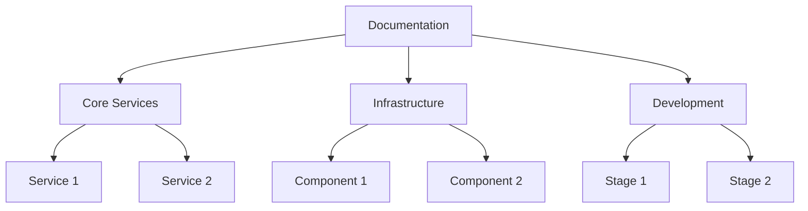

# Context Template

-> IMPORTANT: Never add fictional dates, version numbers, or metrics. Only include real, verified information. If information is not available, mark it as "To be determined" or remove the section.

## Primary Purpose and Main Goals

### Primary Purpose

This template provides comprehensive instructions for enhancing documentation to be more LLM-friendly, ensuring better context understanding, semantic relationships, and improved information retrieval.

### Main Goals

1. Improve LLM context understanding
2. Enhance semantic relationships
3. Optimize cross-references
4. Add meaningful metadata
5. Create comprehensive context maps

## Context Enhancement Strategies

### 1. Semantic Relationships



#### Implementation

```markdown
# Service Relationships

## Dependencies

- Dependency 1: Purpose and role
- Dependency 2: Purpose and role
- Dependency 3: Purpose and role

## Data Flow

1. Step 1 description
2. Step 2 description
3. Step 3 description
4. Step 4 description
5. Step 5 description
```

### 2. Cross-References

#### Implementation

```markdown
# Service Configuration

## Related Components

- [Component 1](../component1/config.md)
- [Component 2](../component2/setup.md)
- [Component 3](../component3/management.md)

## Dependencies

- [Dependency 1](../../dependency1/service.md)
- [Dependency 2](../../dependency2/setup.md)
```

### 3. Metadata Enhancement

#### Implementation

```yaml
# metadata.yaml
context:
  type: service
  category: core
  dependencies:
    - dependency_1
    - dependency_2
    - dependency_3
  relationships:
    - relationship_1
    - relationship_2
  lifecycle:
    - stage_1
    - stage_2
    - stage_3
  security:
    - security_1
    - security_2
    - security_3
```

## Documentation Structure

### 1. Context Maps



### 2. Information Hierarchy

```markdown
# Documentation Structure

## Core Services

- Service 1
  - API Documentation
  - Configuration
  - Dependencies
  - Security

## Infrastructure

- Component 1
  - Setup
  - Configuration
  - Maintenance
- Component 2
  - Setup
  - Configuration
  - Optimization

## Development

- Stage 1
  - Environment
  - Dependencies
  - Tools
- Stage 2
  - Unit Tests
  - Integration Tests
  - E2E Tests
```

## Best Practices

### 1. Context Clarity

- Use clear section headers
- Provide context in introductions
- Explain relationships explicitly
- Include relevant examples
- Add cross-references

### 2. Semantic Markup

```markdown
# Service Configuration

## Purpose

This configuration defines how the service interacts with its dependencies
and manages its resources.

## Components

- Component 1
- Component 2
- Component 3

## Relationships

- Depends on: Dependency 1
- Uses: Dependency 2
- Communicates with: Dependency 3
```

### 3. Metadata Standards

```yaml
# standards.yaml
metadata:
  required:
    - type
    - category
    - dependencies
    - relationships
  optional:
    - lifecycle
    - security
    - performance
  format:
    - yaml
    - json
    - markdown
```

## Implementation Guidelines

### 1. Document Structure

- Clear hierarchy
- Consistent formatting
- Explicit relationships
- Comprehensive metadata
- Cross-references

### 2. Content Organization

- Logical grouping
- Clear dependencies
- Explicit relationships
- Contextual information
- Related resources

### 3. Cross-Reference Management

- Consistent linking
- Bidirectional references
- Context preservation
- Relationship mapping
- Dependency tracking
