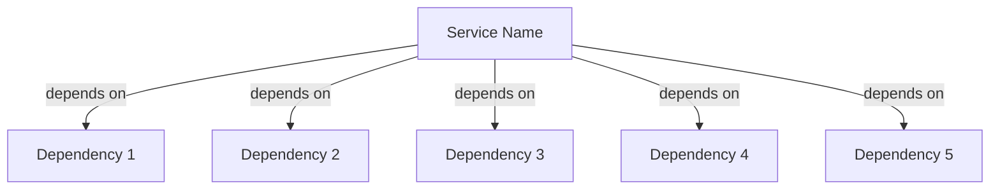
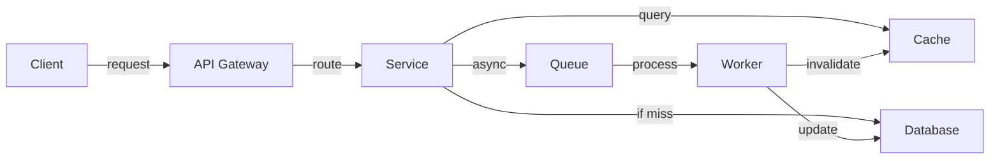
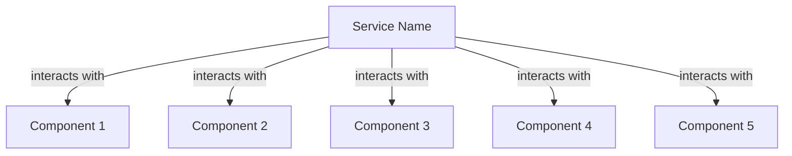

# Semantic Relationships Template

-> IMPORTANT: Never add fictional dates, version numbers, or metrics. Only include real, verified information. If information is not available, mark it as "To be determined" or remove the section.

## Primary Purpose and Main Goals

### Primary Purpose

This template provides a structured approach to implementing semantic relationships in microservices documentation, ensuring clear understanding of component interactions and dependencies.

### Main Goals

1. Document component relationships
2. Map service dependencies
3. Visualize data flows
4. Track component interactions
5. Maintain relationship consistency

## Relationship Types

### 1. Service Dependencies



### 2. Data Flow



### 3. Component Interactions



## Implementation Guidelines

### 1. Service Documentation

```markdown
# Service Name

## Dependencies

- Dependency 1: Purpose and role
- Dependency 2: Purpose and role
- Dependency 3: Purpose and role
- Dependency 4: Purpose and role
- Dependency 5: Purpose and role

## Data Flow

1. Step 1 description
2. Step 2 description
3. Step 3 description
4. Step 4 description
5. Step 5 description
6. Step 6 description

## Component Interactions

- Component 1: Interaction description
- Component 2: Interaction description
- Component 3: Interaction description
- Component 4: Interaction description
- Component 5: Interaction description
```

### 2. API Documentation

```markdown
# API Endpoints

## Endpoint Group

- HTTP_METHOD /endpoint

  - Depends on: Dependency name
  - Uses: Component name
  - Updates: Component names
  - Returns: Response description

- HTTP_METHOD /endpoint

  - Depends on: Dependency name
  - Uses: Component name
  - Updates: Component names
  - Returns: Response description

- HTTP_METHOD /endpoint
  - Depends on: Dependency name
  - Uses: Component name
  - Updates: Component names
  - Returns: Response description
```

### 3. Configuration Relationships

```yaml
# service-relationships.yaml
service_name:
  dependencies:
    dependency_1:
      type: required
      purpose: purpose_description
      interaction: interaction_type
    dependency_2:
      type: required
      purpose: purpose_description
      interaction: interaction_type
    dependency_3:
      type: required
      purpose: purpose_description
      interaction: interaction_type
    dependency_4:
      type: required
      purpose: purpose_description
      interaction: interaction_type
    dependency_5:
      type: required
      purpose: purpose_description
      interaction: interaction_type
```

## Best Practices

### 1. Relationship Documentation

- Document all dependencies
- Explain interaction types
- Describe data flows
- Map component relationships
- Update relationship maps

### 2. Visual Representation

- Use consistent diagrams
- Include relationship types
- Show data flow direction
- Indicate interaction types
- Maintain diagram clarity

### 3. Relationship Maintenance

- Regular relationship reviews
- Update dependency maps
- Verify interaction flows
- Document relationship changes
- Track component updates

## Implementation Steps

### 1. Service Analysis

1. Identify all services
2. Map dependencies
3. Document interactions
4. Create relationship diagrams
5. Validate relationships

### 2. Documentation Updates

1. Add relationship sections
2. Include visual diagrams
3. Document data flows
4. Update component docs
5. Verify consistency

### 3. Relationship Validation

1. Review dependencies
2. Verify interactions
3. Check data flows
4. Update diagrams
5. Document changes
