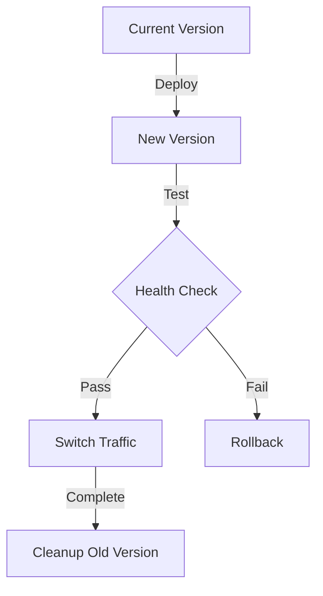
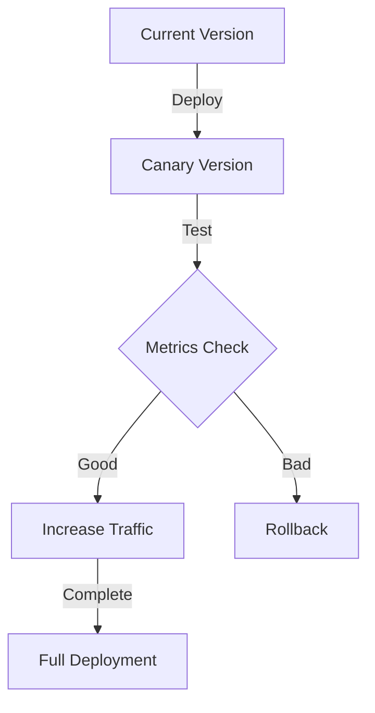

# Production Deployment Guide

## Primary Purpose and Main Goals

### Primary Purpose

This guide provides comprehensive instructions for deploying and managing the Profile Service Microservices in production, ensuring high availability, security, and performance.

### Main Goals

1. Ensure reliable production deployments
2. Maintain system security
3. Optimize performance
4. Enable quick recovery
5. Facilitate maintenance

## Deployment Strategy

### 1. Blue-Green Deployment



### 2. Canary Deployment



## Pre-deployment Checklist

### 1. System Requirements

- [ ] Resource availability
- [ ] Network capacity
- [ ] Storage space
- [ ] Backup systems
- [ ] Monitoring tools

### 2. Security Checks

- [ ] Access controls
- [ ] Network policies
- [ ] SSL certificates
- [ ] Secrets management
- [ ] Security scanning

### 3. Configuration Review

- [ ] Environment variables
- [ ] Service configurations
- [ ] Database settings
- [ ] Cache settings
- [ ] Queue settings

## Deployment Process

### 1. Preparation

```bash
# Backup current state
kubectl get all -n profile-prod -o yaml > backup.yaml

# Verify resources
kubectl get nodes
kubectl get pv,pvc -n profile-prod

# Check current version
helm list -n profile-prod
```

### 2. Deployment Steps

```bash
# Update Helm repository
helm repo update

# Deploy new version
helm upgrade profile-service ./helm \
  -f helm/values-prod.yaml \
  --namespace profile-prod \
  --timeout 10m \
  --atomic

# Verify deployment
kubectl rollout status deployment/profile-service -n profile-prod
```

### 3. Post-deployment Verification

```bash
# Check pod status
kubectl get pods -n profile-prod

# Verify services
kubectl get svc -n profile-prod

# Test endpoints
curl -k https://api.profile-service.com/health
```

## Rollback Procedures

### 1. Quick Rollback

```bash
# Rollback to previous version
helm rollback profile-service 1 -n profile-prod

# Verify rollback
kubectl rollout status deployment/profile-service -n profile-prod
```

### 2. Emergency Rollback

```bash
# Force rollback
kubectl rollout undo deployment/profile-service -n profile-prod

# Restore from backup
kubectl apply -f backup.yaml
```

## Monitoring Setup

### 1. Metrics Collection

```yaml
# prometheus-rules.yaml
apiVersion: monitoring.coreos.com/v1
kind: PrometheusRule
metadata:
  name: profile-service
  namespace: monitoring
spec:
  groups:
    - name: profile-service
      rules:
        - alert: HighErrorRate
          expr: rate(http_requests_total{status=~"5.."}[5m]) > 0.1
          for: 5m
          labels:
            severity: critical
          annotations:
            summary: High error rate detected
```

### 2. Alert Configuration

```yaml
# alertmanager-config.yaml
apiVersion: v1
kind: ConfigMap
metadata:
  name: alertmanager-config
  namespace: monitoring
data:
  alertmanager.yaml: |
    global:
      resolve_timeout: 5m
    route:
      group_by: ['alertname']
      group_wait: 30s
      group_interval: 5m
      repeat_interval: 12h
      receiver: 'team-profile'
```

## Backup Procedures

### 1. Database Backup

```bash
# Backup database
pg_dump -h prod-db.profile-service.com -U prod_user profile_prod > backup.sql

# Verify backup
pg_restore -l backup.sql
```

### 2. Configuration Backup

```bash
# Backup configurations
kubectl get configmap,secret -n profile-prod -o yaml > config-backup.yaml

# Backup persistent volumes
kubectl get pv,pvc -n profile-prod -o yaml > pv-backup.yaml
```

## Performance Optimization

### 1. Resource Tuning

```yaml
# resource-tuning.yaml
apiVersion: apps/v1
kind: Deployment
metadata:
  name: profile-service
spec:
  template:
    spec:
      containers:
        - name: profile-service
          resources:
            requests:
              cpu: "500m"
              memory: "512Mi"
            limits:
              cpu: "1000m"
              memory: "1Gi"
```

### 2. Performance Monitoring

```yaml
# performance-monitoring.yaml
apiVersion: monitoring.coreos.com/v1
kind: ServiceMonitor
metadata:
  name: profile-service
spec:
  endpoints:
    - port: metrics
      interval: 15s
      path: /metrics
```

## Security Hardening

### 1. Network Policies

```yaml
# network-policy.yaml
apiVersion: networking.k8s.io/v1
kind: NetworkPolicy
metadata:
  name: profile-service
  namespace: profile-prod
spec:
  podSelector:
    matchLabels:
      app: profile-service
  policyTypes:
    - Ingress
    - Egress
  ingress:
    - from:
        - namespaceSelector:
            matchLabels:
              name: ingress-nginx
      ports:
        - protocol: TCP
          port: 8080
```

### 2. Security Context

```yaml
# security-context.yaml
apiVersion: apps/v1
kind: Deployment
metadata:
  name: profile-service
spec:
  template:
    spec:
      securityContext:
        runAsNonRoot: true
        runAsUser: 1000
        runAsGroup: 3000
        fsGroup: 2000
      containers:
        - name: profile-service
          securityContext:
            allowPrivilegeEscalation: false
            readOnlyRootFilesystem: true
            capabilities:
              drop:
                - ALL
```

## Cross-References

- [Helm Configuration](helm-configuration.md)
- [Architecture Template](architecture-template.md)
- [Testing Template](testing-template.md)

## Notes

- Regular security audits
- Performance monitoring
- Backup verification
- Documentation updates
