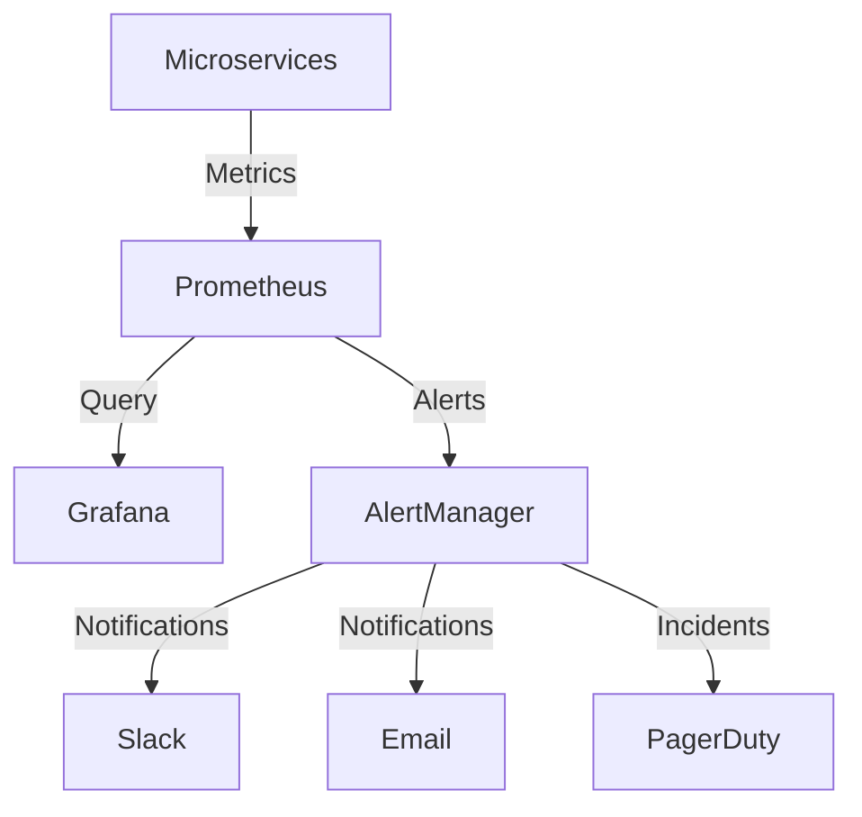

# Security Monitoring Template

-> IMPORTANT: Never add fictional dates, version numbers, or metrics. Only include real, verified information. If information is not available, mark it as "To be determined" or remove the section.

## Primary Purpose and Main Goals

### Primary Purpose

This template provides a structured approach to implementing security monitoring and alerting for microservices, ensuring comprehensive security visibility and incident response capabilities.

### Main Goals

1. Implement security monitoring
2. Configure alerting rules
3. Set up security dashboards
4. Create incident response procedures
5. Enable security event tracking

## Monitoring Architecture

### Security Monitoring Stack



## Security Metrics

### Authentication Metrics

```yaml
metrics:
  authentication:
    - name: "auth_attempts_total"
      type: "counter"
      labels:
        - "service"
        - "method"
        - "result"
    - name: "auth_failures_total"
      type: "counter"
      labels:
        - "service"
        - "reason"
    - name: "token_validations_total"
      type: "counter"
      labels:
        - "service"
        - "result"
```

### Authorization Metrics

```yaml
metrics:
  authorization:
    - name: "authz_checks_total"
      type: "counter"
      labels:
        - "service"
        - "resource"
        - "action"
        - "result"
    - name: "permission_denials_total"
      type: "counter"
      labels:
        - "service"
        - "user"
        - "resource"
        - "action"
```

### API Security Metrics

```yaml
metrics:
  api_security:
    - name: "rate_limit_hits_total"
      type: "counter"
      labels:
        - "service"
        - "endpoint"
        - "client"
    - name: "invalid_requests_total"
      type: "counter"
      labels:
        - "service"
        - "endpoint"
        - "reason"
    - name: "security_headers_missing_total"
      type: "counter"
      labels:
        - "service"
        - "header"
```

## Alerting Rules

### Authentication Alerts

```yaml
alerts:
  - name: "HighAuthFailures"
    expr: "rate(auth_failures_total[5m]) > 10"
    for: "5m"
    labels:
      severity: "warning"
    annotations:
      summary: "High rate of authentication failures"
      description: "Service {{ $labels.service }} has {{ $value }} auth failures per second"

  - name: "TokenValidationErrors"
    expr: "rate(token_validations_total{result='error'}[5m]) > 5"
    for: "5m"
    labels:
      severity: "critical"
    annotations:
      summary: "High rate of token validation errors"
      description: "Service {{ $labels.service }} has {{ $value }} token validation errors per second"
```

### Authorization Alerts

```yaml
alerts:
  - name: "PermissionDenials"
    expr: "rate(permission_denials_total[5m]) > 20"
    for: "5m"
    labels:
      severity: "warning"
    annotations:
      summary: "High rate of permission denials"
      description: "Service {{ $labels.service }} has {{ $value }} permission denials per second"

  - name: "SuspiciousAccessPatterns"
    expr: "rate(authz_checks_total{action='delete'}[5m]) > 5"
    for: "5m"
    labels:
      severity: "critical"
    annotations:
      summary: "Suspicious access patterns detected"
      description: "Service {{ $labels.service }} has {{ $value }} delete operations per second"
```

### API Security Alerts

```yaml
alerts:
  - name: "RateLimitExceeded"
    expr: "rate(rate_limit_hits_total[5m]) > 50"
    for: "5m"
    labels:
      severity: "warning"
    annotations:
      summary: "Rate limit exceeded"
      description: "Service {{ $labels.service }} endpoint {{ $labels.endpoint }} has {{ $value }} rate limit hits per second"

  - name: "SecurityHeadersMissing"
    expr: "rate(security_headers_missing_total[5m]) > 0"
    for: "5m"
    labels:
      severity: "critical"
    annotations:
      summary: "Security headers missing"
      description: "Service {{ $labels.service }} is missing required security headers"
```

## Alert Routing

### Alert Configuration

```yaml
alert_routing:
  - name: "security-critical"
    match:
      severity: "critical"
    receivers:
      - "security-team"
      - "oncall"
    routes:
      - slack: "security-alerts"
      - pagerduty: "security-critical"
      - email: "security@example.com"

  - name: "security-warning"
    match:
      severity: "warning"
    receivers:
      - "security-team"
    routes:
      - slack: "security-alerts"
      - email: "security@example.com"
```

## Dashboards

### Security Overview Dashboard

```yaml
dashboard:
  name: "Security Overview"
  panels:
    - title: "Authentication Failures"
      type: "graph"
      metrics:
        - "rate(auth_failures_total[5m])"
    - title: "Permission Denials"
      type: "graph"
      metrics:
        - "rate(permission_denials_total[5m])"
    - title: "Rate Limit Hits"
      type: "graph"
      metrics:
        - "rate(rate_limit_hits_total[5m])"
```

### Service Security Dashboard

```yaml
dashboard:
  name: "Service Security"
  panels:
    - title: "Service Auth Failures"
      type: "graph"
      metrics:
        - "rate(auth_failures_total{service=~'$service'}[5m])"
    - title: "Service Permission Denials"
      type: "graph"
      metrics:
        - "rate(permission_denials_total{service=~'$service'}[5m])"
    - title: "Service Rate Limits"
      type: "graph"
      metrics:
        - "rate(rate_limit_hits_total{service=~'$service'}[5m])"
```

## Incident Response

### Alert Response Procedures

```yaml
response_procedures:
  - alert: "HighAuthFailures"
    steps:
      - "Check authentication service logs"
      - "Verify token validation service"
      - "Review recent changes"
      - "Check for brute force attempts"
    escalation:
      - "After 15 minutes: Escalate to security team"
      - "After 30 minutes: Escalate to oncall"

  - alert: "SuspiciousAccessPatterns"
    steps:
      - "Review access logs"
      - "Check user activity"
      - "Verify permissions"
      - "Review recent changes"
    escalation:
      - "Immediate: Escalate to security team"
      - "After 15 minutes: Escalate to oncall"
```

## Logging

### Security Log Configuration

```yaml
logging:
  - name: "security_events"
    level: "info"
    format: "json"
    fields:
      - "timestamp"
      - "service"
      - "event_type"
      - "user"
      - "resource"
      - "action"
      - "result"
    retention: "90d"

  - name: "audit_logs"
    level: "info"
    format: "json"
    fields:
      - "timestamp"
      - "service"
      - "user"
      - "action"
      - "resource"
      - "changes"
    retention: "365d"
```

## Maintenance

### Monitoring Maintenance

```yaml
maintenance:
  - task: "Alert Review"
    frequency: "weekly"
    steps:
      - "Review alert thresholds"
      - "Update alert rules"
      - "Verify alert routing"
      - "Test alert delivery"

  - task: "Dashboard Review"
    frequency: "monthly"
    steps:
      - "Review dashboard metrics"
      - "Update dashboard panels"
      - "Verify data accuracy"
      - "Optimize queries"
```

## Cross-References

- [Architecture Template](architecture-template.md)
- [Testing Template](testing-template.md)
- [Deployment Guide](deployment-guide.md)

## Notes

- Regular security audits
- Performance monitoring
- Backup verification
- Documentation updates
