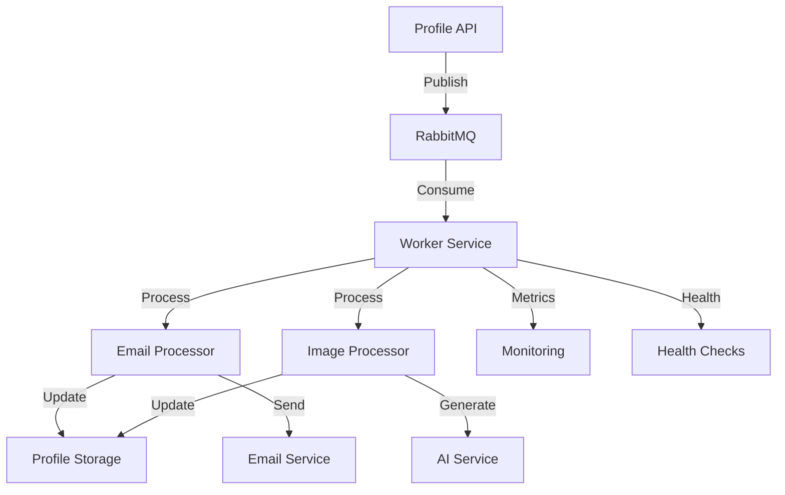
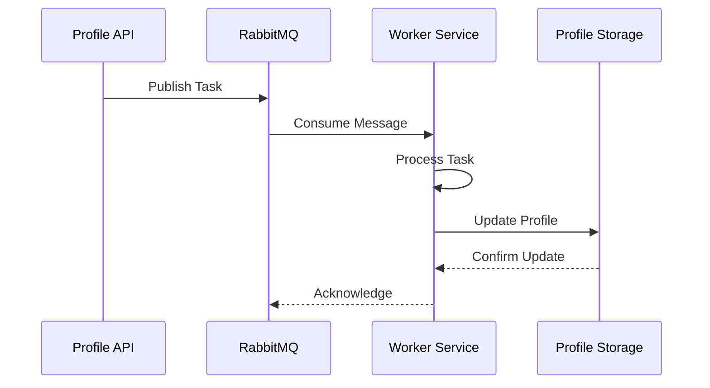
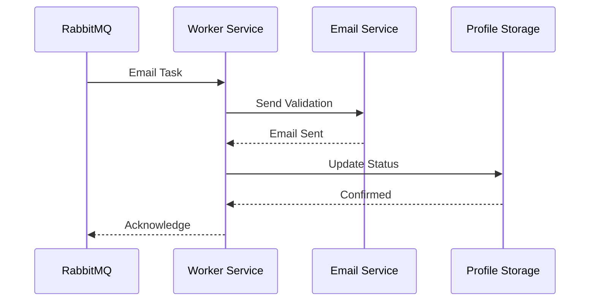
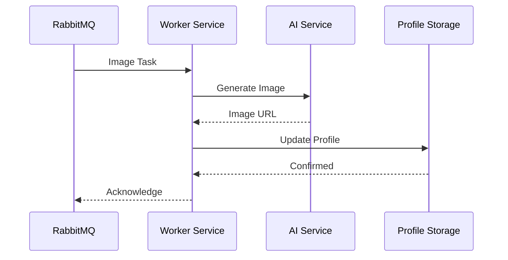
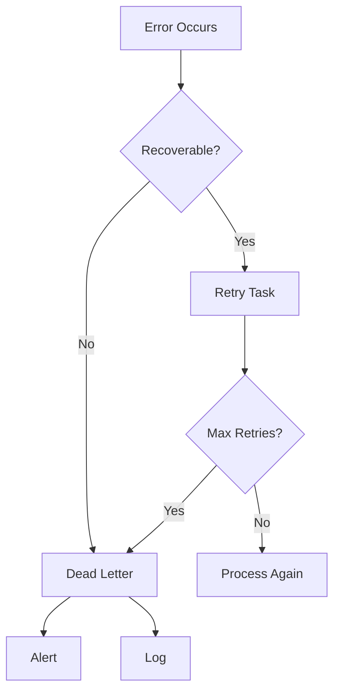
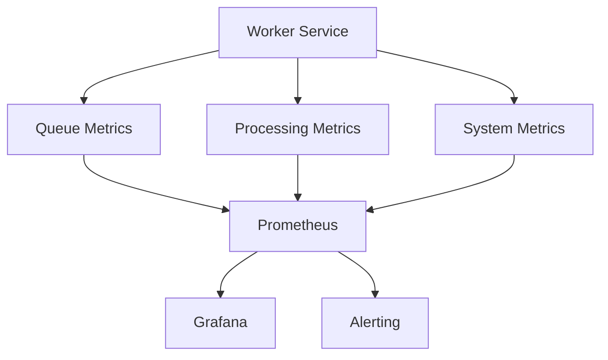

# Worker Service Architecture

## Overview

The Worker Service is designed to handle asynchronous task processing for the Profile Service, specifically managing email validation and image generation tasks. This document outlines the architectural decisions, patterns, and implementation details.

## Architecture Diagram



## Core Components

### 1. Message Queue Integration



#### Queue Structure

- **Email Queue**

  - Name: `profile-email-queue`
  - Purpose: Email validation tasks
  - Durability: Yes
  - TTL: 24 hours
  - Dead Letter Exchange: Yes

- **Image Queue**
  - Name: `profile-image-queue`
  - Purpose: Image generation tasks
  - Durability: Yes
  - TTL: 24 hours
  - Dead Letter Exchange: Yes

### 2. Task Processing

#### Email Validation Flow



#### Image Generation Flow



### 3. Error Handling

#### Error Recovery Flow



### 4. Monitoring

#### Metrics Collection



## Implementation Details

### 1. Service Structure

```
worker-service/
├── cmd/
│   └── worker/
│       └── main.go
├── internal/
│   ├── queue/
│   │   ├── consumer.go
│   │   ├── publisher.go
│   │   └── config.go
│   ├── processor/
│   │   ├── email.go
│   │   └── image.go
│   ├── storage/
│   │   └── client.go
│   ├── monitoring/
│   │   ├── metrics.go
│   │   └── health.go
│   └── config/
│       └── config.go
└── pkg/
    └── shared/
        ├── queue.go
        └── monitoring.go
```

### 2. Key Interfaces

```go
// Queue Consumer Interface
type Consumer interface {
    Consume(ctx context.Context) error
    Close() error
}

// Task Processor Interface
type Processor interface {
    Process(ctx context.Context, task Task) error
    Validate(task Task) error
}

// Storage Client Interface
type StorageClient interface {
    UpdateProfile(ctx context.Context, profile Profile) error
    GetProfile(ctx context.Context, id string) (Profile, error)
}
```

### 3. Configuration Management

```yaml
worker:
  queue:
    host: rabbitmq
    port: 5672
    username: worker
    password: ${QUEUE_PASSWORD}
    vhost: /workers
    prefetch: 10
    reconnect:
      maxAttempts: 5
      initialDelay: 1s
      maxDelay: 30s

  processing:
    maxRetries: 3
    retryDelay: 5s
    timeout: 30s
    batchSize: 10
    concurrency: 5

  monitoring:
    metricsPort: 9090
    healthCheckInterval: 30s
    logLevel: info
```

## Cross-References

- [Worker Service Patterns](../../reference-materials/development/patterns/worker-service-patterns.md)
- [Queuing Patterns](../../reference-materials/development/patterns/queuing-patterns.md)
- [Monitoring Patterns](../../reference-materials/development/patterns/monitoring-patterns.md)
- [Security Patterns](../../reference-materials/development/patterns/security-patterns.md)
- [Long-Running Tasks](../../reference-materials/development/patterns/long-running-tasks.md)
